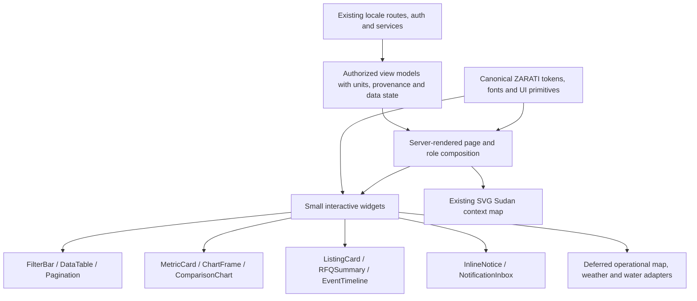

# ZARATI 21st Component Discovery and UI Architecture Gate

Review date: 2026-09-07 (workspace date). Owner of implementation: Antigravity.
Status: discovery complete within available registry access; implementation adoption gate NOT passed.
Scope: report-only authorization. No application code, packages, components, database, environment, branches or deployments changed by this review.

## 1. Decision

Retain ZARATI's design system and build shared domain widgets from its existing primitives. Use 21st.dev to inform composition and interaction patterns. Do not import a dashboard template or overwrite local UI files.

This review ran **26 separate 21st MCP searches**, screened **114 unique demo IDs**, shortlisted **32 candidates**, and inspected **2 full component sources plus the returned dependency files for the table**. The 21st account permits two free source retrievals per day; the usage endpoint confirmed **0/2 remaining** after those reads. Other shortlisted components are assessed from catalog metadata only, not represented as source-verified. No paywall bypass, upgrade, package installation or component installation was attempted.

**No candidate is approved for unchanged direct reuse.** The two source-reviewed examples need substantial adaptation; the others require source inspection before code adoption. Fit scores rate usefulness of the adapted pattern, not production readiness, visual QA, or tested framework compatibility. The earlier five-option shortlist is superseded by this broader inventory; Area Chart Analytics Card remains promising but is not source-validated.

The request's “Phase R1” is interpreted here as the **first UI adoption tranche**, not a rewrite of historical project phase naming. Existing documents already discuss R1-B and R4. This report does not move R4 weather, GIS or predictive analytics into an earlier product release.

## 2. Evidence and review limits

Evidence grades:
- **S**: actual component and demo source inspected through get_component. Static review only; no build/runtime test.
- **M**: registry name/description/source identity inspected. Any feature claim is the author's metadata claim.
- **Local**: inspected workspace source; does not prove the state of a live deployment.

Source-reviewed IDs: Market Snapshot demo **20113**, parent component **10399**; Flexi Filter Table demo **7466**, parent component **4970**. All other IDs in this report are **demo IDs** returned by registry search, not inferred parent IDs. Public source links and available preview links appear in the inventory.

No browser, screen-reader, touch, contrast, bundle-size or hydration test was performed on registry candidates. No unverified candidate is labeled accessible, RTL-ready, React 19 compatible, Next 16 compatible or dependency-free. Package version ranges for uninspected candidates are unknown. License/reuse terms and transitive dependency maintenance must be checked at code adoption; a catalog entry alone does not establish those terms.

Review uses the UI/UX Pro Max review criteria for accessible controls, responsive data views, reduced motion and meaningful charts. ZARATI's explicit canonical-design instruction takes precedence over generating a new palette, typography system or generic style.

### Local evidence

| Source | Evidence used |
|---|---|
| [package.json](package.json) | Next 16.2.9, React/React DOM 19.2.4, Tailwind 4.3.0, Recharts 3.8.1, Lucide ^1.41.0, clsx and tailwind-merge; no direct Framer Motion, Radix, HeroUI or map engine declaration |
| [app/globals.css](app/globals.css) | Active Tailwind theme, Arabic typography/bidi rules and CSS reduced-motion handling |
| [design-system/tokens.css](design-system/tokens.css) | Brand/semantic scales, spacing, radius, layout/z-index and data-theme dark overrides |
| [design-system/components.md](design-system/components.md) | Component specification; some values/API descriptions differ from live primitives |
| [components/ui/card.tsx](components/ui/card.tsx) | Canonical surface, rounded-xl, border and shadow-sm wrapper |
| [components/ui/button.tsx](components/ui/button.tsx), [badge.tsx](components/ui/badge.tsx), [input.tsx](components/ui/input.tsx), [skeleton.tsx](components/ui/skeleton.tsx) | Actual APIs and existing loading/focus patterns |
| [components/layout/page-wrapper.tsx](components/layout/page-wrapper.tsx) | Responsive gutters px-4/sm:px-6/lg:px-8; max-w-7xl or narrow max-w-4xl |
| [app/[lang]/layout.tsx](app/%5Blang%5D/layout.tsx), [lib/fonts.ts](lib/fonts.ts) | Locale lang/dir, global header/footer, self-hosted Next font setup |
| [components/layout/header.tsx](components/layout/header.tsx) | Existing localized navigation and lg desktop boundary |
| [components/dashboard/farmer-dashboard-client.tsx](components/dashboard/farmer-dashboard-client.tsx) | Listing creation/status workflow, localized responsive forms |
| [components/dashboard/trader-dashboard-client.tsx](components/dashboard/trader-dashboard-client.tsx) | Buyer/seller RFQ states and gated contact retrieval |
| [components/marketplace/marketplace-client.tsx](components/marketplace/marketplace-client.tsx) | Category/text filtering and RFQ action flow |
| [components/admin/AdminDashboard.tsx](components/admin/AdminDashboard.tsx) | KPI grid, search and horizontally scrollable table |
| [app/[lang]/overview/page.tsx](app/%5Blang%5D/overview/page.tsx) | Server-loaded KPI/table composition and localized formatting |
| [app/[lang]/intelligence/page.tsx](app/%5Blang%5D/intelligence/page.tsx) | Explicit PLANNED ARCHITECTURE / R4+ page and placeholder analytics sections |
| [components/maps/SudanMap.tsx](components/maps/SudanMap.tsx) | Existing labeled SVG national context with LTR geometry; not an operational GIS engine |
| [lib/services/crop-service.ts](lib/services/crop-service.ts), [marketplace-service.ts](lib/services/marketplace-service.ts) | Existing data gateways; empty results also returned on failures |
| [lib/services/intelligence/interfaces.ts](lib/services/intelligence/interfaces.ts) | Observation provenance, temporal class, derivation and publication-related types |
| [ZARATI_R4_INTELLIGENCE_SCOPE_FREEZE.md](ZARATI_R4_INTELLIGENCE_SCOPE_FREEZE.md) | Historical foundation before weather/feeds, normalization and institutional analytics; HFT/predictive yield/complex satellite processing excluded |

Next.js compatibility review used the installed [use-client guide](node_modules/next/dist/docs/01-app/03-api-reference/01-directives/use-client.md) and [lazy-loading guide](node_modules/next/dist/docs/01-app/02-guides/lazy-loading.md), as required by AGENTS.md. Interactive entry points require the appropriate client boundary; props crossing that boundary must be serializable. The local guide explicitly limits ssr:false to Client Components and notes the current server-to-client dynamic-import splitting limitation.

## 3. Canonical design and architecture constraints

1. Keep forest green #0D3B1E, leaf green #4CAF50, navy #0F2D5E, teal #00897B, river blue #1565C0 and existing semantic status colors. Gold #F4A800 remains restricted to investor/admin contexts. A registry's “primary” must not redefine ours.
2. Use actual Card, Button, Input, Select, Badge and Skeleton APIs. Preserve their role and appearance; do not allow generated registry dependencies to replace them.
3. Preserve Geist for Latin UI and IBM Plex Sans Arabic for Arabic UI through the active globals. Do not import the vendor's fonts or translate Arabic by applying tracking/uppercase styling.
4. Preserve the 4px-based spacing scale, responsive gutters and existing container roles. Use a one-column mobile composition where long Arabic text requires it. Mobile controls should offer approximately 44px touch areas even when visual icons are smaller.
5. Translate all visible text, dates, accessible names and status descriptions. Use logical start/end spacing and placement. Portal content must inherit the correct language/direction; root dir alone does not prove this.
6. Keep numbers/currency/identifiers bidi-isolated where needed. Do not flip geography. Time-series chronology needs an explicit, consistent convention; use an LTR plotting frame with localized surrounding controls unless a separately reviewed alternative is chosen.
7. Build data visualization on installed Recharts where needed, or native/SVG primitives for simple static meters/sparklines. Recharts is declared but this review's app/components import search found no current chart use; do not mistake installation for an established shared chart implementation.
8. Keep authoritative fetch/authorization/normalization outside presentation components. Never copy registry sample data, stock exchange branding, synthesized forecasts, fake delivery events or “live” indicators into production.

### Existing integration risks to resolve before adoption

- **Two token namespaces:** globals defines fixed --color-surface/--color-text values; dark overrides modify --za-surface-card/--za-text-primary. The current Card uses bg-surface/text inherited from active globals. A data-theme change therefore does not by itself establish complete dark mode for that primitive. Recommend an explicit mapping using existing token values; do not introduce a registry-owned theme.
- **No generic shadcn variable contract:** --card, --foreground and --muted-foreground used by Market Snapshot are not defined in the inspected globals/tokens. Likewise bg-background, bg-popover, text-muted-foreground and animation utilities from the table cannot be assumed present. Names such as primary/secondary also carry different semantics.
- **Specification/runtime drift:** tokens still declare Inter/IBM Plex Arabic while active globals select Geist/IBM Plex Sans Arabic. Component documentation describes APIs/sizing different from actual Button. Follow the current working implementation for integration and document intentional reconciliation for Antigravity; do not silently “fix” it through a vendor import.
- **Mixed surfaces in application source:** some newer screens use bg-surface-card or bg-surface-canvas and square border-2 panels; those color utility names are not declared in the inspected @theme block. Treat this as a mapping concern, not evidence that ZARATI wants a new vendor style.
- **Data state ambiguity:** crop and marketplace services return [] for disabled/missing client, query failure and genuine no rows. Presentation alone cannot distinguish unavailable from empty. Recommend a typed result/state adapter before adding charts; no service change is executed here.
- **Navigation labels and mobile access:** ensure active category/nav state is programmatic, not only colored; the marketplace search currently uses placeholder text without an explicit label in the inspected JSX. Preserve the design while addressing these gaps.
- **Data scope:** “my” metrics must be user-scoped; national/public totals must be labeled accordingly. The overview reads general listing/crop services; its label/count semantics deserve review before expanding KPIs.
- **Motion:** CSS reduced-motion handling exists, but it does not automatically suppress JavaScript animation libraries. Audit each adopted interaction separately.

## 4. Coverage of all 20 requested surfaces

| # | ZARATI surface | Recommended pattern(s) / IDs | Architecture disposition |
|---|---|---|---|
| 1 | Farmer dashboard | Stat Card 26138; Skeleton 18999; Notice 19366 | Existing farmer workflow plus shared summary/action widgets |
| 2 | Agricultural market intelligence | Market Snapshot 20113; Filter Table 7466; InlineAnalyticsTable 7475 | Provenance-aware filter, chart, table composition |
| 3 | Commodity price trends | 20113; Area Charts 2 4729; Analytics Card 6611 | Real observation dates, units/currency and missing-data handling |
| 4 | Crop production analytics | Progress Metric 15024; Trend Card 7802 | Recharts comparison/time buckets; actual hectares/tonnes |
| 5 | Weather/climate intelligence | Weather Card 6836; Widget 1646 (defer service code) | Selected farm/location + provider/forecast time; R4-B data gate |
| 6 | Irrigation/water monitoring | Gauge 1757; Meter 19524 | Native/styled meter pattern; no operational control implied |
| 7 | Farm/field management | Kanban Board 24339; table/filter patterns | List-first tasks + field details; farm geometry separate |
| 8 | Marketplace listings | Product Card 8286; Product Detail 7820 | Existing listing/RFQ flow with agricultural metadata |
| 9 | Buyer/seller dashboards | 26138; 7466; 7710 | Existing RFQ permissions/states; no finance-template takeover |
| 10 | Logistics/delivery tracking | Order History 7710; Status Tracker 8205 | Real event timeline; defer unsupported carrier/ETA functions |
| 11 | Notifications/alerts | Notice 19366; Inbox 8245; Empty state 19367 | Inline status first; persistent inbox only with supporting service |
| 12 | KPI/stat cards | 26138; 15024; 18999 | Single shared MetricCard family |
| 13 | Data tables | Table 105; Pagination 25118; 7466 | Semantic tables, bounded rows, URL state |
| 14 | Charts/time series | 4729; 15024; 7802; 20113 | One chart frame and formatter contract over existing Recharts |
| 15 | Maps/geospatial | Existing SudanMap; Interactive Map 3898; markers 13980/13983 | SVG context now; operational map engine gate later |
| 16 | Search/filtering | 7466; Pagination 25118 | Native/local controls before extra dropdown/calendar packages |
| 17 | Mobile navigation | Floating Nav 5840; Drawer 11444 | Visible labels, safe area, locale-aware routes, minimal motion |
| 18 | Arabic/RTL layouts | Sidebar Light 19361; 11444 | Logical layout and portal direction; no registry RTL certification |
| 19 | Admin dashboards | Overview 8371; Activities 8372; 105/7466 | Existing admin authorization + queue/table/activity composition |
| 20 | Government/institutional analytics | 19070; 7475; 4729; existing map | Aggregate-only provenance/coverage views; no synthetic national totals |

## 5. Shortlist inventory and risk matrix

Fit rubric: domain usefulness 0–3, canonical design adaptability 0–3, stack simplicity 0–2, interaction/data clarity 0–2. Scores are reviewer judgments for the **modified pattern**. Unknown source behavior is not treated as a pass. Risks below describe source adoption before modifications; “expected” marks an inference, not measured evidence.

All shortlisted entries use **adapt pattern**. Entries explicitly marked defer are architectural references only until supporting data/engine/source gates pass. Direct unchanged reuse count: **0**.

| Demo ID | Component | Grade | Module | Fit /10 | Dependency risk | RTL risk | Accessibility risk | Performance risk |
|---|---|---|---|---|---|---|---|---|
| 26138 | [Stat Card](https://21st.dev/@felipemenezes098/components/card-05) | M | Farmer/buyer/seller/admin KPI | 9 | Low expected; actual imports unknown | Low–medium | Medium | Low expected |
| 15024 | [Progress Metric Card](https://21st.dev/@makviesainte/components/progress-metric-card) | M | Crop production; KPI charts | 8 | Medium; Recharts stated, version unknown | Medium | Medium | Medium |
| 18999 | [Stat Cards Skeleton](https://21st.dev/@felipemenezes098/components/skeleton-10) | M | All KPI loading states | 8 | Low expected; imports unknown | Low | Medium | Low expected |
| 6611 | [Area Chart Analytics Card](https://21st.dev/@ahmedmayara/components/area-chart-analytics-card) | M | Compact commodity trends | 8 | Unknown | Medium | Medium–high | Medium |
| 4729 | [Area Charts 2](https://21st.dev/@sean0205/components/area-charts-2) | M | Market intelligence; time-series panels | 8 | Unknown | Medium | Medium–high | Medium |
| 20113 | [Market Snapshot](https://21st.dev/@ssicevs/components/market-snapshot) | S | Commodity market snapshot | 8 | Medium; undeclared framer-motion import | High | High | Medium |
| 7802 | [Trend Card](https://21st.dev/@ravikatiyar162/components/trend-card) | M | Crop volumes; irrigation history | 7 | Unknown | Medium | Medium–high | Medium |
| 19070 | [Advanced Stats](https://21st.dev/@uilayout.contact/components/advanced-stats) | M | Executive and government summary | 7 | Unknown; animation engine unverified | Medium | Medium–high | Medium–high |
| 8371 | [Dashboard Overview](https://21st.dev/@uniquesonu/components/dashboard-overview) | M | Admin and role dashboard composition | 7 | Unknown | Unknown | Unknown | Unknown |
| 6836 | [Weather Card](https://21st.dev/@user_xn1cklas/components/weather-card) | M | Weather and climate | 7 | Unknown | Unknown | Unknown | Unknown |
| 1646 | [Weather Widget](https://21st.dev/@fahadyaseen001/components/weather-widget) | M | Weather provider integration reference | 5 | High; OpenWeatherMap service stated; npm unknown | Medium | Unknown | Medium–high |
| 1757 | [Gauge](https://21st.dev/@designali-in/components/gauge) | M | Irrigation/water bounded reading | 7 | Unknown | Medium | Medium–high | Unknown |
| 19524 | [Meter](https://21st.dev/@hero_ui/components/heroui-meter) | M | Water monitoring meter semantics | 7 | High; HeroUI/react-aria stated, exact packages unknown | Medium | Medium; accessible label claimed | Medium expected |
| 24339 | [Kanban Board](https://21st.dev/@arunjdass/components/kanban-board) | M | Farm task/field work management | 6 | Unknown; native HTML5 drag/drop stated | High | High | Medium |
| 8286 | [Product Card](https://21st.dev/@ravikatiyar162/components/product-card-2) | M | Marketplace listing grid | 8 | Unknown; animation implementation unknown | Medium | Medium | Medium |
| 7820 | [E-commerce Product Detail](https://21st.dev/@dhileepkumargm/components/e-commerce-product-detail) | M | Marketplace listing detail | 7 | Low–medium claimed portable SVG; imports unknown | Medium | Medium; ARIA/keyboard claims unverified | Medium |
| 8205 | [Order Status Tracker](https://21st.dev/@ravikatiyar162/components/order-status-tracker) | M | Delivery detail/status | 8 | Unknown | Medium | Medium | Low–medium expected |
| 7710 | [Order History](https://21st.dev/@kavikatiyar/components/order-history) | M | Logistics timeline; buyer/seller history | 8 | Unknown | Medium | Medium | Low–medium expected |
| 19366 | [Notice Alert](https://21st.dev/@corr/components/notice-alert) | M | Inline notices; data-quality alerts | 9 | Unknown; wrapper dependencies unverified | Low–medium | Medium | Low expected |
| 8245 | [NotificationIn box Popover](https://21st.dev/@ruixen.ui/components/notification-inbox-popover) | M | Notifications inbox | 8 | Medium expected; Lucide stated; popover/tab dependencies unknown | Medium–high | Medium–high | Medium |
| 19367 | [Empty Notifications State](https://21st.dev/@7ovr/components/empty-states-1) | M | Notification empty state | 8 | Low expected; imports unknown | Low | Low–medium | Low expected |
| 7466 | [Flexi Filter Table](https://21st.dev/@ruixen.ui/components/flexi-filter-table) | S | Search/filter toolbar; admin and listings tables | 8 | High; nine registry files, eight new npm packages | High | High | Medium–high at scale |
| 105 | [Table](https://21st.dev/@originui/components/table) | M | Shared data-table structure | 8 | Unknown | Medium | Medium | Low–medium expected |
| 25118 | [Table Pagination](https://21st.dev/@shadcnui-blocks/components/pagination-14) | M | Table pagination | 8 | Unknown | Medium | Medium | Low expected |
| 7475 | [InlineAnalyticsTable](https://21st.dev/@ruixen.ui/components/inline-analytics-table) | M | Government comparison tables; market intelligence | 8 | Unknown; chart engine not stated | Medium–high | Medium–high | Medium–high |
| 19361 | [Sidebar Light](https://21st.dev/@inference-sh/components/sidebar-light) | M | Arabic/RTL desktop dashboard navigation | 8 | Unknown | Medium–high | Medium | Low–medium expected |
| 11444 | [Drawer](https://21st.dev/@coss.com/components/drawer) | M | Mobile menu and filter drawer | 7 | Unknown; drawer primitive/library version unverified | High | Medium–high | Medium |
| 5840 | [Floating Nav](https://21st.dev/@ruixen.ui/components/floating-nav) | M | Farmer mobile bottom navigation | 6 | Medium; React + Framer Motion stated | High | High | Medium |
| 3898 | [Interactive Map](https://21st.dev/@lovesickfromthe6ix/components/interactive-map) | M | Farm/field geospatial workspace | 6 | High/unknown; map engine and provider unverified | High | High | High expected |
| 13980 | [MarkerContent](https://21st.dev/@mapcn/components/mapcn-marker-content) | M | Future field/market map markers | 7 | High; MapLibre host dependency stated | Medium–high | High | High at scale |
| 13983 | [MarkerLabel](https://21st.dev/@mapcn/components/mapcn-marker-label) | M | Future map labels | 7 | High; MapLibre host dependency stated | High | Medium–high | Medium–high |
| 8372 | [Dashboard Activities](https://21st.dev/@uniquesonu/components/dashboard-activities) | M | Admin activity; institutional audit feed | 7 | Unknown | Medium | Medium | Low–medium expected |

### Per-candidate compatibility, responsiveness and modifications

For M entries, Next.js and React compatibility remain unverified even if the pattern is naturally implementable in the local stack. Tailwind utilities must be reviewed for v4 behavior and mapped to existing tokens; a “shadcn” label is not a compatibility guarantee.

#### 26138 — Stat Card (9/10)

- **Source:** [Stat Card](https://21st.dev/@felipemenezes098/components/card-05); author felipemenezes098; metadata only; further retrieval unavailable after quota was exhausted.
- **Next.js:** Static candidate; React/Next boundary unknown.
- **React:** Exact APIs and peer dependency support for React 19.2.4 unknown.
- **Tailwind:** Source unavailable; v4 syntax, plugins and token contract require inspection. Pattern may be rebuilt in current Tailwind without adopting vendor CSS.
- **Light/dark:** Not stated; remap tokens; both modes require canonical-token and contrast review.
- **Responsive/RTL/accessibility:** Low–medium RTL risk, Medium accessibility risk. No viewport testing or Arabic rendering performed; catalog responsiveness claims are not validation.
- **Strategy and modifications:** Compact metric/icon/trend hierarchy. Compose with existing Card and Lucide; pass value, unit, comparison period, source and as-of. Do not imply that rising prices are universally beneficial; label direction separately from severity. Handle zero, missing and stale values.

#### 15024 — Progress Metric Card (8/10)

- **Source:** [Progress Metric Card](https://21st.dev/@makviesainte/components/progress-metric-card); author makviesainte; metadata only; further retrieval unavailable after quota was exhausted.
- **Next.js:** Interactive; client boundary and React peers unverified.
- **React:** Exact APIs and peer dependency support for React 19.2.4 unknown.
- **Tailwind:** Source unavailable; v4 syntax, plugins and token contract require inspection. Pattern may be rebuilt in current Tailwind without adopting vendor CSS.
- **Light/dark:** Not stated; remap tokens; both modes require canonical-token and contrast review.
- **Responsive/RTL/accessibility:** Medium RTL risk, Medium accessibility risk. No viewport testing or Arabic rendering performed; catalog responsiveness claims are not validation.
- **Strategy and modifications:** Use its progression/bar pattern through existing Recharts 3.8.1; keep actual observations on the x-axis and hectares/tonnes explicit. Avoid smoothing discrete harvest totals. Add a table alternative and responsive axis density.

#### 18999 — Stat Cards Skeleton (8/10)

- **Source:** [Stat Cards Skeleton](https://21st.dev/@felipemenezes098/components/skeleton-10); author felipemenezes098; metadata only; further retrieval unavailable after quota was exhausted.
- **Next.js:** Static/CSS candidate; unverified.
- **React:** Exact APIs and peer dependency support for React 19.2.4 unknown.
- **Tailwind:** Source unavailable; v4 syntax, plugins and token contract require inspection. Pattern may be rebuilt in current Tailwind without adopting vendor CSS.
- **Light/dark:** Not stated; both modes require canonical-token and contrast review.
- **Responsive/RTL/accessibility:** Low RTL risk, Medium accessibility risk. No viewport testing or Arabic rendering performed; catalog responsiveness claims are not validation.
- **Strategy and modifications:** Adapt placeholder geometry using existing Skeleton, one loading announcement per region, aria-busy and reduced motion. Never use persistent skeletons to disguise a planned feature.

#### 6611 — Area Chart Analytics Card (8/10)

- **Source:** [Area Chart Analytics Card](https://21st.dev/@ahmedmayara/components/area-chart-analytics-card); author ahmedmayara; metadata only; further retrieval unavailable after quota was exhausted.
- **Next.js:** Interactive chart; Next/React/source unverified.
- **React:** Exact APIs and peer dependency support for React 19.2.4 unknown.
- **Tailwind:** Source unavailable; v4 syntax, plugins and token contract require inspection. Pattern may be rebuilt in current Tailwind without adopting vendor CSS.
- **Light/dark:** Not stated; both modes require canonical-token and contrast review.
- **Responsive/RTL/accessibility:** Medium RTL risk, Medium–high accessibility risk. No viewport testing or Arabic rendering performed; catalog responsiveness claims are not validation.
- **Strategy and modifications:** Prior shortlist winner remains a compact-card pattern only. Replace ad-spend language with commodity/market/unit/currency; source engine unknown. Implement with existing Recharts, not a second chart package.

#### 4729 — Area Charts 2 (8/10)

- **Source:** [Area Charts 2](https://21st.dev/@sean0205/components/area-charts-2); author sean0205; metadata only; further retrieval unavailable after quota was exhausted.
- **Next.js:** Interactive chart; Next/React/source unverified.
- **React:** Exact APIs and peer dependency support for React 19.2.4 unknown.
- **Tailwind:** Source unavailable; v4 syntax, plugins and token contract require inspection. Pattern may be rebuilt in current Tailwind without adopting vendor CSS.
- **Light/dark:** Not stated; both modes require canonical-token and contrast review.
- **Responsive/RTL/accessibility:** Medium RTL risk, Medium–high accessibility risk. No viewport testing or Arabic rendering performed; catalog responsiveness claims are not validation.
- **Strategy and modifications:** Use line/area layouts as reference, wrapped in canonical Card. Choose line for price observations, area only when baseline and accumulation are meaningful. Include gaps, units, provenance, table alternative and interval controls.

#### 20113 — Market Snapshot (8/10)

- **Source:** [Market Snapshot](https://21st.dev/@ssicevs/components/market-snapshot); author ssicevs; source inspected.
- **Next.js:** Source: hooks; missing use-client entry; React 19 integration untested.
- **React:** Standard hooks/component syntax observed; not compiled or tested with React 19.2.4.
- **Tailwind:** Common utility syntax plus inline generic theme variables; requires canonical token mapping.
- **Light/dark:** Theme vars present but incompatible names; both modes require canonical-token and contrast review.
- **Responsive/RTL/accessibility:** High RTL risk, High accessibility risk. Source has w-full/max-w-[340px] and a scaling SVG, but seven tiny controls and touch-none require mobile redesign.
- **Strategy and modifications:** Pattern only. Replace synthetic sample-index periods and invented timestamps with real dated observations. Rebuild with Recharts and canonical tokens; keyboard/touch access, larger labels and period targets; no global shared animation ID.

#### 7802 — Trend Card (7/10)

- **Source:** [Trend Card](https://21st.dev/@ravikatiyar162/components/trend-card); author ravikatiyar162; metadata only; further retrieval unavailable after quota was exhausted.
- **Next.js:** Interactive; client boundary/source unverified.
- **React:** Exact APIs and peer dependency support for React 19.2.4 unknown.
- **Tailwind:** Source unavailable; v4 syntax, plugins and token contract require inspection. Pattern may be rebuilt in current Tailwind without adopting vendor CSS.
- **Light/dark:** Catalog claims shadcn theme adaptation; both modes require canonical-token and contrast review.
- **Responsive/RTL/accessibility:** Medium RTL risk, Medium–high accessibility risk. No viewport testing or Arabic rendering performed; catalog responsiveness claims are not validation.
- **Strategy and modifications:** Use responsive bar-summary pattern. Bar widths must represent actual time buckets, not irregular observations with equal spacing. Explicit interval, totals, missing data and units; reuse canonical chart frame.

#### 19070 — Advanced Stats (7/10)

- **Source:** [Advanced Stats](https://21st.dev/@uilayout.contact/components/advanced-stats); author uilayout.contact; metadata only; further retrieval unavailable after quota was exhausted.
- **Next.js:** Interactive animation; source unverified.
- **React:** Exact APIs and peer dependency support for React 19.2.4 unknown.
- **Tailwind:** Source unavailable; v4 syntax, plugins and token contract require inspection. Pattern may be rebuilt in current Tailwind without adopting vendor CSS.
- **Light/dark:** Not stated; both modes require canonical-token and contrast review.
- **Responsive/RTL/accessibility:** Medium RTL risk, Medium–high accessibility risk. No viewport testing or Arabic rendering performed; catalog responsiveness claims are not validation.
- **Strategy and modifications:** Adapt KPI-plus-chart composition only; remove scroll-triggered data reveals and timeline spectacle. Keep summary visible immediately, provenance close to figures, and institutional navy subordinate to semantic data colors.

#### 8371 — Dashboard Overview (7/10)

- **Source:** [Dashboard Overview](https://21st.dev/@uniquesonu/components/dashboard-overview); author uniquesonu; metadata only; further retrieval unavailable after quota was exhausted.
- **Next.js:** Next/React/Tailwind implementation unverified.
- **React:** Exact APIs and peer dependency support for React 19.2.4 unknown.
- **Tailwind:** Source unavailable; v4 syntax, plugins and token contract require inspection. Pattern may be rebuilt in current Tailwind without adopting vendor CSS.
- **Light/dark:** Unknown; both modes require canonical-token and contrast review.
- **Responsive/RTL/accessibility:** Unknown RTL risk, Unknown accessibility risk. No viewport testing or Arabic rendering performed; catalog responsiveness claims are not validation.
- **Strategy and modifications:** Sparse description: use only as a layout research candidate. Preserve existing role-specific actions and current PageWrapper; no replacement app shell, mock metrics or imported auth logic.

#### 6836 — Weather Card (7/10)

- **Source:** [Weather Card](https://21st.dev/@user_xn1cklas/components/weather-card); author user_xn1cklas; metadata only; further retrieval unavailable after quota was exhausted.
- **Next.js:** Next/React/Tailwind implementation unverified.
- **React:** Exact APIs and peer dependency support for React 19.2.4 unknown.
- **Tailwind:** Source unavailable; v4 syntax, plugins and token contract require inspection. Pattern may be rebuilt in current Tailwind without adopting vendor CSS.
- **Light/dark:** Unknown; both modes require canonical-token and contrast review.
- **Responsive/RTL/accessibility:** Unknown RTL risk, Unknown accessibility risk. No viewport testing or Arabic rendering performed; catalog responsiveness claims are not validation.
- **Strategy and modifications:** Candidate weather-card composition only. Show selected farm/region, observed versus forecast time, provider, precipitation mm and temperature units. No runtime capability inferred from a card preview.

#### 1646 — Weather Widget (5/10)

- **Source:** [Weather Widget](https://21st.dev/@fahadyaseen001/components/weather-widget); author fahadyaseen001; metadata only; further retrieval unavailable after quota was exhausted.
- **Next.js:** Browser location/API behavior stated; SSR/source unverified.
- **React:** Exact APIs and peer dependency support for React 19.2.4 unknown.
- **Tailwind:** Source unavailable; v4 syntax, plugins and token contract require inspection. Pattern may be rebuilt in current Tailwind without adopting vendor CSS.
- **Light/dark:** shadcn integration claimed; both modes unverified; both modes require canonical-token and contrast review.
- **Responsive/RTL/accessibility:** Medium RTL risk, Unknown accessibility risk. No viewport testing or Arabic rendering performed; catalog responsiveness claims are not validation.
- **Strategy and modifications:** Defer provider-coupled code. Use only information hierarchy; selected farm must take precedence over device location. Provider access belongs behind an approved server adapter, with denied-location, stale and unavailable states.

#### 1757 — Gauge (7/10)

- **Source:** [Gauge](https://21st.dev/@designali-in/components/gauge); author designali-in; metadata only; further retrieval unavailable after quota was exhausted.
- **Next.js:** Next/React/Tailwind implementation unverified.
- **React:** Exact APIs and peer dependency support for React 19.2.4 unknown.
- **Tailwind:** Source unavailable; v4 syntax, plugins and token contract require inspection. Pattern may be rebuilt in current Tailwind without adopting vendor CSS.
- **Light/dark:** Unknown; both modes require canonical-token and contrast review.
- **Responsive/RTL/accessibility:** Medium RTL risk, Medium–high accessibility risk. No viewport testing or Arabic rendering performed; catalog responsiveness claims are not validation.
- **Strategy and modifications:** Gauge candidate only: prefer a labeled native meter for reservoir fill or soil-moisture range. Define min/max/unit and stale sensor state. Never present irrigation control actions without an authorized control service.

#### 19524 — Meter (7/10)

- **Source:** [Meter](https://21st.dev/@hero_ui/components/heroui-meter); author hero_ui; metadata only; further retrieval unavailable after quota was exhausted.
- **Next.js:** Framework/peer compatibility unverified.
- **React:** Exact APIs and peer dependency support for React 19.2.4 unknown.
- **Tailwind:** Source unavailable; v4 syntax, plugins and token contract require inspection. Pattern may be rebuilt in current Tailwind without adopting vendor CSS.
- **Light/dark:** Variant colors stated; mode behavior unknown; both modes require canonical-token and contrast review.
- **Responsive/RTL/accessibility:** Medium RTL risk, Medium; accessible label claimed accessibility risk. No viewport testing or Arabic rendering performed; catalog responsiveness claims are not validation.
- **Strategy and modifications:** Borrow accessible label + formatted value + range pattern; avoid adopting another UI framework. Native meter or existing styled primitives may be sufficient; thresholds must be agronomically defined, not copied.

#### 24339 — Kanban Board (6/10)

- **Source:** [Kanban Board](https://21st.dev/@arunjdass/components/kanban-board); author arunjdass; metadata only; further retrieval unavailable after quota was exhausted.
- **Next.js:** Interactive; browser drag/drop; source unverified.
- **React:** Exact APIs and peer dependency support for React 19.2.4 unknown.
- **Tailwind:** Source unavailable; v4 syntax, plugins and token contract require inspection. Pattern may be rebuilt in current Tailwind without adopting vendor CSS.
- **Light/dark:** Minimal aesthetic stated; modes unknown; both modes require canonical-token and contrast review.
- **Responsive/RTL/accessibility:** High RTL risk, High accessibility risk. No viewport testing or Arabic rendering performed; catalog responsiveness claims are not validation.
- **Strategy and modifications:** Adapt task grouping only, with list-first mobile view and explicit Move-to-status controls. Drag cannot be the sole interaction. Tasks require farm/field/season IDs; no task persistence or operational workflow supplied by catalog.

#### 8286 — Product Card (8/10)

- **Source:** [Product Card](https://21st.dev/@ravikatiyar162/components/product-card-2); author ravikatiyar162; metadata only; further retrieval unavailable after quota was exhausted.
- **Next.js:** React props stated; client/source unverified.
- **React:** Exact APIs and peer dependency support for React 19.2.4 unknown.
- **Tailwind:** Source unavailable; v4 syntax, plugins and token contract require inspection. Pattern may be rebuilt in current Tailwind without adopting vendor CSS.
- **Light/dark:** Not stated; both modes require canonical-token and contrast review.
- **Responsive/RTL/accessibility:** Medium RTL risk, Medium accessibility risk. No viewport testing or Arabic rendering performed; catalog responsiveness claims are not validation.
- **Strategy and modifications:** Adapt image/title/metadata hierarchy into existing listing cards. Display crop, grade if known, quantity, unit, currency, locality and available date; preserve RFQ flow, negotiated/null prices and real seller trust evidence. Remove staggered entrances.

#### 7820 — E-commerce Product Detail (7/10)

- **Source:** [E-commerce Product Detail](https://21st.dev/@dhileepkumargm/components/e-commerce-product-detail); author dhileepkumargm; metadata only; further retrieval unavailable after quota was exhausted.
- **Next.js:** Tailwind stated; Next image/router/source unverified.
- **React:** Exact APIs and peer dependency support for React 19.2.4 unknown.
- **Tailwind:** Source unavailable; v4 syntax, plugins and token contract require inspection. Pattern may be rebuilt in current Tailwind without adopting vendor CSS.
- **Light/dark:** Catalog claims both modes; both modes require canonical-token and contrast review.
- **Responsive/RTL/accessibility:** Medium RTL risk, Medium; ARIA/keyboard claims unverified accessibility risk. No viewport testing or Arabic rendering performed; catalog responsiveness claims are not validation.
- **Strategy and modifications:** Borrow gallery and information grouping. Keep existing Next Image handling and RFQ CTA; remove retail sizes/colors, invented ratings, wishlist/cart/buy-now promises unless backed by existing features.

#### 8205 — Order Status Tracker (8/10)

- **Source:** [Order Status Tracker](https://21st.dev/@ravikatiyar162/components/order-status-tracker); author ravikatiyar162; metadata only; further retrieval unavailable after quota was exhausted.
- **Next.js:** Props-driven per catalog; source unverified.
- **React:** Exact APIs and peer dependency support for React 19.2.4 unknown.
- **Tailwind:** Source unavailable; v4 syntax, plugins and token contract require inspection. Pattern may be rebuilt in current Tailwind without adopting vendor CSS.
- **Light/dark:** Not stated; both modes require canonical-token and contrast review.
- **Responsive/RTL/accessibility:** Medium RTL risk, Medium accessibility risk. No viewport testing or Arabic rendering performed; catalog responsiveness claims are not validation.
- **Strategy and modifications:** Borrow explicit status + summary + tracking-action structure. Show only recorded delivery events, last update and actual ETA confidence. Do not translate accepted RFQ into shipped/delivered.

#### 7710 — Order History (8/10)

- **Source:** [Order History](https://21st.dev/@kavikatiyar/components/order-history); author kavikatiyar; metadata only; further retrieval unavailable after quota was exhausted.
- **Next.js:** Next/React/Tailwind source unverified.
- **React:** Exact APIs and peer dependency support for React 19.2.4 unknown.
- **Tailwind:** Source unavailable; v4 syntax, plugins and token contract require inspection. Pattern may be rebuilt in current Tailwind without adopting vendor CSS.
- **Light/dark:** Not stated; both modes require canonical-token and contrast review.
- **Responsive/RTL/accessibility:** Medium RTL risk, Medium accessibility risk. No viewport testing or Arabic rendering performed; catalog responsiveness claims are not validation.
- **Strategy and modifications:** Use a vertical ordered event list on mobile; distinguish occurred, current, planned, delayed and cancelled events. Date/time locale + time zone; no animated fake progress or carrier claims.

#### 19366 — Notice Alert (9/10)

- **Source:** [Notice Alert](https://21st.dev/@corr/components/notice-alert); author corr; metadata only; further retrieval unavailable after quota was exhausted.
- **Next.js:** Static candidate; source unverified.
- **React:** Exact APIs and peer dependency support for React 19.2.4 unknown.
- **Tailwind:** Source unavailable; v4 syntax, plugins and token contract require inspection. Pattern may be rebuilt in current Tailwind without adopting vendor CSS.
- **Light/dark:** Semantic tones stated; modes unknown; both modes require canonical-token and contrast review.
- **Responsive/RTL/accessibility:** Low–medium RTL risk, Medium accessibility risk. No viewport testing or Arabic rendering performed; catalog responsiveness claims are not validation.
- **Strategy and modifications:** Adapt restrained inline notice with ZARATI success/warning/danger/info tokens and existing buttons. Use status for routine updates and alert sparingly for urgent errors; add labels and recoverable action.

#### 8245 — NotificationIn box Popover (8/10)

- **Source:** [NotificationIn box Popover](https://21st.dev/@ruixen.ui/components/notification-inbox-popover); author ruixen.ui; metadata only; further retrieval unavailable after quota was exhausted.
- **Next.js:** Interactive; Next boundary/React source unverified.
- **React:** Exact APIs and peer dependency support for React 19.2.4 unknown.
- **Tailwind:** Source unavailable; v4 syntax, plugins and token contract require inspection. Pattern may be rebuilt in current Tailwind without adopting vendor CSS.
- **Light/dark:** Not stated; both modes require canonical-token and contrast review.
- **Responsive/RTL/accessibility:** Medium–high RTL risk, Medium–high accessibility risk. No viewport testing or Arabic rendering performed; catalog responsiveness claims are not validation.
- **Strategy and modifications:** Adapt All/Unread + timestamps + full-inbox link. Label bell/unread count, implement keyboard/focus/Escape behavior, mobile full-page fallback and pagination. Mark-read requires an authorized persistent service.

#### 19367 — Empty Notifications State (8/10)

- **Source:** [Empty Notifications State](https://21st.dev/@7ovr/components/empty-states-1); author 7ovr; metadata only; further retrieval unavailable after quota was exhausted.
- **Next.js:** Static candidate; source unverified.
- **React:** Exact APIs and peer dependency support for React 19.2.4 unknown.
- **Tailwind:** Source unavailable; v4 syntax, plugins and token contract require inspection. Pattern may be rebuilt in current Tailwind without adopting vendor CSS.
- **Light/dark:** Not stated; both modes require canonical-token and contrast review.
- **Responsive/RTL/accessibility:** Low RTL risk, Low–medium accessibility risk. No viewport testing or Arabic rendering performed; catalog responsiveness claims are not validation.
- **Strategy and modifications:** Borrow icon/title/help/action structure using local primitives. Distinguish no notifications from load failure or insufficient permission. Do not add a nonfunctional action.

#### 7466 — Flexi Filter Table (8/10)

- **Source:** [Flexi Filter Table](https://21st.dev/@ruixen.ui/components/flexi-filter-table); author ruixen.ui; source inspected.
- **Next.js:** Source: use-client present; React hooks conventional; direct local APIs conflict.
- **React:** Standard hooks/component syntax observed; not compiled or tested with React 19.2.4.
- **Tailwind:** Tailwind-style utilities plus missing shadcn theme/animation contract; local primitive API mismatch prevents direct use.
- **Light/dark:** shadcn utility vars; not mapped to ZARATI; both modes require canonical-token and contrast review.
- **Responsive/RTL/accessibility:** High RTL risk, High accessibility risk. Toolbar changes at md; table wrapper scrolls, but dense columns and nested fixed-height scrolling need mobile review.
- **Strategy and modifications:** Pattern only. Replace imported registry controls with local/native primitives; add labels, server/URL filtering, clear/reset, bounds validation, visible-row selection and indeterminate state, sorting/pagination and explicit errors.

#### 105 — Table (8/10)

- **Source:** [Table](https://21st.dev/@originui/components/table); author originui; metadata only; further retrieval unavailable after quota was exhausted.
- **Next.js:** shadcn format stated; source/versions unverified.
- **React:** Exact APIs and peer dependency support for React 19.2.4 unknown.
- **Tailwind:** Source unavailable; v4 syntax, plugins and token contract require inspection. Pattern may be rebuilt in current Tailwind without adopting vendor CSS.
- **Light/dark:** Not stated; both modes require canonical-token and contrast review.
- **Responsive/RTL/accessibility:** Medium RTL risk, Medium accessibility risk. No viewport testing or Arabic rendering performed; catalog responsiveness claims are not validation.
- **Strategy and modifications:** Use semantic table structure as reference. Keep scoped mobile overflow, captions, column headers and aria-sort; expose key fields in a mobile summary without duplicating screen-reader content.

#### 25118 — Table Pagination (8/10)

- **Source:** [Table Pagination](https://21st.dev/@shadcnui-blocks/components/pagination-14); author shadcnui-blocks; metadata only; further retrieval unavailable after quota was exhausted.
- **Next.js:** Interactive control; source unverified.
- **React:** Exact APIs and peer dependency support for React 19.2.4 unknown.
- **Tailwind:** Source unavailable; v4 syntax, plugins and token contract require inspection. Pattern may be rebuilt in current Tailwind without adopting vendor CSS.
- **Light/dark:** Not stated; both modes require canonical-token and contrast review.
- **Responsive/RTL/accessibility:** Medium RTL risk, Medium accessibility risk. No viewport testing or Arabic rendering performed; catalog responsiveness claims are not validation.
- **Strategy and modifications:** Adapt page size/range/previous-next composition using local Select/Button. Localize labels, disable impossible navigation, preserve filters in URL and correctly handle zero rows and deleted last-page records.

#### 7475 — InlineAnalyticsTable (8/10)

- **Source:** [InlineAnalyticsTable](https://21st.dev/@ruixen.ui/components/inline-analytics-table); author ruixen.ui; metadata only; further retrieval unavailable after quota was exhausted.
- **Next.js:** Interactive table/charts; source unverified.
- **React:** Exact APIs and peer dependency support for React 19.2.4 unknown.
- **Tailwind:** Source unavailable; v4 syntax, plugins and token contract require inspection. Pattern may be rebuilt in current Tailwind without adopting vendor CSS.
- **Light/dark:** Catalog claims both modes; both modes require canonical-token and contrast review.
- **Responsive/RTL/accessibility:** Medium–high RTL risk, Medium–high accessibility risk. No viewport testing or Arabic rendering performed; catalog responsiveness claims are not validation.
- **Strategy and modifications:** Borrow value-plus-sparkline rows; visible numeric values remain authoritative. Paginate, cap sparkline points and avoid one heavy chart instance per row. Include units, reporting period, geography and data coverage.

#### 19361 — Sidebar Light (8/10)

- **Source:** [Sidebar Light](https://21st.dev/@inference-sh/components/sidebar-light); author inference-sh; metadata only; further retrieval unavailable after quota was exhausted.
- **Next.js:** Route highlighting stated; Next/router/source unverified.
- **React:** Exact APIs and peer dependency support for React 19.2.4 unknown.
- **Tailwind:** Source unavailable; v4 syntax, plugins and token contract require inspection. Pattern may be rebuilt in current Tailwind without adopting vendor CSS.
- **Light/dark:** Named Light; dark unverified; both modes require canonical-token and contrast review.
- **Responsive/RTL/accessibility:** Medium–high RTL risk, Medium accessibility risk. No viewport testing or Arabic rendering performed; catalog responsiveness claims are not validation.
- **Strategy and modifications:** Adapt grouped nested navigation with locale-aware Next links, start/end spacing, correct RTL disclosure icons, aria-current and expanded state. Preserve site header; role shell only where justified.

#### 11444 — Drawer (7/10)

- **Source:** [Drawer](https://21st.dev/@coss.com/components/drawer); author coss.com; metadata only; further retrieval unavailable after quota was exhausted.
- **Next.js:** Interactive gesture panel; source unverified.
- **React:** Exact APIs and peer dependency support for React 19.2.4 unknown.
- **Tailwind:** Source unavailable; v4 syntax, plugins and token contract require inspection. Pattern may be rebuilt in current Tailwind without adopting vendor CSS.
- **Light/dark:** Not stated; both modes require canonical-token and contrast review.
- **Responsive/RTL/accessibility:** High RTL risk, Medium–high accessibility risk. No viewport testing or Arabic rendering performed; catalog responsiveness claims are not validation.
- **Strategy and modifications:** Adapt sheet behavior only if needed: locale-dependent start/end edge, focus trap/restoration, Escape, visible close, scroll lock and keyboard-safe sizing. Gestures supplement explicit controls.

#### 5840 — Floating Nav (6/10)

- **Source:** [Floating Nav](https://21st.dev/@ruixen.ui/components/floating-nav); author ruixen.ui; metadata only; further retrieval unavailable after quota was exhausted.
- **Next.js:** React stated; Next route behavior unverified.
- **React:** Exact APIs and peer dependency support for React 19.2.4 unknown.
- **Tailwind:** Source unavailable; v4 syntax, plugins and token contract require inspection. Pattern may be rebuilt in current Tailwind without adopting vendor CSS.
- **Light/dark:** Catalog claims both modes; both modes require canonical-token and contrast review.
- **Responsive/RTL/accessibility:** High RTL risk, High accessibility risk. No viewport testing or Arabic rendering performed; catalog responsiveness claims are not validation.
- **Strategy and modifications:** Adapt location/active-link pattern without motion dependency. Keep visible localized labels on phones (catalog hides them), 3–5 destinations, safe-area padding, adequate tap targets and reserved content space.

#### 3898 — Interactive Map (6/10)

- **Source:** [Interactive Map](https://21st.dev/@lovesickfromthe6ix/components/interactive-map); author lovesickfromthe6ix; metadata only; further retrieval unavailable after quota was exhausted.
- **Next.js:** Browser map; client-only needs/source unverified.
- **React:** Exact APIs and peer dependency support for React 19.2.4 unknown.
- **Tailwind:** Source unavailable; v4 syntax, plugins and token contract require inspection. Pattern may be rebuilt in current Tailwind without adopting vendor CSS.
- **Light/dark:** Multiple visual styles claimed; themes unknown; both modes require canonical-token and contrast review.
- **Responsive/RTL/accessibility:** High RTL risk, High accessibility risk. No viewport testing or Arabic rendering performed; catalog responsiveness claims are not validation.
- **Strategy and modifications:** Defer operational map adoption; inspect engine, provider terms, worker/CSS requirements and geometry API. Keep existing SVG national context; real fields need verified boundaries and accessible list/table fallback.

#### 13980 — MarkerContent (7/10)

- **Source:** [MarkerContent](https://21st.dev/@mapcn/components/mapcn-marker-content); author mapcn; metadata only; further retrieval unavailable after quota was exhausted.
- **Next.js:** MapLibre/browser integration; source unverified.
- **React:** Exact APIs and peer dependency support for React 19.2.4 unknown.
- **Tailwind:** Source unavailable; v4 syntax, plugins and token contract require inspection. Pattern may be rebuilt in current Tailwind without adopting vendor CSS.
- **Light/dark:** Not stated; both modes require canonical-token and contrast review.
- **Responsive/RTL/accessibility:** Medium–high RTL risk, High accessibility risk. No viewport testing or Arabic rendering performed; catalog responsiveness claims are not validation.
- **Strategy and modifications:** Pattern/defer: marker content only, not a complete map. Choose a single map engine separately; keyboard labels, popup access, clustering and lazy loading. Keep map coordinates unmirrored in RTL.

#### 13983 — MarkerLabel (7/10)

- **Source:** [MarkerLabel](https://21st.dev/@mapcn/components/mapcn-marker-label); author mapcn; metadata only; further retrieval unavailable after quota was exhausted.
- **Next.js:** MapLibre/browser integration; source unverified.
- **React:** Exact APIs and peer dependency support for React 19.2.4 unknown.
- **Tailwind:** Source unavailable; v4 syntax, plugins and token contract require inspection. Pattern may be rebuilt in current Tailwind without adopting vendor CSS.
- **Light/dark:** Not stated; both modes require canonical-token and contrast review.
- **Responsive/RTL/accessibility:** High RTL risk, Medium–high accessibility risk. No viewport testing or Arabic rendering performed; catalog responsiveness claims are not validation.
- **Strategy and modifications:** Pattern/defer: verify Arabic shaping/font assets, label collisions, start/end placement and high-contrast text. Never mirror geography; localize labels independently.

#### 8372 — Dashboard Activities (7/10)

- **Source:** [Dashboard Activities](https://21st.dev/@uniquesonu/components/dashboard-activities); author uniquesonu; metadata only; further retrieval unavailable after quota was exhausted.
- **Next.js:** Next/React/Tailwind source unverified.
- **React:** Exact APIs and peer dependency support for React 19.2.4 unknown.
- **Tailwind:** Source unavailable; v4 syntax, plugins and token contract require inspection. Pattern may be rebuilt in current Tailwind without adopting vendor CSS.
- **Light/dark:** Not stated; both modes require canonical-token and contrast review.
- **Responsive/RTL/accessibility:** Medium RTL risk, Medium accessibility risk. No viewport testing or Arabic rendering performed; catalog responsiveness claims are not validation.
- **Strategy and modifications:** Borrow chronological activity layout; actual actor/action/time/scope must come from authorized events. Public views must exclude private contacts; no synthetic activity.

## 6. Detailed source findings

Line references below refer to the exact componentCode returned by the MCP in this review, not local files. Vendor code was not saved into the project.

### Market Snapshot — demo 20113 / parent 10399

**Useful pattern:** small metric + trend + period selector + source footer. **Decision:** adapt the pattern, do not reuse the implementation unchanged.

| Finding | Evidence | Required adaptation |
|---|---|---|
| Missing direct App Router client boundary | Component begins with React hooks imports; no use-client directive; demo also lacks it | Provide a client entry at the chart boundary when imported by a Server Component; do not mark the whole route client |
| Dependency metadata incomplete | Source line 2 imports framer-motion; returned npmDependencies is empty | Treat imports as authoritative. Prefer rebuilding with current Recharts/CSS rather than adding motion solely for this widget |
| Period labels are not real date filtering | Line 23 slices the constant array according to period index | Filter actual dated observations by explicit start/end; disable intervals without sufficient data |
| Invented timestamps | Lines 42–46 invent a time span around a fixed July 29, 2026 anchor; labels force en-US | Pass observation timestamps and locale/time zone; distinguish observed time from fetch time |
| Demo financial identity | Hardcoded Amazon/AMZN, dollars, NASDAQ, Updated 1:54 PM | Replace with actual commodity, market, original currency/unit, source and as-of metadata |
| Screen-reader support incomplete | SVG has role=img and aria-label, but points are pointer-only | Provide keyboard/tap equivalent and a readable table/summary; translated accessible names |
| Small labels and controls | Source uses 9–11px labels and seven compact period buttons | Use canonical type scale, readable labels, wrapping/fewer periods and sufficient targets |
| Mobile scrolling interference | Line 70 uses touch-none on SVG | Allow vertical page pan and implement deliberate chart inspection without blocking scroll |
| Selection semantics missing | Period buttons lack aria-pressed or equivalent | Add programmatic active state and visible keyboard focus |
| Partial reduced-motion implementation | useReducedMotion affects path/value initial animation; spring underline still configured | Remove unnecessary motion or gate all JS motion |
| Repeated-widget animation collision risk | Line 101 shares layoutId=msnap-period-tab across instances | Scope/remove shared animation identity when rendering multiple cards |
| Data model not reusable | No data props; constant VALUES; delta always styled green | Define reusable props; treat empty/singleton/zero-baseline cases explicitly and separate price direction from business desirability |
| Theme mismatch | --card/--foreground/--muted-foreground and fallback chart colors | Map to existing ZARATI colors/Card; no global stock-theme import |
| Pointer performance | Pointer movement updates React state and recalculates paths; small fixed demo | Use bounded data, stable derived series and measured interaction behavior for real datasets |

Static conclusion: conventional React syntax is plausible, but this exact source is not a drop-in Next/React/Tailwind solution. No peer-version, hydration or visual test was run.

### Flexi Filter Table — demo 7466 / parent 4970

**Useful pattern:** search + categorical filters + optional range/date controls above a semantic table. **Decision:** rebuild/adapt composition with local controls.

| Finding | Evidence | Required adaptation |
|---|---|---|
| Proper client entry exists | Source line 1 use-client; state/useMemo | Keep a narrow client filter/table boundary; server owns authorized datasets |
| Local API conflict | Line 154 uses Button size=icon; line 147 Badge destructive; registry Calendar imports buttonVariants | Local Button supports sm/md/lg, local Badge uses danger, local Button has no buttonVariants export. Adapt calls/wrappers; do not overwrite primitives |
| Existing-file collision | Dependency tree includes button.tsx, input.tsx and badge.tsx at current paths | No automatic registry import; preserve canonical implementation |
| Hidden-row selection defect | Lines 122–124 compare selectedRows to full data and select data.map rather than filteredData | Define visible-page selection versus all-results selection explicitly; provide indeterminate state and clear scope |
| Author metadata overstates configurability | Source accepts no props and embeds users/status/location fields | Define real column/filter/data contracts, independent of sample user balances |
| Filtering is entirely local | Five hardcoded records; data.filter/useMemo | Server/URL filtering and pagination for scalable or sensitive data; never filter unauthorized data in browser |
| No implemented sorting/pagination | No sort state or page model in component | Add explicit sort/paging contract; integrate Pagination pattern 25118 |
| Inert actions | View/Edit/Delete menu items have no handlers | Route to actual authorized actions or omit; do not ship pretend actions |
| Missing labels | Search/range inputs use placeholders; row/header checkboxes and ellipsis button lack explicit accessible names | Add visible input labels, row-specific selection/action names and table caption |
| Input semantics incomplete | Free numeric range conversion; date uses toDateString | Validate finite ordered bounds; locale-aware date formatting and clear/reset behavior |
| RTL not implemented end-to-end | Dependency table uses text-left/pr-0; menus use pl-8/pr-2/left-2 | Logical classes, direction-aware portal/menu placement and Arabic labels/numbers |
| Theme/animation assumptions | bg-background, bg-popover, muted/foreground/ring vars and animate-in classes | Use canonical surface/text/status/focus tokens; verify any required animation utilities before adoption |
| Mobile density | md toolbar wrapping; max-h-[400px] region plus table overflow wrapper | Use simpler mobile filters and a scoped table scroll; verify sticky headers and keyboard visibility |
| No empty/error/loading distinction | No dedicated states beyond filtered row count | Shared DataState contract and localized messages; do not imply failures mean zero users |
| Unpinned dependencies | Returned dependency versions are latest | If a later implementation needs any package, review/pin compatible versions then; no installation at this gate |

Returned dependency files: button, badge, checkbox, input, label, table, dropdown-menu, popover, calendar.

Returned npm dependencies: @radix-ui/react-slot, class-variance-authority, lucide-react, @radix-ui/react-checkbox, @radix-ui/react-label, @radix-ui/react-icons, @radix-ui/react-dropdown-menu, @radix-ui/react-popover, react-day-picker. **Nine declarations; eight are not direct dependencies in current package.json, and Lucide already exists.** Animation utility support is an additional unresolved CSS requirement. Radix behavior alone does not make unlabeled controls accessible.

## 7. Rejected/deferred source candidates

These decisions concern fitness for this architecture, not general library quality. They are metadata-based unless otherwise stated. No rejected entry is promoted by a high search rank.

| Demo ID | Source | Fit /10 | Reason |
|---|---|---|---|
| 9758 | [Bento Dashboard](https://21st.dev/@daiwiikharihar/components/bento-dashboard) | 3 | Neo-brutalist animated dashboard replaces the existing visual language and adds non-agricultural system-health semantics. |
| 13218 | [8-bit Stats Dashboard](https://21st.dev/@theorcdev/components/8bit-advanced2) | 1 | 8-bit/pixel aesthetic conflicts with institutional typography and data legibility. |
| 24473 | [Energy Meter](https://21st.dev/@thegridcn/components/energy-meter) | 2 | Tron HUD meter and animated counters are unsuitable for ordinary water monitoring. |
| 2115 | [AI Swarm Visualization](https://21st.dev/@spydiecy/components/ai-swarm-visualization) | 1 | AI particle simulation is unrelated to agricultural market evidence and adds visual/computational distraction. |
| 19985 | [AI Routing Indicator](https://21st.dev/@elements-/components/routing-indicator) | 2 | Agent routing confidence is not market-data confidence; wrong semantic model. |
| 20802 | [AI Agent Pipeline](https://21st.dev/@monolythdev/components/ai-agent-pipeline) | 2 | AI pipeline animation is an implementation visualization, not a farmer/institutional decision interface. |
| 11601 | [Globe Weather](https://21st.dev/@shuding/components/cobe-globe-weather) | 2 | Weather emoji globe does not provide local forecast intelligence or an accessible field map. |
| 11602 | [Globe Satellites](https://21st.dev/@shuding/components/cobe-globe-satellites) | 1 | Orbiting satellite emoji are not agricultural remote sensing. |
| 11605 | [Globe Analytics](https://21st.dev/@shuding/components/cobe-globe-analytics) | 2 | Visitor analytics on a globe are not production or regional agricultural analytics. |
| 14031 | [SatelliteOrbit](https://21st.dev/@ridemountainpig/components/flightcn-satellite-orbit) | 2 | Orbital paths solve space/telecom visualization, not field boundary management. |
| 1128 | [Globe](https://21st.dev/@dillionverma/components/globe) | 3 | Rotating WebGL globe is unnecessary for a Sudan operations map; keep local geography legible. |
| 8260 | [Order Tracking Parallax Card](https://21st.dev/@ruixen.ui/components/order-tracking-parallax-card) | 3 | Parallax delivery tracking adds pointer-dependent decorative motion; choose the simpler event timeline. |
| 5479 | [Crypto Dashboard](https://21st.dev/@reuno-ui/components/crypto-dashboard) | 2 | Crypto/CoinGecko dashboard introduces unrelated data/provider semantics and branding. |
| 8253 | [Financial Dashboard](https://21st.dev/@ravikatiyar162/components/financial-dashboard) | 4 | Financial services/transactions hub is not ZARATI's RFQ workflow; no justification for adopting the whole dashboard. |
| 20107 | [Candle Chart](https://21st.dev/@ssicevs/components/candle-chart) | 4 | OHLC candles require actual open/high/low/close data. Sparse agricultural observations do not justify a trading terminal. |
| 22256 | [Price Target Fan](https://21st.dev/@ssicevs/components/price-target-fan) | 3 | Forecast target fan implies predictive authority that is outside the inspected R4 intelligence scope. |
| 22254 | [SMA Chart](https://21st.dev/@ssicevs/components/sma-chart) | 5 | 60/200-period SMA presentation is premature without a regular, sufficient, comparable historical series; defer rather than invent points. |
| 10051 | [Animated Weather Icons](https://21st.dev/@dev.yadhakim/components/animated-weather-icons) | 3 | Continuous weather animation adds motion/battery cost; existing static Lucide icons suffice. |
| 7045 | [Avatar Notifications](https://21st.dev/@ruixen.ui/components/avatar-notifications) | 4 | Blinking notification indicator is unnecessary; use static count plus readable unread state. |
| 5650 | [Product Card](https://21st.dev/@beratberkayg/components/product-card-1) | 4 | Retail carousel, color swatches, sizes, wishlist and cart semantics conflict with agricultural RFQ listings. |
| 1635 | [ProductCard](https://21st.dev/@youcefbnm/components/product-card) | 4 | Color-variant retail card does not prioritize agricultural quantity, unit, crop and location. |
| 25988 | [Promo Section](https://21st.dev/@bundui/components/promo-section) | 3 | Animated promotional marquee is not a useful marketplace discovery/filtering surface. |
| 21987 | [Expanded Map](https://21st.dev/@dev.shejanmahamud/components/expanded-map) | 4 | 3D expanding map card is insufficient as a field workspace and hides useful location detail behind decorative interaction. |
| 21517 | [Animated Sidebar](https://21st.dev/@unlumen/components/sidebar-001) | 4 | Animated, drag-resizable sidebar adds interaction and RTL complexity with little Phase R1 benefit. |
| 21349 | [Motion Navigation Menu](https://21st.dev/@unlumen/components/motion-navigation-menu) | 4 | Morphing navigation and spring transitions are not required for the role dashboard shell. |
| 16938 | [HeroUI Table](https://21st.dev/@hero_ui/components/heroui-table) | 5 | Full HeroUI table would introduce another UI stack; adapt capabilities onto local semantic tables instead. |
| 13913 | [ComboBox](https://21st.dev/@hero_ui/components/heroui-combo-box) | 5 | HeroUI combobox is a framework-heavy choice for initial crop/state filters; native Select first. |
| 13982 | [MarkerTooltip](https://21st.dev/@mapcn/components/mapcn-marker-tooltip) | 5 | Hover-only marker tooltip pattern is insufficient for touch/keyboard map access; defer until paired with accessible popup/list. |

Other search hits are preserved in the full inventory as screened/not shortlisted. For example, form Field entries are not agricultural field-management modules, signup/auth entries are outside this UI discovery scope, and duplicate chart/gauge variants do not justify separate adoption.

## 8. Recommended UI architecture

### 8.1 Composition and ownership

The names above are proposed responsibilities, not files created by this review.

- **Foundation:** retain Card, Button, Badge, Input, Select, Skeleton, PageWrapper, Header and current locale layout. Reconcile token mapping intentionally before adding an adapter layer.
- **View models:** use existing services and permissions; translate domain results into safe presentation data. Keep original values alongside normalized ones and pass provenance/temporal class/publication state where available. Do not expose ingestion records or restricted contacts merely because a table can display them.
- **Shared widgets:** one MetricCard family, one DataState family, one FilterBar contract, one semantic DataTable/Pagination pair, one ChartFrame and formatter policy. Component variations come from domain data, not separate farmer/trader/admin UI libraries.
- **Feature composition:** farmer = own listing/action summary; buyer/seller = RFQ queues and authorized contact flow; admin = moderation/operations tables; institution = aggregate indicators, comparison charts, coverage and provenance.
- **Interaction boundaries:** filters, dialogs, charts, maps and unread controls become small client components. Keep public/static headings, summaries and data fetching server-side where compatible with existing architecture.
- **Navigation:** preserve localized site links/header. Introduce a role-specific desktop sidebar only where page depth warrants it, with a compact mobile equivalent. No global sidebar takeover.
- **Charts:** prefer real dated line charts for prices, bars for production/volume, and labeled meters for bounded water readings. One consistent legend/tooltip/table alternative; no decorative candlesticks, sparkline-per-cell overload or fake real-time motion.
- **Maps:** keep SudanMap for national context. A future map workspace is a separate engine decision with layers, accessible feature list, source attribution and geometry validation. Marker components alone do not provide GIS.
- **Institutional experience:** filter by geography, commodity, source and period; pair headline aggregates with coverage counts, reporting date and comparison tables. Only use authorized aggregate exports, with no private farm/contact leakage.

### 8.2 Presentation contracts

| Contract | Required information/behavior |
|---|---|
| Metric | Label, value or missing state, unit, scope, as-of time; comparison baseline/period only when valid |
| Time series | Actual timestamp and value, unit/currency, source/market/commodity, observation versus forecast/derived status; explicit gaps and no-data states |
| Filter state | Query, crop, market/state, relevant status, date range, page/sort; shareable URL where appropriate; reset and result count |
| Listing | Existing listing ID, localized title, quantity, unit, currency, nullable/negotiable price, locality and permitted RFQ actions |
| Event timeline | Event identity, real status, occurred time, source; projected ETA clearly distinct from completed event |
| Map feature | Stable ID, verified geometry/location, localized name, permitted metadata and textual/list equivalent |
| Weather/water | Selected region/field, observation/forecast timestamp, units, provider and stale/unavailable state; no inferred operational control |
| Data state | Loading, empty, error/unavailable, stale, ready, planned, restricted; distinguish unknown from numerical zero |

Use the existing intelligence provenance/temporal model rather than inventing a competing metadata schema. The UI contract is a projection, not a migration proposal.

### 8.3 Acceptance criteria for Antigravity's later implementation

1. Inspect exact source and dependency tree for each selected code reuse, confirm license and version compatibility. For pattern-only rebuilds, use ZARATI primitives and do not claim the vendor code was validated.
2. Verify Next 16 client boundaries and serializable props using installed docs. Compile with React 19/Tailwind 4 under the actual project toolchain; do not install a parallel design system.
3. Test English and Arabic at 320, 375, 768, 1024 and 1440px with long labels and 200% zoom. No page-wide horizontal overflow; dense tables may have a labeled local scroll region.
4. Keyboard-test all controls, menus, drawers, filters, selection and chart inspection. Verify accessible names, focus order/restoration, Escape behavior and visible focus; avoid nested button/link controls.
5. Check normal text contrast at least 4.5:1 and meaningful graphics/large text at least 3:1. Pair status color with text/icon; test the existing approved palette in context rather than replacing it.
6. Validate Arabic font shaping, zero tracking on Arabic, logical alignment, localized accessible labels and isolated numbers. Keep map geometry/chronology consistent.
7. Test light and dark against canonical tokens independently. The presence of vendor dark classes is not acceptance.
8. Exercise empty, failed, stale, partial and restricted data; zero, null, singleton series, missing dates and zero comparison baselines. Never substitute sample data to make a chart look complete.
9. Verify permissions and real action state transitions remain unchanged; RFQ accepted is not proof of delivery. UI-only filtering is not authorization.
10. Measure route JS and interaction performance before/after; keep Framer Motion/second chart engines out of the initial dependency plan. Use bounded rows/series, lazy operational maps and no continuous decorative animations.
11. Use meaningful existing build/type/lint and behavior checks only when implementation is authorized. This discovery has run none of those mutation-prone checks.

## 9. Exact Phase R1 UI adoption sequence

This is an ordered proposal for Antigravity, not execution authorization. Steps 0–9 are the initial UI tranche around existing capabilities. Steps 10–12 are explicit later gates; do not fill unsupported modules with demos.

| Order | Proposed adoption | Registry references | Dependency plan | Exit condition |
|---|---|---|---|---|
| 0 | Freeze canonical primitive APIs, token mapping and data-state contract | Local sources; source audits 20113/7466 | No package additions | Theme/API conflicts documented and resolved by implementation owner; permission and scope preserved |
| 1 | Shared InlineNotice, EmptyState and loading compositions | 19366, 19367, 18999 | Existing Card/Badge/Button/Skeleton/Lucide | Loading versus empty versus failure/planned distinguishable; Arabic and keyboard checks pass |
| 2 | Shared MetricCard on farmer/overview/admin surfaces | 26138; optional 15024 pattern later | Existing primitives; no chart in every KPI | Correct own/public scope, real counts, units/as-of, no fake deltas |
| 3 | Shared filter/search toolbar | 7466 pattern only | Local Input/Select/Button; native date/range first | Labels, reset, URL state and result-count behavior; bounds validation |
| 4 | Semantic DataTable and Pagination | 105, 25118; corrected 7466 selection pattern | Native table/local controls; no HeroUI/Radix bundle import | Sorting/paging and visible-row selection work in RTL, keyboard and mobile; no hidden unauthorized records |
| 5 | Marketplace ListingCard/detail information hierarchy | 8286, 7820 patterns | Existing Next Image/Card/RFQ flow | Nullable prices, quantities/units, localized metadata and real RFQ actions preserved |
| 6 | Compose farmer and buyer/seller task/queue summaries | 26138, 7466; 8371 layout reference | Reuse steps 1–5 and existing actions | Listing/RFQ state transitions and contact access unchanged; no finance-template semantics |
| 7 | Consolidate role navigation and mobile access | 19361, 5840 patterns; 11444 only if a drawer is justified | Existing Next links and local controls; no motion dependency | Visible labels, aria-current, locale-preserving links, safe-area clearance and focus behavior |
| 8 | ChartFrame and first historical commodity trend | 20113 pattern plus 4729/6611; 15024 for subsequent bars | Existing Recharts 3.8.1 | Approved comparable historical observations, explicit date/unit/source, gaps and accessible table; otherwise remain a planned state |
| 9 | Admin activity and institutional comparison composition | 8372, 7475, 19070 patterns | Existing table/chart widgets | Real authorized events/aggregates, source coverage, no private data leakage; cap sparkline/row cost |
| 10 | Persistent notification inbox and real delivery timeline, separately data-gated | 8245, 7710, 8205 | Prefer existing services; any new backend work requires separate authorization | Actual notification/read-state and delivery-event contracts exist; until then inline notices only |
| 11 | Weather, water readings and farm task management | 6836, 1757/19524, 24339 | Provider/task adapters separately scoped; native meter/list first | R4-B/weather and relevant field/task/sensor data gates passed; no automatic irrigation control |
| 12 | Operational field GIS | 3898, 13980, 13983 patterns | Separate single-engine review; no map install in R1 | Verified boundaries, provider/worker/CSS review, Arabic labels and accessible feature-list fallback |

**First five source inspections when quota becomes available:** 26138 Stat Card; 19366 Notice Alert; 105 Table; 25118 Table Pagination; 8286 Product Card. Next: 19361 Sidebar Light, 4729 Area Charts 2, 15024 Progress Metric Card, 8245 Notification Inbox and 3898 Interactive Map. This is a future inspection queue, not a scheduled task or authorization to upgrade the account.

**Gate outcome:** architecture direction recommended; unchanged component adoption rejected. Pattern implementation can be planned from this report, while code-reuse candidates remain conditional on source, compatibility and behavior verification.

## Appendix A. Reproducible 21st search log

Each query used type=component and limit=5. All 26 calls returned successfully. Search rank was not accepted as evidence of agricultural fitness. Searches ran through the connected 21st MCP, not inferred catalog links.

| # | Query | Returned demo IDs |
|---|---|---|
| 1 | farmer agriculture dashboard | 19070, 8371, 9758, 8253, 2737 |
| 2 | agricultural market intelligence analytics | 19985, 2115, 19070, 20113, 20802 |
| 3 | commodity price trends time series | 20107, 22254, 20113, 22256, 7802 |
| 4 | crop production analytics bar chart | 19070, 2366, 2503, 2435, 2395 |
| 5 | weather climate forecast | 6836, 10051, 1646, 11601, 23460 |
| 6 | irrigation water monitoring gauge | 1757, 19524, 24473, 3719 |
| 7 | farm field management | 11867, 11467, 8641, 6342, 18215 |
| 8 | marketplace product listings | 8725, 25988, 8297, 7820, 22103 |
| 9 | buyer seller dashboard | 2737, 8253, 8371, 2427, 5479 |
| 10 | logistics delivery tracking timeline | 7710, 641, 7759, 8260, 8205 |
| 11 | notifications alerts | 338, 1170, 3587, 19366, 23620 |
| 12 | KPI stat cards | 26138, 15024, 18999, 19070, 13218 |
| 13 | data table sorting pagination | 25118, 453, 105, 454, 16938 |
| 14 | charts time series | 7802, 5326, 9613, 10117, 6417 |
| 15 | maps geospatial | 21987, 3898, 14031, 1128, 11602 |
| 16 | search filtering faceted | 12365, 7466, 13913, 6761, 24932 |
| 17 | mobile bottom navigation | 10458, 11444, 21349, 11878, 5840 |
| 18 | RTL sidebar navigation | 19371, 19361, 8252, 21517, 9748 |
| 19 | admin dashboard | 8371, 8693, 8372, 2737, 2624 |
| 20 | government institutional analytics dashboard | 19070, 11605, 7475, 2737, 8371 |
| 21 | kanban task management calendar | 3239, 24339, 1088, 2316, 4901 |
| 22 | product card grid | 8286, 8089, 19021, 1635, 5650 |
| 23 | line chart area chart analytics | 4729, 6611, 4453, 5880, 2380 |
| 24 | notification inbox | 8245, 2, 7045, 19367, 701 |
| 25 | map layers markers maplibre | 13980, 13983, 13982, 3898, 10422 |
| 26 | bar chart production dashboard | 4659, 4721, 10123, 4722, 2503 |

## Appendix B. Full deduplicated registry inventory

All 114 discovered entries are retained for traceability. “Screened” means not shortlisted, not approved, and not source-inspected. Alternate demo IDs can share a source page (for example Bar Chart 10117/10123); keep the exact demo ID for later retrieval.

| Demo ID | Component/source | Author | Disposition | Preview |
|---|---|---|---|---|
| 19070 | [Advanced Stats](https://21st.dev/@uilayout.contact/components/advanced-stats) | uilayout.contact | Shortlist / M / adapt pattern | [Preview](https://cdn.21st.dev/uilayout.contact/advanced-stats/default/preview.1783677974362.png) |
| 8371 | [Dashboard Overview](https://21st.dev/@uniquesonu/components/dashboard-overview) | uniquesonu | Shortlist / M / adapt pattern | [Preview](https://cdn.21st.dev/uniquesonu/dashboard-overview/default/preview.1759320014142.png) |
| 9758 | [Bento Dashboard](https://21st.dev/@daiwiikharihar/components/bento-dashboard) | daiwiikharihar | Rejected or deferred; see section 7 | [Preview](https://cdn.21st.dev/user_332oxzW8MyPod4IDIdKq9rbPYuk/bento-dashboard/default/preview.1787862280504.png) |
| 8253 | [Financial Dashboard](https://21st.dev/@ravikatiyar162/components/financial-dashboard) | ravikatiyar162 | Rejected or deferred; see section 7 | [Preview](https://cdn.21st.dev/ravikatiyar162/financial-dashboard/default/preview.1759039352150.png) |
| 2737 | [Sidebar](https://21st.dev/@uniquesonu/components/sidebar) | uniquesonu | Screened; not shortlisted | [Preview](https://cdn.21st.dev/uniquesonu/sidebar/default/preview.1785194012970-da6feec3-bae3-4bab-ae78-5a8d61a40c11.png) |
| 19985 | [AI Routing Indicator](https://21st.dev/@elements-/components/routing-indicator) | elements- | Rejected or deferred; see section 7 | [Preview](https://cdn.21st.dev/elements-/routing-indicator/default/preview.1784366538594-89b9601b-0a59-4e4e-a80e-216e26b2d54d.png) |
| 2115 | [AI Swarm Visualization](https://21st.dev/@spydiecy/components/ai-swarm-visualization) | spydiecy | Rejected or deferred; see section 7 | [Preview](https://cdn.21st.dev/user_2x7qNq1R4V3iv559IOTNyUIojOy/ai-swarm-visualization/default/preview.1786736937294.webp) |
| 20113 | [Market Snapshot](https://21st.dev/@ssicevs/components/market-snapshot) | ssicevs | Shortlist / S / adapt pattern | [Preview](https://cdn.21st.dev/user_3CdJgTW8geRShR3gegqAjY0JB3B/market-snapshot/market-snapshot-demo/preview.1787340343081.webp) |
| 20802 | [AI Agent Pipeline](https://21st.dev/@monolythdev/components/ai-agent-pipeline) | monolythdev | Rejected or deferred; see section 7 | [Preview](https://cdn.21st.dev/dani_0212bfb0/ai-agent-pipeline/default/preview.1784539505048-93a381a6-1e9b-4df4-95f4-6dbd62affd1e.png) |
| 20107 | [Candle Chart](https://21st.dev/@ssicevs/components/candle-chart) | ssicevs | Rejected or deferred; see section 7 | [Preview](https://cdn.21st.dev/user_3CdJgTW8geRShR3gegqAjY0JB3B/candle-chart/candle-chart-demo/preview.1787667244207.png) |
| 22254 | [SMA Chart](https://21st.dev/@ssicevs/components/sma-chart) | ssicevs | Rejected or deferred; see section 7 | [Preview](https://cdn.21st.dev/user_3CdJgTW8geRShR3gegqAjY0JB3B/sma-chart/default/preview.1787340176207.png) |
| 22256 | [Price Target Fan](https://21st.dev/@ssicevs/components/price-target-fan) | ssicevs | Rejected or deferred; see section 7 | [Preview](https://cdn.21st.dev/user_3CdJgTW8geRShR3gegqAjY0JB3B/price-target-fan/default/preview.1786366155781.webp) |
| 7802 | [Trend Card](https://21st.dev/@ravikatiyar162/components/trend-card) | ravikatiyar162 | Shortlist / M / adapt pattern | [Preview](https://cdn.21st.dev/ravikatiyar162/trend-card/default/preview.1758293774742.png) |
| 2366 | [Incident Bar Chart](https://21st.dev/@reaviz/components/incident-bar-chart) | reaviz | Screened; not shortlisted | [Preview](https://cdn.21st.dev/user_reaviz/incident-bar-chart/default/preview.1786738570368.png) |
| 2503 | [Weekly KPI Chart](https://21st.dev/@isaiahbjork/components/weekly-kpi-chart) | isaiahbjork | Screened; not shortlisted | [Preview](https://cdn.21st.dev/isaiahbjork/weekly-kpi-chart/default/preview.1785302842690-e6074757-0636-409b-9adc-0d1e603c7fd9.png) |
| 2435 | [Stats](https://21st.dev/@ephraimduncan/components/stats-4) | ephraimduncan | Screened; not shortlisted | [Preview](https://cdn.21st.dev/user_2vZexZytBe3Vo4fbfmzWgvCugbB/stats-4/default/preview.1786557040377.webp) |
| 2395 | [Stacked Diverging bar](https://21st.dev/@reaviz/components/stacked-diverging-bar) | reaviz | Screened; not shortlisted | [Preview](https://cdn.21st.dev/user_reaviz/stacked-diverging-bar/default/preview.1786478295867.png) |
| 6836 | [Weather Card](https://21st.dev/@user_xn1cklas/components/weather-card) | user_xn1cklas | Shortlist / M / adapt pattern | [Preview](https://cdn.21st.dev/larsen66/weather-card/default/preview.1757008326833.png) |
| 10051 | [Animated Weather Icons](https://21st.dev/@dev.yadhakim/components/animated-weather-icons) | dev.yadhakim | Rejected or deferred; see section 7 | [Preview](https://cdn.21st.dev/user_39US82jUnMicURPKQSF6KHvMUo3/animated-weather-icons/default/preview.1787578988191.png) |
| 1646 | [Weather Widget](https://21st.dev/@fahadyaseen001/components/weather-widget) | fahadyaseen001 | Shortlist / M / adapt pattern | [Preview](https://cdn.21st.dev/user_2tXjPHvLJb5RnBTS11EgQH5TYSh/weather-widget/default/preview.1740774943616.png) |
| 11601 | [Globe Weather](https://21st.dev/@shuding/components/cobe-globe-weather) | shuding | Rejected or deferred; see section 7 | [Preview](https://cdn.21st.dev/reapollo/cobe-globe-weather/default/preview.1774294444412.png) |
| 23460 | [Returns Calendar](https://21st.dev/@ssicevs/components/returns-calendar) | ssicevs | Screened; not shortlisted | [Preview](https://cdn.21st.dev/user_3CdJgTW8geRShR3gegqAjY0JB3B/returns-calendar/default/preview.1787345382939.png) |
| 1757 | [Gauge](https://21st.dev/@designali-in/components/gauge) | designali-in | Shortlist / M / adapt pattern | [Preview](https://cdn.21st.dev/user_2rO0IUQINTfBex4xN8Ghho5dpr4/gauge/default/preview.1743933957950.png) |
| 19524 | [Meter](https://21st.dev/@hero_ui/components/heroui-meter) | hero_ui | Shortlist / M / adapt pattern | [Preview](https://cdn.21st.dev/user_hero_ui/heroui-meter/without-label/preview.1785922912090.png) |
| 24473 | [Energy Meter](https://21st.dev/@thegridcn/components/energy-meter) | thegridcn | Rejected or deferred; see section 7 | [Preview](https://cdn.21st.dev/thegridcn/energy-meter/default/preview.1786711736436-093807e9-01e0-404c-b2b6-04566833709b.png) |
| 3719 | [Gauge](https://21st.dev/@designali-in/components/gauge-1) | designali-in | Screened; not shortlisted | [Preview](https://cdn.21st.dev/designali-in/gauge-1/default/preview.1751651719142.png) |
| 11867 | [Field](https://21st.dev/@jshguo/components/interfaces-field) | jshguo | Screened; not shortlisted | [Preview](https://cdn.21st.dev/reapollo/interfaces-field/simple-field/preview-dark.1775121259498.png) |
| 11467 | [Field](https://21st.dev/@coss.com/components/field) | coss.com | Screened; not shortlisted | [Preview](https://cdn.21st.dev/coss.com/field/complete-form/preview.1774281231358.png) |
| 8641 | [Field](https://21st.dev/@shadcn/components/field-1) | shadcn | Screened; not shortlisted | [Preview](https://cdn.21st.dev/larsen66/field-1/default/preview.1760071813040.png) |
| 6342 | [Field Components](https://21st.dev/@anubra266/components/field-components) | anubra266 | Screened; not shortlisted | [Preview](https://cdn.21st.dev/larsen66/field-components/default/preview.1756339627539.png) |
| 18215 | [Field](https://21st.dev/@intentui/components/field) | intentui | Screened; not shortlisted | [Preview](https://cdn.21st.dev/intentui/field/default/preview.1784763783724-c7511438-b16c-41ba-a15e-b2d08960a004.png) |
| 8725 | [Job Listing](https://21st.dev/@educalvolpz/components/job-listing) | educalvolpz | Screened; not shortlisted | [Preview](https://cdn.21st.dev/larsen66/job-listing/default/preview.1760167097573.png) |
| 25988 | [Promo Section](https://21st.dev/@bundui/components/promo-section) | bundui | Rejected or deferred; see section 7 | [Preview](https://cdn.21st.dev/user_bundui/promo-section/default/preview.1788389279012.webp) |
| 8297 | [Product Carousel](https://21st.dev/@ravikatiyar162/components/product-carousel) | ravikatiyar162 | Screened; not shortlisted | [Preview](https://cdn.21st.dev/ravikatiyar162/product-carousel/default/preview.1759113075764.png) |
| 7820 | [E-commerce Product Detail](https://21st.dev/@dhileepkumargm/components/e-commerce-product-detail) | dhileepkumargm | Shortlist / M / adapt pattern | [Preview](https://cdn.21st.dev/dhileepkumargm/e-commerce-product-detail/default/preview.1758345928653.png) |
| 22103 | [Recipe Card](https://21st.dev/@ziegfiroyt/components/automation10) | ziegfiroyt | Screened; not shortlisted | [Preview](https://cdn.21st.dev/ziegfiroyt/automation10/default/preview.1785101587889-abb4e4f3-7a18-40ca-8b41-88bc2ce64ec2.png) |
| 2427 | [Signup](https://21st.dev/@ephraimduncan/components/signup) | ephraimduncan | Screened; not shortlisted | [Preview](https://cdn.21st.dev/user_2vZexZytBe3Vo4fbfmzWgvCugbB/signup/default/preview.1748455091808.png) |
| 5479 | [Crypto Dashboard](https://21st.dev/@reuno-ui/components/crypto-dashboard) | reuno-ui | Rejected or deferred; see section 7 | [Preview](https://cdn.21st.dev/user_skiper-ui/crypto-dashboard/default/preview.1786366241114.webp) |
| 7710 | [Order History](https://21st.dev/@kavikatiyar/components/order-history) | kavikatiyar | Shortlist / M / adapt pattern | [Preview](https://cdn.21st.dev/kavikatiyar/order-history/default/preview.1758097678410.png) |
| 641 | [Order tracking](https://21st.dev/@javierdev0/components/order-tracking) | javierdev0 | Screened; not shortlisted | [Preview](https://cdn.21st.dev/user_2rOaJzeYmWcsYVMWFS0A1Jq23sQ/order-tracking/default/preview.png?v=1) |
| 7759 | [Card](https://21st.dev/@ravikatiyar162/components/card-24) | ravikatiyar162 | Screened; not shortlisted | [Preview](https://cdn.21st.dev/ravikatiyar162/card-24/default/preview.1758175367266.png) |
| 8260 | [Order Tracking Parallax Card](https://21st.dev/@ruixen.ui/components/order-tracking-parallax-card) | ruixen.ui | Rejected or deferred; see section 7 | [Preview](https://cdn.21st.dev/ruixen.ui/order-tracking-parallax-card/default/preview.1788795931415-c8c75fea-2962-4d02-a9f4-b5e63159a890.png) |
| 8205 | [Order Status Tracker](https://21st.dev/@ravikatiyar162/components/order-status-tracker) | ravikatiyar162 | Shortlist / M / adapt pattern | [Preview](https://cdn.21st.dev/ravikatiyar162/order-status-tracker/default/preview.1758935641971.png) |
| 338 | [Alert](https://21st.dev/@serafimcloud/components/alert) | serafimcloud | Screened; not shortlisted | [Preview](https://cdn.21st.dev/user_2nElBLvklOKlAURm6W1PTu6yYFh/alert/alert-notification/preview.png?v=1) |
| 1170 | [Alert](https://21st.dev/@shadcn/components/alert) | shadcn | Screened; not shortlisted | [Preview](https://cdn.21st.dev/user_shadcn/alert/default/preview.png) |
| 3587 | [Alert](https://21st.dev/@sean0205/components/alert-1) | sean0205 | Screened; not shortlisted | [Preview](https://cdn.21st.dev/sean0205/alert-1/extended/preview.1751434599073.png) |
| 19366 | [Notice Alert](https://21st.dev/@corr/components/notice-alert) | corr | Shortlist / M / adapt pattern | [Preview](https://cdn.21st.dev/corr/notice-alert/default/preview.1784723104620-22d682d0-eefc-4af7-8ae9-1855c45c3304.png) |
| 23620 | [Alert with Icon and Actions](https://21st.dev/@cnippet-dev/components/v-alert-3) | cnippet-dev | Screened; not shortlisted | [Preview](https://cdn.21st.dev/cnippet.dev/v-alert-3/default/preview.1785491555666-79588257-c9c6-435b-a246-f89dadef6625.png) |
| 26138 | [Stat Card](https://21st.dev/@felipemenezes098/components/card-05) | felipemenezes098 | Shortlist / M / adapt pattern | [Preview](https://cdn.21st.dev/felipemenezes098/card-05/default/preview.1788469906345-5d3e2e11-d381-48bc-912d-5083c94b608b.png) |
| 15024 | [Progress Metric Card](https://21st.dev/@makviesainte/components/progress-metric-card) | makviesainte | Shortlist / M / adapt pattern | [Preview](https://cdn.21st.dev/makviesainte/progress-metric-card/default/preview.1782062854405.png) |
| 18999 | [Stat Cards Skeleton](https://21st.dev/@felipemenezes098/components/skeleton-10) | felipemenezes098 | Shortlist / M / adapt pattern | [Preview](https://cdn.21st.dev/user_felipemenezes098/skeleton-10/default/preview.1788199544358.png) |
| 13218 | [8-bit Stats Dashboard](https://21st.dev/@theorcdev/components/8bit-advanced2) | theorcdev | Rejected or deferred; see section 7 | [Preview](https://cdn.21st.dev/larsen66/8bit-advanced2/default/preview.1780153251447.png) |
| 25118 | [Table Pagination](https://21st.dev/@shadcnui-blocks/components/pagination-14) | shadcnui-blocks | Shortlist / M / adapt pattern | [Preview](https://cdn.21st.dev/shadcnui-blocks/pagination-14/default/preview.1787170662525-c3b8eb82-a70c-41c1-86dc-132def3bdf6d.png) |
| 453 | [Numbered Pagination](https://21st.dev/@originui/components/numbered-pagination) | originui | Screened; not shortlisted | [Preview](https://cdn.21st.dev/user_originui/numbered-pagination/default/preview.1737992372368.png) |
| 105 | [Table](https://21st.dev/@originui/components/table) | originui | Shortlist / M / adapt pattern | [Preview](https://cdn.21st.dev/user_originui/table/default/preview.1738000290628.png) |
| 454 | [Joined Pagination](https://21st.dev/@originui/components/joined-pagination) | originui | Screened; not shortlisted | [Preview](https://cdn.21st.dev/user_originui/joined-pagination/default/preview.1737992324526.png) |
| 16938 | [HeroUI Table](https://21st.dev/@hero_ui/components/heroui-table) | hero_ui | Rejected or deferred; see section 7 | [Preview](https://cdn.21st.dev/larsen66/heroui-table/pagination/preview.1783013197092.png) |
| 5326 | [Relative Time](https://21st.dev/@haydenbleasel/components/relative-time) | haydenbleasel | Screened; not shortlisted | [Preview](https://cdn.21st.dev/user_2rdQLmsxuhvWx0tfvW2jDPWI7CY/relative-time/controlled-time/preview.1788208038779.png) |
| 9613 | [Mini Chart](https://21st.dev/@jatin-yadav05/components/mini-chart) | jatin-yadav05 | Screened; not shortlisted | [Preview](https://cdn.21st.dev/jatin-yadav05/mini-chart/default/preview.1765288344961.png) |
| 10117 | [Bar Chart](https://21st.dev/@bklitai/components/bar-chart) | bklitai | Screened; not shortlisted | [Preview](https://cdn.21st.dev/bklitai/bar-chart/bar-chart-multiple-series/preview.1785311329972-b058687e-c765-43f3-9e84-57c20691fb75.png) |
| 6417 | [Total Sales Chart](https://21st.dev/@ahmedmayara/components/total-sales-chart) | ahmedmayara | Screened; not shortlisted | [Preview](https://cdn.21st.dev/user_2qwbyfIFugWPE0zPbh0IyehnANf/total-sales-chart/default/preview.1786632059931.webp) |
| 21987 | [Expanded Map](https://21st.dev/@dev.shejanmahamud/components/expanded-map) | dev.shejanmahamud | Rejected or deferred; see section 7 | [Preview](https://cdn.21st.dev/user_32IAZZ0jCu5Ox98TEx5aAsxVNyq/expanded-map/expanded-map-locations/preview.1787663442745.png) |
| 3898 | [Interactive Map](https://21st.dev/@lovesickfromthe6ix/components/interactive-map) | lovesickfromthe6ix | Shortlist / M / adapt pattern | [Preview](https://cdn.21st.dev/lovesickfromthe6ix/interactive-map/default/preview.1788804028295-d40fbfb8-e1e5-48f4-aa6d-3a1ed5676402.webp) |
| 14031 | [SatelliteOrbit](https://21st.dev/@ridemountainpig/components/flightcn-satellite-orbit) | ridemountainpig | Rejected or deferred; see section 7 | [Preview](https://cdn.21st.dev/ridemountainpig/flightcn-satellite-orbit/default/preview.1785544423051-f5c29038-0807-433b-8812-ff437e078590.png) |
| 1128 | [Globe](https://21st.dev/@dillionverma/components/globe) | dillionverma | Rejected or deferred; see section 7 | [Preview](https://cdn.21st.dev/user_magicui/globe/default/preview.png) |
| 11602 | [Globe Satellites](https://21st.dev/@shuding/components/cobe-globe-satellites) | shuding | Rejected or deferred; see section 7 | [Preview](https://cdn.21st.dev/reapollo/cobe-globe-satellites/default/preview.1774294444412.png) |
| 12365 | [Search Tool](https://21st.dev/@serafimcloud/components/search-tool) | serafimcloud | Screened; not shortlisted | [Preview](https://cdn.21st.dev/21st.dev/search-tool/default/preview.1777401827359.png) |
| 7466 | [Flexi Filter Table](https://21st.dev/@ruixen.ui/components/flexi-filter-table) | ruixen.ui | Shortlist / S / adapt pattern | [Preview](https://cdn.21st.dev/user_2y5Wd5l713ZIFYjX19aZXSyXd6b/flexi-filter-table/default/preview.1787236995912.png) |
| 13913 | [ComboBox](https://21st.dev/@hero_ui/components/heroui-combo-box) | hero_ui | Rejected or deferred; see section 7 | [Preview](https://cdn.21st.dev/reapollo/heroui-combo-box/with-sections/preview.1780281654285.png) |
| 6761 | [Suggestive Search](https://21st.dev/@user_hardp/components/suggestive-search) | user_hardp | Screened; not shortlisted | [Preview](https://cdn.21st.dev/larsen66/suggestive-search/default/preview.1756881852934.png) |
| 24932 | [Searchable FAQ Accordion](https://21st.dev/@cnippet-dev/components/v-accordion-11) | cnippet-dev | Screened; not shortlisted | [Preview](https://cdn.21st.dev/user_36Tbt0v8JdD4jEycmBFhR8tojnR/v-accordion-11/default/preview.1787742596774.png) |
| 10458 | [Bottom Menu](https://21st.dev/@0xUrvish/components/bottom-menu) | 0xUrvish | Screened; not shortlisted | [Preview](https://cdn.21st.dev/larsen66/bottom-menu/demos/default/preview.1773272598452.png) |
| 11444 | [Drawer](https://21st.dev/@coss.com/components/drawer) | coss.com | Shortlist / M / adapt pattern | [Preview](https://cdn.21st.dev/coss.com/drawer/mobile-menu/preview.1774285079281.png) |
| 21349 | [Motion Navigation Menu](https://21st.dev/@unlumen/components/motion-navigation-menu) | unlumen | Rejected or deferred; see section 7 | [Preview](https://cdn.21st.dev/user_registry_unlumen_1783477855825/motion-navigation-menu/default/preview.1784801046890.png) |
| 11878 | [Dropdown Menu](https://21st.dev/@jshguo/components/interfaces-dropdown-menu) | jshguo | Screened; not shortlisted | [Preview](https://cdn.21st.dev/reapollo/interfaces-dropdown-menu/bottom-end/preview.1775121944241.png) |
| 5840 | [Floating Nav](https://21st.dev/@ruixen.ui/components/floating-nav) | ruixen.ui | Shortlist / M / adapt pattern | [Preview](https://cdn.21st.dev/ruixen.ui/floating-nav/default/preview.1755842178208.png) |
| 19371 | [Sidebar 1](https://21st.dev/@uiable/components/uiable-sidebar-1) | uiable | Screened; not shortlisted | [Preview](https://cdn.21st.dev/uiable/uiable-sidebar-1/default/preview.1783730726986.png) |
| 19361 | [Sidebar Light](https://21st.dev/@inference-sh/components/sidebar-light) | inference-sh | Shortlist / M / adapt pattern | [Preview](https://cdn.21st.dev/inference-sh/sidebar-light/default/preview.1783729093009.png) |
| 8252 | [SidebarShowcase](https://21st.dev/@ruixen.ui/components/sidebar-showcase) | ruixen.ui | Screened; not shortlisted | [Preview](https://cdn.21st.dev/ruixen.ui/sidebar-showcase/default/preview.1759034753110.png) |
| 21517 | [Animated Sidebar](https://21st.dev/@unlumen/components/sidebar-001) | unlumen | Rejected or deferred; see section 7 | [Preview](https://cdn.21st.dev/unlumen/sidebar-001/default/preview.1784797106739-2620364d-d932-466f-9370-ecdcf7289b63.png) |
| 9748 | [Sidebar with Browser like Tabs](https://21st.dev/@arunachalam/components/sidebar-with-chrome-like-tabs) | arunachalam | Screened; not shortlisted | [Preview](https://cdn.21st.dev/user_2wfnj4jcSPR8JWRk7tpzrihdDV8/sidebar-with-chrome-like-tabs/default/preview.1787140175840.webp) |
| 8693 | [Dashboard Configuration](https://21st.dev/@dgearsonu1/components/dashboard-configuration) | dgearsonu1 | Screened; not shortlisted | [Preview](https://cdn.21st.dev/dgearsonu1/dashboard-configuration/default/preview.1760093921358.png) |
| 8372 | [Dashboard Activities](https://21st.dev/@uniquesonu/components/dashboard-activities) | uniquesonu | Shortlist / M / adapt pattern | [Preview](https://cdn.21st.dev/uniquesonu/dashboard-activities/default/preview.1759320446675.png) |
| 2624 | [Auth UI](https://21st.dev/@jahed/components/auth-ui) | jahed | Screened; not shortlisted | [Preview](https://cdn.21st.dev/easemize/auth-ui/default/preview.1752208958307.png) |
| 11605 | [Globe Analytics](https://21st.dev/@shuding/components/cobe-globe-analytics) | shuding | Rejected or deferred; see section 7 | [Preview](https://cdn.21st.dev/reapollo/cobe-globe-analytics/default/preview.1774294444412.png) |
| 7475 | [InlineAnalyticsTable](https://21st.dev/@ruixen.ui/components/inline-analytics-table) | ruixen.ui | Shortlist / M / adapt pattern | [Preview](https://cdn.21st.dev/ruixen.ui/inline-analytics-table/default/preview.1757839975232.png) |
| 3239 | [Kanban](https://21st.dev/@shailendrakumar19999/components/kanban) | shailendrakumar19999 | Screened; not shortlisted | [Preview](https://cdn.21st.dev/user_2ytgKTOYdmIWPc7GkqzOLR96ZKe/kanban/default/preview.1786985421665.webp) |
| 24339 | [Kanban Board](https://21st.dev/@arunjdass/components/kanban-board) | arunjdass | Shortlist / M / adapt pattern | [Preview](https://cdn.21st.dev/user_39o4wVmT0Y5zTgtujcn7Fxw3uiT/kanban-board/default/preview.1786364010646.webp) |
| 1088 | [Kanban](https://21st.dev/@haydenbleasel/components/kanban) | haydenbleasel | Screened; not shortlisted | [Preview](https://cdn.21st.dev/user_haydenbleasel/kanban/default/preview.png) |
| 2316 | [Kanban](https://21st.dev/@TomIsLoading/components/kanban) | TomIsLoading | Screened; not shortlisted | [Preview](https://cdn.21st.dev/user_TomIsLoading/kanban/default/preview.1785486593442.png) |
| 4901 | [Kanban Board](https://21st.dev/@arihantcodes_1f7b8c4d/components/kanban-board) | arihantcodes_1f7b8c4d | Screened; not shortlisted | [Preview](https://cdn.21st.dev/larsen66/kanban-board/default/preview.1754084030513.png) |
| 8286 | [Product Card](https://21st.dev/@ravikatiyar162/components/product-card-2) | ravikatiyar162 | Shortlist / M / adapt pattern | [Preview](https://cdn.21st.dev/ravikatiyar162/product-card-2/default/preview.1759073049075.png) |
| 8089 | [Product Card](https://21st.dev/@ravikatiyar162/components/product-card-1) | ravikatiyar162 | Screened; not shortlisted | [Preview](https://cdn.21st.dev/ravikatiyar162/product-card-1/default/preview.1758803559565.png) |
| 19021 | [Product Grid Skeleton](https://21st.dev/@cnippet-dev/components/v-skeleton-11) | cnippet-dev | Screened; not shortlisted | [Preview](https://cdn.21st.dev/user_36Tbt0v8JdD4jEycmBFhR8tojnR/v-skeleton-11/default/preview.1787593679267.webp) |
| 1635 | [ProductCard](https://21st.dev/@youcefbnm/components/product-card) | youcefbnm | Rejected or deferred; see section 7 | [Preview](https://cdn.21st.dev/user_2sdAd21yCZlZRkVtZyf4K8ogkBh/product-card/product-card/preview.png?v=1) |
| 5650 | [Product Card](https://21st.dev/@beratberkayg/components/product-card-1) | beratberkayg | Rejected or deferred; see section 7 | [Preview](https://cdn.21st.dev/beratberkayg/product-card-1/default/preview.1785192713083-a85d44a3-7979-456d-b469-dbded1219da5.png) |
| 4729 | [Area Charts 2](https://21st.dev/@sean0205/components/area-charts-2) | sean0205 | Shortlist / M / adapt pattern | [Preview](https://cdn.21st.dev/user_2wpPk1CyWKAxM46S7k5UoCQhmqF/area-charts-2/default/preview.1786560717399.webp) |
| 6611 | [Area Chart Analytics Card](https://21st.dev/@ahmedmayara/components/area-chart-analytics-card) | ahmedmayara | Shortlist / M / adapt pattern | [Preview](https://cdn.21st.dev/user_2qwbyfIFugWPE0zPbh0IyehnANf/area-chart-analytics-card/default/preview.1786563665519.webp) |
| 4453 | [Area Charts 1](https://21st.dev/@sean0205/components/area-charts-1) | sean0205 | Screened; not shortlisted | [Preview](https://cdn.21st.dev/user_2wpPk1CyWKAxM46S7k5UoCQhmqF/area-charts-1/default/preview.1786558128673.webp) |
| 5880 | [Area Chart](https://21st.dev/@SubframeApp/components/area-chart) | SubframeApp | Screened; not shortlisted | [Preview](https://cdn.21st.dev/larsen66/area-chart/default/preview.1755894946108.png) |
| 2380 | [Area Chart](https://21st.dev/@reaviz/components/area-chart-2) | reaviz | Screened; not shortlisted | [Preview](https://cdn.21st.dev/user_reaviz/area-chart-2/default/preview.1786473799928.png) |
| 8245 | [NotificationIn box Popover](https://21st.dev/@ruixen.ui/components/notification-inbox-popover) | ruixen.ui | Shortlist / M / adapt pattern | [Preview](https://cdn.21st.dev/user_2y5Wd5l713ZIFYjX19aZXSyXd6b/notification-inbox-popover/default/preview.1786566386240.png) |
| 2 | [Team Invitation](https://21st.dev/@kokonutd/components/team-invitation) | kokonutd | Screened; not shortlisted | [Preview](https://cdn.21st.dev/kokonutd/team-invitation/default/preview.1788785937954-b44f9523-6082-4161-ab55-099f1b6b4176.png) |
| 7045 | [Avatar Notifications](https://21st.dev/@ruixen.ui/components/avatar-notifications) | ruixen.ui | Rejected or deferred; see section 7 | [Preview](https://cdn.21st.dev/user_2y5Wd5l713ZIFYjX19aZXSyXd6b/avatar-notifications/default/preview.1787234246408.png) |
| 19367 | [Empty Notifications State](https://21st.dev/@7ovr/components/empty-states-1) | 7ovr | Shortlist / M / adapt pattern | [Preview](https://cdn.21st.dev/user_registry_7ovr_1782691739820/empty-states-1/default/preview.1788201581135.png) |
| 701 | [Alert](https://21st.dev/@shadcn/components/alert) | shadcn | Screened; not shortlisted | [Preview](https://cdn.21st.dev/user_shadcn/alert/minimalist/preview.png?v=1) |
| 13980 | [MarkerContent](https://21st.dev/@mapcn/components/mapcn-marker-content) | mapcn | Shortlist / M / adapt pattern | [Preview](https://cdn.21st.dev/reapollo/mapcn-marker-content/default/preview.1780350008960.png) |
| 13983 | [MarkerLabel](https://21st.dev/@mapcn/components/mapcn-marker-label) | mapcn | Shortlist / M / adapt pattern | [Preview](https://cdn.21st.dev/reapollo/mapcn-marker-label/default/preview.1780350397877.png) |
| 13982 | [MarkerTooltip](https://21st.dev/@mapcn/components/mapcn-marker-tooltip) | mapcn | Rejected or deferred; see section 7 | [Preview](https://cdn.21st.dev/reapollo/mapcn-marker-tooltip/default/preview.1780350239698.png) |
| 10422 | [Location Map](https://21st.dev/@Mazyar%20kawa/components/location-map) | Mazyar kawa | Screened; not shortlisted | [Preview](https://cdn.21st.dev/larsen66/location-map/demos/default/preview.1773231367126.png) |
| 4659 | [Line Charts 1](https://21st.dev/@sean0205/components/line-charts-1) | sean0205 | Screened; not shortlisted | [Preview](https://cdn.21st.dev/user_2wpPk1CyWKAxM46S7k5UoCQhmqF/line-charts-1/default/preview.1786558337806.png) |
| 4721 | [Line Charts 4](https://21st.dev/@sean0205/components/line-charts-4) | sean0205 | Screened; not shortlisted | [Preview](https://cdn.21st.dev/user_2wpPk1CyWKAxM46S7k5UoCQhmqF/line-charts-4/default/preview.1786558416731.webp) |
| 10123 | [Bar Chart](https://21st.dev/@bklitai/components/bar-chart) | bklitai | Screened; not shortlisted | [Preview](https://cdn.21st.dev/bklitai/bar-chart/bar-chart-no-gap/preview.1785311329972-b058687e-c765-43f3-9e84-57c20691fb75.png) |
| 4722 | [Line Charts 5](https://21st.dev/@sean0205/components/line-charts-5) | sean0205 | Screened; not shortlisted | [Preview](https://cdn.21st.dev/user_2wpPk1CyWKAxM46S7k5UoCQhmqF/line-charts-5/default/preview.1787004806470.png) |

## Appendix C. Review integrity

Only this Markdown report was created by Codex. Existing workspace changes from other work were observed and left intact. No registry code was written to application paths; no test/build output, screenshots, generated UI assets, dependency lockfiles or additional reports were created by this review. Static review identifies risks and patterns; it does not certify a component or deployed feature.

