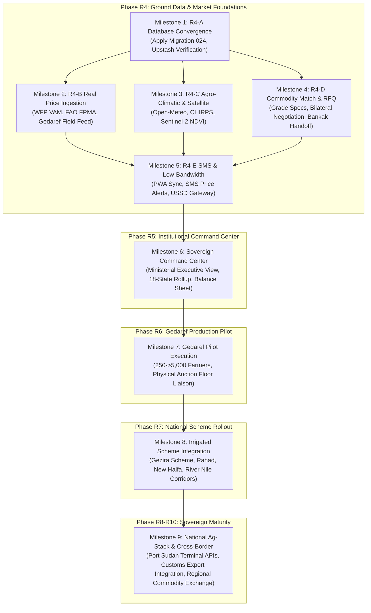

# ZARATI | زرعتي — MASTER COMPLETION ROADMAP
**Document Class:** Sovereign Infrastructure Technical & Strategic Plan  
**Target Milestone Range:** Phase R4-A through Phase R10  
**Current Production Version:** Commit `b34a73b` (Live at `https://zarati-platform.vercel.app`)  
**Database Schema Target:** Migration 024 (`20260907000024_024_r4_a_data_foundation.sql`)  
**Audience:** Technical Leadership, Engineering Directorate, Institutional Partners

---

## 1. PROGRAM OVERVIEW & CORE SOVEREIGN TENETS

ZARATI is engineered as Sudan’s sovereign agricultural intelligence and commodity market infrastructure. It bridges the structural information deficit between smallholder/mechanized producers, domestic grain aggregators, export traders, and state food security planners.

### Non-Negotiable Operational Principles
1. **The Law of Ground Truth:** Zero mock data shall ever be presented as real-time ground feeds. If data is indicative, synthetic, or estimated, it must carry clear, human-readable confidence intervals, source attribution, and method disclosures.
2. **Deterministic Security:** Authorization is anchored strictly in database-level Row-Level Security (RLS) and cryptographic session verification. Middleware is an optimization, never the sole security barrier.
3. **Resilience Under Constraint:** All mobile interfaces and data entry mechanisms must function over degraded 2G/3G networks, support intermittent Starlink connectivity, survive packet loss, and operate cleanly under high-glare field conditions.
4. **Institutional Non-Partisanship:** Presentation tone, data visualization, and reporting must reflect the rigorous sobriety of a central statistical agency or sovereign infrastructure bank, avoiding venture capital hyperbole.

---

## 2. END-TO-END DEPENDENCY GRAPH (R4-A TO R10)



---

## 3. DETAILED MILESTONE BREAKDOWN

### MILESTONE 1: R4-A REAL DATA FOUNDATION & PRODUCTION DB CONVERGENCE
* **Target Objective:** Eliminate the parity gap between local Migration 024 and production Supabase (`nelsijiczufflyqosvzi`), establishing the schema foundation for real market observations, weather feeds, and audit trails.
* **Scope & Work Packages:**
  1. **Schema Convergence:** Apply Migration `20260907000024_024_r4_a_data_foundation.sql` (701 lines) to production Supabase:
     - Establish `market_commodity_observations` table with composite index `(state_id, commodity_id, observation_date DESC)`.
     - Establish `market_bulletins` and `market_provenance_audit` log.
     - Apply strict RLS: Public read for published observations; insert/update restricted to authenticated price enumerators and administrators.
  2. **Security & Infrastructure Verification:**
     - Configure Upstash Redis production keys (`UPSTASH_REDIS_REST_URL`, `UPSTASH_REDIS_REST_TOKEN`) in Vercel environment.
     - Verify strict rate limiter fail-closed enforcement in `lib/auth/rate-limit.ts`.
     - Verify zero regression across 48 existing routes.
* **Testing & Release Gates:**
  - `pg_prove` or direct SQL verification confirming all 12 new tables, 18 indexes, and 8 triggers are active.
  - Vitest suite expanded to cover Migration 024 schema constraints and RLS isolation.
  - Zero downtime production release check.

---

### MILESTONE 2: R4-B MARKET PRICE INGESTION & PIPELINE
* **Target Objective:** Build automated pipelines for international food security telemetry (WFP, FAO, FEWS NET) paired with a ground reporter ingestion portal for domestic wholesale markets.
* **Scope & Work Packages:**
  1. **Automated Feed Ingestion:**
     - **WFP VAM & HDX Pipeline:** Bi-weekly automated sync of Sudanese market price bulletins (Sorghum, Wheat, Millet, Groundnut across 18 states).
     - **FAO FPMA Ingestion:** Monthly national benchmark price synchronization.
     - **Provenance Pipeline:** Every observation tagged with `source_type` (`UN_WFP`, `FAO_GIEWS`, `AUCTION_FLOOR`, `FIELD_ENUMERATOR`), timestamp, and confidence flag (`VERIFIED_TRANSACTION`, `WHOLESALE_BID`, `INDICATIVE_SURVEY`).
  2. **Gedaref Ground Price Reporter App:**
     - Secure, mobile-optimized daily price submission form for certified auction floor reporters at Gedaref Crop Exchange (سوق محاصيل القضارف).
     - Captures: High, Low, Weighted Average, Volume (90kg/100kg sacks), Grade (Grade 1 vs Grade 2), and Cash vs Bankak price differential.
     - Two-stage supervisor verification queue before publishing to public price boards.
* **Testing & Release Gates:**
  - Automated parser unit tests with historical WFP CSV and PDF test vectors.
  - Reporter authentication and audit trail verification (all changes logged with user ID, IP, and timestamp).
  - Outlier detection engine: Automated flag for price spikes exceeding \(\pm 25\%\) day-over-day before publish.

---

### MILESTONE 3: R4-C AGRO-CLIMATIC & SATELLITE INTEGRATION
* **Target Objective:** Replace simulated weather telemetry with real-world satellite and atmospheric observation data across Sudan's agricultural zones.
* **Scope & Work Packages:**
  1. **Atmospheric & Soil Moisture Telemetry:**
     - Ingest Open-Meteo High-Resolution Ag-Weather API (2m temperature, relative humidity, precipitation, evapotranspiration ET0, and 0-10cm soil moisture).
     - CHIRPS (Climate Hazards Center InfraRed Precipitation with Station data) integration for historical rainfall anomaly mapping in Gedaref, Gezira, Sennar, and Blue Nile.
  2. **Vegetation Health & Remote Sensing (NDVI):**
     - Sentinel-2 (Copernicus 10m resolution, 5-day revisit) and Landsat-8/9 public imagery processing via Google Earth Engine API or Sentinel Hub Open Data.
     - Compute localized NDVI (Normalized Difference Vegetation Index) and NDWI (Water Index) tiles for major crop belts.
     - Cache pre-rendered GeoTIFF/Mapbox vector tiles on Cloudflare/Vercel Edge storage for sub-second field rendering.
* **Testing & Release Gates:**
  - Fallback mechanisms for satellite latency (handling 10-day cloud cover gaps during Kharif rainy season).
  - Client-side Leaflet/MapLibre performance: 60 FPS scrolling on mobile WebViews with vector polygon overlays.

---

### MILESTONE 4: R4-D COMMODITY MARKETPLACE MATCHING & RFQ
* **Target Objective:** Transition marketplace from display-only catalog to an institutional B2B Request-for-Quote (RFQ) and bilateral trade negotiation infrastructure.
* **Scope & Work Packages:**
  1. **Sudanese Commodity Specification Engine:**
     - Standardized crop listing schema matching Sudanese export standards:
       - **Sesame:** Gedaref White (سمسم أبيض قضارف), Red Sesame, Purity %, Impurities max 1.5%, Admixture, Moisture max 6%.
       - **Sorghum (دخن / ذرة):** Feterita (فتريتة), Dabar (دبر), Wad Ahmed, Tabat (طابت) — Grade 1/2, Foreign matter %, Broken grain %.
       - **Gum Arabic (صمغ عربي):** Acacia Senegal (Hashab هشاب), Acacia Seyal (Talha طلحة), Cleaned/Hand-picked selected (HPS).
  2. **Bilateral RFQ & Deal Rooms:**
     - Verified Trader can initiate confidential RFQ on farmer listing.
     - Bid specification: Price per metric ton or bag (Jute/PP), delivery terms (Ex-Warehouse Gedaref, FOB Port Sudan, Farmgate).
     - Bilateral acceptance gate: Mutual contact reveal only upon bid agreement.
     - Settlement handoff: Generate Bank of Khartoum (Bankak بنكك) or O-Cash payment invoice reference and physical weighbridge inspection checklist.
* **Testing & Release Gates:**
  - Strict RLS isolation: Trader A cannot inspect Trader B's competing bids on a listing.
  - Cryptographic audit trail of all accepted quotes and price confirmations.

---

### MILESTONE 5: R4-E SMS & FIELD OFFLINE / USSD GATEWAY
* **Target Objective:** Deliver price and weather intelligence to smallholder farmers lacking high-speed 4G connectivity or modern smartphones.
* **Scope & Work Packages:**
  1. **PWA Offline-First Architecture:**
     - Implement Service Worker caching for core mobile views (`/farmer`, `/trader`, `/crops`, `/market-prices`).
     - Local IndexedDB storage for offline farm data entry; auto-sync when device regains connectivity (Starlink hub or town cellular coverage).
  2. **Telecom Gateway Integration (SMS / USSD):**
     - Integration with local telecom gateways (Zain Sudan, Sudani, MTN) via SMPP protocol or aggregators.
     - Weekly automated SMS broadcast of market benchmark prices to registered farmers in their specific locality and dialect.
     - Interactive USSD menu design (`*xxx#`) for simple price checks and crop availability reporting.
* **Testing & Release Gates:**
  - Zero-connectivity offline CRUD test suite verifying clean queuing and conflict-free reconciliation.
  - SMS throughput and latency benchmarks (under 60 seconds delivery latency).

---

### MILESTONE 6: R5 SOVEREIGN INSTITUTIONAL & COMMAND CENTER
* **Target Objective:** Build the high-level executive dashboard designed for the Minister of Agriculture, State Governors, and food security crisis coordinators.
* **Scope & Work Packages:**
  1. **National Food Security Command Dashboard:**
     - 18-State aggregate view: Production estimates, cultivated area (feddans), harvest progress, strategic grain reserves, deficit/surplus balance sheet.
     - Real-time commodity price disparity matrix across 6 major hubs (Gedaref, El Obeid, Sennar, Nyala, Dongola, Port Sudan).
     - Export volume pacing vs national reserve thresholds.
  2. **Multi-Agency Role-Based Data Partitions:**
     - Sovereign analytics access tier (`role = 'government'` or `'institutional'`).
     - Exportable institutional PDF/Excel situation reports with official watermarks and metadata provenance.
* **Testing & Release Gates:**
  - Multi-tenant role segregation verified via automated penetration suite.
  - Executive presentation mode: 100% responsive, high-contrast, optimized for 4K boardroom displays.

---

### MILESTONE 7: R6 GEDAREF PRODUCTION PILOT
* **Target Objective:** Execute the first physical ground pilot in Gedaref State, onboarding real producers and validating the end-to-end data pipeline.
* **Scope & Work Packages:**
  1. **Phase 1 (250 Farmers, 5 Field Reporters):** Focus on Sesame and Sorghum harvest season. Manual aggregation, daily auction floor reconciliation.
  2. **Phase 2 (1,000 Farmers, 20 Traders):** Onboard local agricultural cooperatives. Enable Bankak transaction reference tagging.
  3. **Phase 3 (5,000 Farmers):** Direct weighbridge data integration and automated state market fee compliance reporting.
* **Testing & Release Gates:**
  - Pilot KPI gate: 95%+ price reporting accuracy against physical Gedaref auction tickets; zero data corruption incidents.

---

### MILESTONES 8 TO 9: R7–R10 NATIONAL SCHEME EXPANSION & SOVEREIGN MATURITY
* **Milestone 8 (R7):** Rollout to Gezira Scheme (مشروع الجزيرة), Rahad, and River Nile wheat/vegetable belts. Irrigation canal monitoring and tenant farmer aggregation.
* **Milestone 9 (R8–R10):** Port Sudan export logistics APIs, customs integration, regional cross-border commodity exchange (interfacing with Egypt, Saudi Arabia, UAE buyers), and integration into Sudan National AgriStack.

---

## 4. MODEL ORCHESTRATION ARCHITECTURE

To optimize engineering speed, reasoning depth, and cost efficiency, the completion program utilizes a strict two-tier model orchestration protocol:

| Task Domain | Primary Model | Justification & Scope |
| :--- | :--- | :--- |
| **High-Throughput Research, Ingestion Parsers, UI Components, Translations** | **Gemini 3.8 Flash** | Fast inference, massive context window, exceptional Arabic syntax comprehension, rapid transformation of unstructured WFP/FAO reports into clean JSON. |
| **Database Migrations, RLS Security Policies, Auth Cryptography, Financial Settlement Logic** | **Gemini 3.1 Pro / Sonnet** | Deep step-by-step reasoning, zero tolerance for subtle SQL/RLS authorization bypasses, cryptographic state verification, architectural stress testing. |

---

## 5. SCOPE DISCIPLINE: WHAT ZARATI MUST NOT BUILD

Learning from the distress and post-mortem analyses of African agritech predecessors (e.g., Twiga Foods restructuring, iProcure administration, Gro Intelligence shutdown), ZARATI enforces strict scope boundaries:

1. **NO Physical Logistics Fleet Ownership:** Zarati is a software intelligence and market coordination platform. It will not purchase trucks, operate capital-heavy transport fleets, or take on fuel/depreciation risk.
2. **NO Uncollateralized Balance-Sheet Lending:** Zarati will never issue direct credit or act as a primary lender. Zarati provides telemetry, farm verification, and credit scoring data to institutional banks (e.g., Agricultural Bank of Sudan, Bank of Khartoum), which carry the balance-sheet risk.
3. **NO Speculative Inventory Holding:** Zarati will not take title to commodities or warehouse physical grain in anticipation of price inflation. All transactions are bilateral matches between verified producers and buyers.
4. **NO Consumer B2C Delivery:** Zarati strictly serves B2B commercial agriculture, cooperatives, export aggregators, and sovereign institutions. It does not deliver groceries or small retail quantities.
5. **NO Proprietary Satellite Launches:** All geospatial intelligence relies on proven open-access constellations (Copernicus Sentinel-2, Landsat-8/9, MODIS, ERA5, CHIRPS) with edge-cached processing.

---

## 6. PRODUCTION RELEASE GATES & TIMELINE OVERVIEW

```
+---------------------------------------------------------------------------------------+
| PHASE R4-A: DATABASE FOUNDATION CONVERGENCE                                           |
| Status: Code Ready (Migration 024 Committed) -> Awaiting DB Apply & Upstash Env Sync  |
+---------------------------------------------------------------------------------------+
                                           |
                                           v
+---------------------------------------------------------------------------------------+
| PHASE R4-B & R4-C: REAL INGESTION PIPELINES (WFP/FAO/SATELLITE)                       |
| Status: Architecture Frozen -> Target Implementation: Q4 2026                         |
+---------------------------------------------------------------------------------------+
                                           |
                                           v
+---------------------------------------------------------------------------------------+
| PHASE R4-D & R4-E: COMMODITY RFQ & LOW-BANDWIDTH FIELD GATEWAYS                       |
| Status: Architecture Frozen -> Target Implementation: Q1 2027                         |
+---------------------------------------------------------------------------------------+
                                           |
                                           v
+---------------------------------------------------------------------------------------+
| PHASE R5: SOVEREIGN INSTITUTIONAL COMMAND CENTER                                      |
| Status: Design Frozen -> Target Presentation: Minister Briefing Q1 2027               |
+---------------------------------------------------------------------------------------+
                                           |
                                           v
+---------------------------------------------------------------------------------------+
| PHASE R6: GEDAREF PILOT DEPLOYMENT (250 TO 5,000 PRODUCERS)                           |
| Status: Operational Plan Ready -> Launch Window: Pre-Kharif Planting Cycle 2027       |
+---------------------------------------------------------------------------------------+
```

---
*ZARATI Technical Directorate — Authoritative Completion Roadmap Frozen for Execution.*
