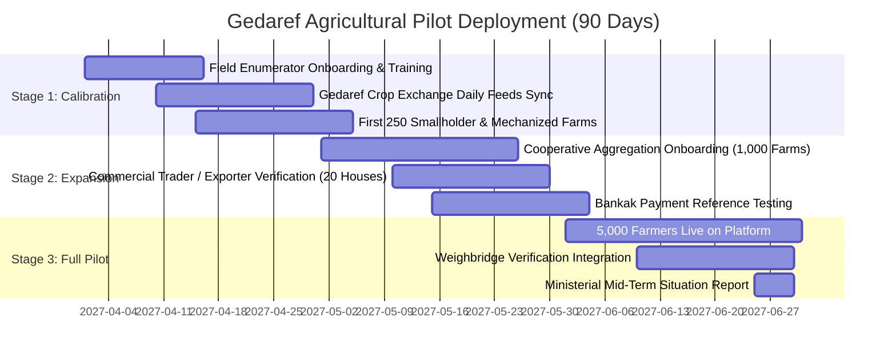

# ZARATI | زرعتي — MINISTER & PILOT READINESS PLAN
**Document Class:** Sovereign Institutional Engagement & Ground Execution Strategy  
**Target Milestone:** Ministerial Presentation & Gedaref Agricultural Pilot Deployment  
**Operational Target:** Gedaref State (ولاية القضارف)  
**Authoritative Environment:** `https://zarati-platform.vercel.app` (Commit `b34a73b`)  
**Audience:** Founder, Institutional Advisory Board, Operational Field Directors

---

## 1. INSTITUTIONAL EXECUTIVE SUMMARY & VALUE PROPOSITION

Sudan faces an unprecedented structural shock to its food supply chains and commodity export liquidity. The agricultural heartlands—specifically Gedaref, Sennar, Blue Nile, and the irrigated schemes—continue to produce millions of metric tons of sorghum, sesame, groundnuts, and millet, yet the national distribution apparatus operates in information darkness:
- **Price Asymmetry:** Producers at the farmgate are exploited by multi-tier intermediaries (the *Sheil* system) due to lack of real-time wholesale price discovery.
- **Strategic Blindness:** Sovereign ministries lack consolidated, real-time balance sheets of regional grain reserves, creating localized famine risks despite national surpluses.
- **Export Liquidity Friction:** Exporters in Port Sudan struggle to verify batch purity, origin locality, and physical aggregation volumes in Gedaref without weeks of manual inspection.

**ZARATI** delivers the sovereign digital bridge: an institutional-grade agricultural intelligence platform and B2B commodity infrastructure connecting verified producers, domestic aggregators, institutional food aid procurers (WFP/FAO), and commercial export houses.

---

## 2. THE 5-MINUTE MINISTER PITCH NARRATIVE

*Designed for delivery to the Federal Minister of Agriculture and Forestry or the Governor of Gedaref State.*

> **"معالي الوزير / سعادة الوالي: السودان لا يعاني فقط من أزمة إنتاج، بل يعاني من أزمة بيانات وسيادة رقمية زراعية."**
> *(Your Excellency: Sudan does not merely face a production crisis; it faces a crisis of agricultural data sovereignty.)*
>
> "Right now, Gedaref produces over 80% of Sudan’s export sesame and millions of bags of sorghum, yet the true wholesale floor price is locked inside physical chalkboards at the Gedaref Crop Exchange. Smallholder farmers sell at a fraction of true value, while national planners cannot track food reserves across state lines.
>
> **ZARATI (زرعتي) is Sudan's sovereign answer.**
> 1. **Institutional Ground Truth:** We do not rely on guesses or disconnected spreadsheets. ZARATI establishes daily digital price feeds directly from the Gedaref auction floor and international food security networks (WFP/FAO).
> 2. **Farmer-to-Trader Infrastructure:** We provide verified producers with instant wholesale price transparency and direct Request-for-Quote (RFQ) matching with accredited commercial buyers, eliminating predatory price gouging.
> 3. **Ministerial Command Center:** For the Ministry, ZARATI provides an executive cockpit: real-time crop balance sheets across all 18 states, monitored rainfall anomalies, satellite vegetation indices, and strategic food security reserve tracking.
>
> We do not ask the Ministry to fund heavy fleets or buy tractors. We bring the digital sovereign architecture ready today—and we propose a controlled 90-day pilot in Gedaref starting with 250 verified farmers and the Gedaref Crop Exchange to prove that Sudan’s agricultural trade can be transparent, digitized, and globally competitive."

---

## 3. THE 20-MINUTE DEEP-DIVE INTERACTIVE PRESENTATION WALKTHROUGH

This presentation utilizes the live production application (`https://zarati-platform.vercel.app`) across four synchronized hardware form factors.

```
+----------------------------------------------------------------------------------------------------+
| 20-MINUTE MINISTERIAL DEMONSTRATION PROGRESSION                                                    |
+----------------------------------------------------------------------------------------------------+
| Minutes 00-04 | Large Display : National Sovereign Landing & Sovereign Vision Trilogy              |
| Minutes 05-09 | Mobile Arabic : Smallholder Farmer Mobile Experience (RTL, 48px touch, low-data)   |
| Minutes 10-14 | Laptop        : Verified Commercial Trader B2B Deal Room & RFQ Matching            |
| Minutes 15-18 | Tablet/Screen : Ministerial 18-State Command Center & Food Balance Sheets         |
| Minutes 19-20 | Formal Close  : Presentation of Gedaref Pilot Protocol & Memorandum of Alignment   |
+----------------------------------------------------------------------------------------------------+
```

### Form Factor 1: Large Display / Projector (Boardroom Command View)
* **Target View:** `/[lang]` (Homepage) & `/[lang]/intelligence`
* **Core Interaction:**
  - Demonstrate the authoritative brand identity: Authentic Sudan Cedar/Acacia and Nile palette, verified high-resolution widescreen Hero (`Zhero`), and the official approved Zarati crest.
  - Showcase the Sovereign Vision Trilogy (`/about`, `/intelligence`, `/crops`) via the high-resolution poster lightbox modal (`1.png`, `2.png`, `3.png`).
  - Demonstrate instant bilingual switching: Show how the entire UI seamlessly mirrors layout, font hierarchy (IBM Plex Sans Arabic), and navigation direction between Arabic and English without visual glitch.

### Form Factor 2: Mobile / Smartphone (Field Farmer Experience — Arabic RTL)
* **Target View:** Hand a physical Android smartphone running Chrome on 3G/LTE to the Minister or senior technical advisor.
* **Target Route:** `/[lang]/farmer` & `/[lang]/market-prices`
* **Core Interaction:**
  - Demonstrate Arabic RTL ergonomics: Menu button anchored on the **right**, logo pinned cleanly on the **left**, thumb-friendly 48px touch targets.
  - Display the high-contrast outdoor UI: Stark dark text against clean surfaces, optimized for readable operation under intense 45°C Gedaref sun glare.
  - Walk through Farm Registration: Entering land area in **Feddans** (فدان), selecting crop varieties (e.g., *Feterita* Sorghum, Gedaref White Sesame), and checking the daily auction floor price board.

### Form Factor 3: Laptop / Workstation (Commercial Trader & Aggregator View)
* **Target View:** `/[lang]/trader` & `/[lang]/marketplace`
* **Core Interaction:**
  - Showcase the bulk commodity marketplace: Filter by state (Gedaref), crop grade (Grade 1 Sesame), bag type (100kg Jute sack), and harvest year.
  - Demonstrate the B2B RFQ engine: How a verified exporter initiates an inquiry, specifies delivery terms (Ex-Warehouse Gedaref vs FOB Port Sudan), and accesses bilateral deal confirmation without public contact spamming.
  - Present the Bankak payment invoice reference handoff and weighbridge physical quality checklist.

### Form Factor 4: Tablet / Executive Screen (Ministerial Command Center)
* **Target View:** `/[lang]/admin` (Institutional Preview Mode)
* **Core Interaction:**
  - Present the 18-State Agricultural Rollup: Cultivated area tracking, seasonal rainfall anomalies via satellite telemetry, and crop deficit/surplus balance sheets.
  - Demonstrate the Data Provenance Inspector: Every price displayed shows exactly where it originated (e.g., "Gedaref Auction Floor - Ticket #4082" or "UN WFP Market Monitor").

---

## 4. THE MINISTER DEMO TRUTH LAW

Institutional credibility is fragile and irreplaceable. To ensure absolute integrity during government presentations, all team members must adhere to the **ZARATI Demo Truth Law**:

| Data Category | Definition | Presentation Standard during Ministerial Demo |
| :--- | :--- | :--- |
| **Category 1: LIVE REAL DATA** | Production database records, verified GIS state boundaries, real crop profiles, and live application logic. | Present with pride as live platform foundation: *"This is running on our live production edge servers."* |
| **Category 2: LIVE FUNCTIONAL SYSTEM** | Working authentication state machines, Row-Level Security, rate-limiters, multilingual engines, responsive CSS. | Present as operational software architecture: *"The application logic, security isolation, and data governance are fully functional today."* |
| **Category 3: PLANNED ARCHITECTURE PREVIEW** | Market price boards and weather feeds awaiting live institutional API keys or field reporter onboarding. | **MANDATORY DISCLOSURE:** *"These specific figures represent our calibrated indicative models and historical WFP benchmarks. They demonstrate the exact structure that our ground enumerators and exchange feeds will populate upon pilot launch."* |
| **Category 4: SOVEREIGN VISION** | Advanced national export forecasting, cross-border customs clearing, automated satellite drone yield estimation. | Present as future phase milestones: *"This represents Phase R7–R10 of the sovereign roadmap, designed for subsequent nationwide rollout."* |

### Absolute Prohibitions:
- **NEVER** claim a formal agreement or MOU with the Ministry of Agriculture, Gedaref Crop Exchange, or WFP exists until signed and executed.
- **NEVER** claim test market prices are "live satellite feeds" or "real-time financial transactions."
- **NEVER** hide or dismiss technical limitations; embrace them as the exact reason why institutional cooperation is required.

---

## 5. GEDAREF PILOT OPERATIONAL ROADMAP

The pilot will take place in Gedaref State (ولاية القضارف), Sudan’s premier mechanized grain and sesame hub, spanning a 90-day operational cycle.



### Stage 1: Foundation & Ground Truth Calibration (Days 1–30)
- **Target Participants:** 250 verified farmers (mix of traditional smallholders and semi-mechanized schemes in Central Gedaref and El Fashaga localities).
- **Ground Personnel:** 5 certified Field Enumerators equipped with ruggedized Android devices.
- **Auction Floor Protocol:** Daily morning physical recording of the Gedaref Crop Exchange opening bids, closing transactions, and traded volumes for Sesame (White/Red) and Sorghum (*Feterita*, *Dabar*).
- **Output:** Publication of Sudan's first authenticated digital daily crop price index.

### Stage 2: Controlled Expansion & Commercial Matching (Days 31–60)
- **Target Participants:** 1,000 farmers aggregated through 4 local agricultural cooperatives; 20 verified wholesale traders and export houses.
- **Transaction Flow:** Initiation of bilateral Request-for-Quotes (RFQs).
- **Settlement Tracking:** Farmers and traders log Bank of Khartoum (Bankak بنكك) payment confirmation vouchers for reconciled orders.
- **Logistics Integration:** Physical quality inspection at certified aggregation points in Gedaref city.

### Stage 3: Full-Scale Commercial Pilot (Days 61–90)
- **Target Participants:** 5,000 farmers; 50,000 metric tons of grain and oilseeds registered under harvest management.
- **Physical Weighbridge Integration:** Direct digital logging of truckloads entering the Gedaref exchange silos and private storage facilities.
- **Sovereign Review:** Formal delivery of the First Gedaref Agricultural Intelligence Report to the State Governor and Federal Ministry of Agriculture.

---

## 6. INSTITUTIONAL & DATA PARTNERSHIP FRAMEWORK

To anchor ZARATI permanently in Sudan's institutional ecosystem, the following bilateral alignment tracks are established:

```
                                +-------------------------------------+
                                |      FEDERAL MINISTRY OF AGRI       |
                                |     (Policy, Mandate, Statistics)   |
                                +-------------------------------------+
                                                   |
                                                   v
+-------------------------------+      +-----------------------+      +-------------------------------+
|    GEDAREF CROP EXCHANGE      | ---> |      ZARATI PLATFORM  | <--- |   UN WFP / FAO SUDAN (VAM)    |
| (Physical Auction Floor Feeds)|      | (Digital Infrastructure)      | (Food Security Benchmarks)    |
+-------------------------------+      +-----------------------+      +-------------------------------+
                                                   |
                                                   v
                                +-------------------------------------+
                                |     BANK OF KHARTOUM (BANKAK)       |
                                |  (Digital Settlement Confirmation)  |
                                +-------------------------------------+
```

1. **Federal Ministry of Agriculture & Natural Resources:**
   - **Role:** Policy patron and institutional beneficiary of national food security telemetry.
   - **Value to Ministry:** Automated statistical rollups across 18 states without manual paperwork delay.
2. **Gedaref State Ministry of Production & Economic Resources & Gedaref Crop Exchange (سوق محاصيل القضارف):**
   - **Role:** Ground operational partner for daily auction floor price verification and local trade registry.
   - **Value to Exchange:** Modernization of physical auction infrastructure into a hybrid digital-physical exchange, increasing trading liquidity and state fee recovery.
3. **UN World Food Programme (WFP VAM) & FAO Sudan:**
   - **Role:** Data exchange partner for historical and bi-weekly market monitoring bulletins.
   - **Value to Agencies:** Granular, farmgate-level crop availability data to enhance humanitarian local grain procurement and reduce post-harvest waste.
4. **Agricultural Research Corporation (ARC - Wad Medani):**
   - **Role:** Scientific validation of crop phenology, soil nutrient models, and drought-resistant seed varietals.
5. **Bank of Khartoum (BOK) / Financial Institutions:**
   - **Role:** Settlement verification partner, enabling seamless invoice reconciliation via the ubiquitous Bankak ecosystem.

---
*ZARATI Institutional Directorate — Minister and Pilot Readiness Plan Frozen for Presentation.*
