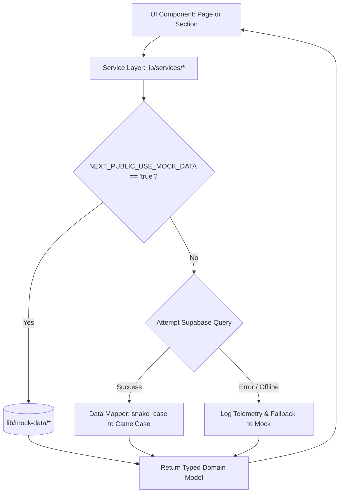

# ZARATI | زرعتي — Mock-to-Production Migration Map
**Document Version:** 1.0.0  
**Phase:** R1-A (Data Architecture & Security Planning)  
**Status:** Architecture Specification — Strictly Non-Destructive  
**Target Execution:** Phase R1-B through R4  

---

## 1. Executive Summary & Strategy

The Zarati MVP codebase currently functions on static mock data located in `lib/mock-data/` (`crops.ts`, `weather.ts`, `marketplace.ts`, `statistics.ts`). These mock data files provide immediate visual and interactive feedback across the marketing pages, crop tracker, weather intelligence, and marketplace preview.

To transition from static prototypes to an enterprise-grade, multi-role AgriTech production database on Supabase without breaking existing UI or destabilizing live builds, Zarati employs a **Dual-Mode Data Gateway Pattern**:
1. **Zero-Downtime Feature Flagging:** Every service method in `lib/services/` inspects an environment-driven feature flag (`NEXT_PUBLIC_USE_MOCK_DATA`) and runtime connection health.
2. **Deterministic Data Transformation:** Data retrieved from Supabase SQL tables is passed through typed transformation mappers (`mappers.ts`) that normalize database snake_case columns and relational foreign keys into the exact TypeScript interfaces defined in `@/types/index.ts`.
3. **Graceful Offline Fallback:** If Supabase connectivity is interrupted (a frequent occurrence given Sudanese telecom conditions), read requests automatically fall back to cached local mock data with telemetry logging rather than throwing unhandled fatal 500 errors.

---

## 2. Inventory of Existing Mock Files

| Mock File | Exported Variable | Current Size / Shape | Consumed By |
|---|---|---|---|
| `lib/mock-data/crops.ts` | `crops: Crop[]` | 8 commodities with embedded `currentPrice` and synthetic 7-day `priceHistory` | `lib/services/crop-service.ts`<br>• `app/[lang]/page.tsx`<br>• `app/[lang]/overview/page.tsx`<br>• `app/[lang]/crops/page.tsx`<br>• `components/home/crop-snapshot.tsx` |
| `lib/mock-data/marketplace.ts` | `listings: Listing[]` | 8 listings across 4 categories (`crops`, `equipment`, `seeds`, `fertilizer`) with 4 embedded sellers | `lib/services/marketplace-service.ts`<br>• `app/[lang]/page.tsx`<br>• `app/[lang]/overview/page.tsx`<br>• `components/home/marketplace-preview.tsx`<br>• Direct import in `app/[lang]/marketplace/page.tsx` |
| `lib/mock-data/weather.ts` | `weatherData: WeatherData[]` | 5 Sudanese agricultural hubs with current observations and 7-day forecast array | `lib/services/weather-service.ts`<br>• `app/[lang]/page.tsx`<br>• `app/[lang]/weather/page.tsx`<br>• `components/home/weather-snapshot.tsx` |
| `lib/mock-data/statistics.ts` | `nationalStats` | 5 national agricultural KPIs (farmers, arable land, GDP, export value, sesame rank) | `lib/mock-data/index.ts` (Presently static in dictionary files `ar.json` / `en.json`) |

---

## 3. Detailed Entity-by-Entity Migration Map

### 3.1 Crops & Market Price Index (`lib/mock-data/crops.ts`)

#### A. Current Mock Data Model
```typescript
interface Crop {
  id: string              // e.g. 'sorghum'
  name: string            // e.g. 'Sorghum'
  nameAr: string          // e.g. 'ذرة رفيعة'
  category: 'grain' | 'oilseed' | 'cash' | 'vegetable' | 'fruit'
  currentPrice: {
    id: string            // e.g. 'sorghum-price'
    name: string; nameAr: string
    price: number         // SDG e.g. 82500
    currency: 'SDG' | 'USD'
    unit: string          // 'ton'
    change: number        // 1200
    changePercent: number // 1.48
    market: string        // 'Gedaref'
    marketAr: string      // 'القضارف'
    fetchedAt: string     // ISO timestamp
  }
  priceHistory: { date: string; price: number }[] // 7-day synthetic array
}
```

#### B. Target PostgreSQL Database Mapping
- **Crop Master Records:** `public.crops`
  - `crops.code` ➔ maps to mock `id` (`'sorghum'`, `'sesame'`)
  - `crops.name_en` ➔ maps to mock `name`
  - `crops.name_ar` ➔ maps to mock `nameAr`
  - `crops.category` ➔ maps to mock `category`
- **Physical Markets:** `public.markets`
  - `markets.name_en` ➔ maps to mock `market` (`'Gedaref'`, `'El Obeid'`)
  - `markets.name_ar` ➔ maps to mock `marketAr`
  - `markets.state_id` ➔ relational link to `public.states`
- **Time-Series Price Feed:** `public.crop_prices`
  - `crop_prices.crop_id` ➔ FK referencing `crops.id`
  - `crop_prices.market_id` ➔ FK referencing `markets.id`
  - `crop_prices.price_sdg` ➔ maps to mock `price`
  - `crop_prices.currency` ➔ defaults to `'SDG'`
  - `crop_prices.price_date` ➔ historical date index
  - `crop_prices.is_official` ➔ boolean data quality flag

#### C. Data Transformation Logic (`lib/services/crop-service.ts`)
```typescript
// Query: Fetch latest price per crop joined with market and 7-day historical prices
export async function getCrops(): Promise<Crop[]> {
  if (shouldUseMockData()) {
    return mockCrops
  }

  const supabase = createClient()
  const { data: cropsData, error } = await supabase
    .from('crops')
    .select(`
      id, code, name_en, name_ar, category,
      crop_prices (
        id, price_sdg, price_usd, currency, unit, price_date, created_at,
        markets ( id, name_en, name_ar )
      )
    `)
    .order('sort_order', { ascending: true })

  if (error || !cropsData) {
    console.error('Failed to fetch crops from Supabase, falling back to mock:', error)
    return mockCrops
  }

  return cropsData.map(mapDbCropToModel)
}

function mapDbCropToModel(record: DbCropWithPrices): Crop {
  const sortedPrices = record.crop_prices.sort(
    (a, b) => new Date(b.price_date).getTime() - new Date(a.price_date).getTime()
  )
  const latest = sortedPrices[0]
  const previous = sortedPrices[1]

  const change = previous ? latest.price_sdg - previous.price_sdg : 0
  const changePercent = previous && previous.price_sdg > 0
    ? Number(((change / previous.price_sdg) * 100).toFixed(2))
    : 0

  return {
    id: record.code,
    name: record.name_en,
    nameAr: record.name_ar,
    category: record.category as CropCategory,
    currentPrice: {
      id: latest.id,
      name: record.name_en,
      nameAr: record.name_ar,
      price: latest.price_sdg,
      currency: latest.currency,
      unit: latest.unit,
      change,
      changePercent,
      market: latest.markets?.name_en ?? 'National',
      marketAr: latest.markets?.name_ar ?? 'القومي',
      fetchedAt: latest.created_at,
    },
    priceHistory: sortedPrices.slice(0, 7).reverse().map(p => ({
      date: p.price_date,
      price: p.price_sdg,
    })),
  }
}
```

---

### 3.2 Marketplace Listings (`lib/mock-data/marketplace.ts`)

#### A. Current Mock Data Model
```typescript
interface Listing {
  id: string              // e.g. 'lst-001'
  title: string           // English title
  titleAr: string         // Arabic title
  description: string
  descriptionAr: string
  category: 'crops' | 'equipment' | 'seeds' | 'fertilizer'
  price: number
  currency: 'SDG' | 'USD'
  unit: string            // 'ton', 'day', 'unit', 'bag (50kg)'
  quantity: number
  location: string        // e.g. 'Gedaref'
  locationAr: string      // e.g. 'القضارف'
  seller: {
    id: string            // e.g. 'sel-001'
    name: string
    nameAr: string
    rating: number
    phone: string         // e.g. '+249912345678'
  }
  images: string[]
  status: 'active' | 'sold' | 'inactive'
  createdAt: string
}
```

#### B. Target PostgreSQL Database Mapping
- **Listings Table:** `public.listings`
  - `listings.id` ➔ UUID primary key (replaces `'lst-001'`)
  - `listings.title_en` ➔ maps to `title`
  - `listings.title_ar` ➔ maps to `titleAr`
  - `listings.description_en` ➔ maps to `description`
  - `listings.description_ar` ➔ maps to `descriptionAr`
  - `listings.category` ➔ `TEXT CHECK (category IN ('crops', 'equipment', 'seeds', 'fertilizer'))`
  - `listings.price` ➔ `NUMERIC(14,2)`
  - `listings.currency` ➔ defaults to `'SDG'`
  - `listings.unit` ➔ `TEXT`
  - `listings.quantity` ➔ `NUMERIC(12,2)`
  - `listings.state_id` ➔ FK to `states.id` (relational location)
  - `listings.status` ➔ `TEXT CHECK (status IN ('active', 'pending_review', 'paused', 'sold', 'expired', 'archived'))`
  - `listings.created_at` ➔ timestamp
- **Seller Profiles:** `public.profiles` & `public.trader_profiles`
  - `seller.id` ➔ `profiles.id` (authenticated UUID)
  - `seller.name` ➔ `profiles.full_name`
  - `seller.nameAr` ➔ `profiles.full_name_ar`
  - `seller.rating` ➔ `trader_profiles.rating` / `profiles.rating`
  - `seller.phone` ➔ `profiles.phone` (**CRITICAL PRIVACY SAFEGUARD**: Phone numbers are NOT exposed on public marketplace queries. Public queries access the `marketplace_seller_public` view or omit phone until an inquiry is mutually accepted).
- **Listing Images:** `public.listing_media`
  - Stored in Supabase Storage bucket `listing-images`, referenced via `listing_media.storage_path`.

#### C. Data Transformation Logic (`lib/services/marketplace-service.ts`)
```typescript
export async function getListings(category?: ListingCategory): Promise<Listing[]> {
  if (shouldUseMockData()) {
    const active = mockListings.filter((l) => l.status === 'active')
    return category && category !== 'all'
      ? active.filter((l) => l.category === category)
      : active
  }

  const supabase = createClient()
  let query = supabase
    .from('listings')
    .select(`
      id, title_en, title_ar, description_en, description_ar,
      category, price, currency, unit, quantity, status, created_at,
      states ( name_en, name_ar ),
      profiles:user_id (
        id, full_name, full_name_ar, rating
      ),
      listing_media ( storage_path, sort_order )
    `)
    .eq('status', 'active')
    .order('created_at', { ascending: false })

  if (category && category !== 'all') {
    query = query.eq('category', category)
  }

  const { data, error } = await query
  if (error || !data) {
    console.error('Failed to fetch listings from Supabase, falling back to mock:', error)
    return mockListings.filter((l) => l.status === 'active')
  }

  return data.map(mapDbListingToModel)
}
```

#### D. Component Fix Required in Phase R1-B
- `app/[lang]/marketplace/page.tsx` currently imports `listings` directly from `@/lib/mock-data` (Line 10).
- In Phase R1-B, this component must be updated to import `getListings` from `@/lib/services/marketplace-service` to respect the data gateway.

---

### 3.3 Weather Intelligence (`lib/mock-data/weather.ts`)

#### A. Current Mock Data Model
```typescript
interface WeatherData {
  city: string            // 'Khartoum', 'Gedaref', 'Port Sudan'
  cityAr: string          // 'الخرطوم', 'القضارف', 'بورتسودان'
  temp: number            // Celsius e.g. 41
  feelsLike: number
  humidity: number        // percentage
  windSpeed: number       // km/h
  condition: 'sunny' | 'partly-cloudy' | 'rainy' | 'dusty'
  fetchedAt: string       // ISO timestamp
  forecast: WeatherForecast[] // 7-day array
}
```

#### B. Architecture Reality & Transition Path
- **Nature of Data:** Weather data is **external ephemeral API data**, NOT user-generated database data.
- **Production Architecture:**
  - In MVP Phase R1: Retain `lib/mock-data/weather.ts` as the primary offline provider.
  - In Phase R3 (Integrations): Deploy a server-side Next.js route handler / cron worker (`app/api/weather/sync/route.ts`) that fetches live weather from OpenWeatherMap or Tomorrow.io for the 5 Sudanese coordinates, caches the result in Supabase table `weather_cache` (or Vercel KV / Edge Cache with a 1-hour TTL), and serves it via `lib/services/weather-service.ts`.
- **Database Schema (Planned for Phase R3, NOT MVP R1):**
  ```sql
  CREATE TABLE IF NOT EXISTS public.weather_cache (
    city_code TEXT PRIMARY KEY,
    state_id UUID REFERENCES public.states(id),
    temp_c NUMERIC(4,1) NOT NULL,
    feels_like_c NUMERIC(4,1),
    humidity_pct SMALLINT,
    wind_speed_kmh NUMERIC(5,1),
    condition TEXT NOT NULL,
    forecast JSONB NOT NULL,
    updated_at TIMESTAMPTZ NOT NULL DEFAULT NOW()
  );
  ```

---

### 3.4 National Agricultural Statistics (`lib/mock-data/statistics.ts`)

#### A. Current Mock Data Model
```typescript
export const nationalStats = {
  totalFarmers: 15_000_000,
  arableLandHectares: 45_000_000,
  gdpContributionPercent: 35,
  annualExportValueUSD: 2_800_000_000,
  sesameExportRank: 1,
}
```

#### B. Current Codebase Truth
- These 5 KPIs are currently hardcoded directly into the i18n dictionaries (`lib/i18n/dictionaries/ar.json` and `en.json`) and consumed by `components/home/stats-section.tsx`.
- The export in `lib/mock-data/statistics.ts` is an unconsumed reference artifact.

#### C. Production Path (Phase R4: Analytics & Institutional Dashboards)
- National macro KPIs will remain in dictionary files for static landing page speed.
- Dynamic platform-level statistics (e.g., *Total Feddans Registered*, *Active Listings Value*, *Monthly Market Volume in SDG*) will be computed via PostgreSQL materialized views (`mv_platform_analytics`) refreshed hourly and exposed to Institutional/Government portals.

---

## 4. Dual-Mode Service Gateway Implementation Pattern

To achieve a clean separation between data fetching, environment flags, and component rendering, all services will follow this standard architectural pattern:



### Gateway Utility (`lib/services/gateway-config.ts` — to be added in R1-B)
```typescript
export function shouldUseMockData(): boolean {
  // If explicitly forced by environment variable
  if (process.env.NEXT_PUBLIC_USE_MOCK_DATA === 'true') {
    return true
  }
  // If Supabase environment credentials are not configured
  if (!process.env.NEXT_PUBLIC_SUPABASE_URL || !process.env.NEXT_PUBLIC_SUPABASE_ANON_KEY) {
    return true
  }
  return false
}
```

---

## 5. UI Component Inventory & Cutover Checklist

| Component File | Currently Imported From | R1-B Target Service Function | Breaking Changes Risk |
|---|---|---|---|
| `app/[lang]/page.tsx` | `@/lib/services/crop-service`<br>`@/lib/services/marketplace-service`<br>`@/lib/services/weather-service` | `getTopCrops()`<br>`getFeaturedListings()`<br>`getAllCitiesWeather()` | **Zero** — Already uses service abstraction |
| `app/[lang]/overview/page.tsx` | `@/lib/services/crop-service`<br>`@/lib/services/marketplace-service` | `getTopCrops()`<br>`getListings()` | **Zero** — Already uses service abstraction |
| `app/[lang]/crops/page.tsx` | `@/lib/services/crop-service` | `getCrops()` | **Zero** — Already uses service abstraction |
| `app/[lang]/weather/page.tsx` | `@/lib/services/weather-service` | `getAllCitiesWeather()` | **Zero** — Already uses service abstraction |
| `app/[lang]/marketplace/page.tsx` | `@/lib/mock-data` (Direct) | `@/lib/services/marketplace-service` `getListings()` | **Low** — Needs import swap from direct mock to service call in R1-B |
| `components/home/crop-snapshot.tsx` | Receives via props from page | Props contract preserved (`Crop[]`) | **Zero** — Pure presentational |
| `components/home/marketplace-preview.tsx` | Receives via props from page | Props contract preserved (`Listing[]`) | **Zero** — Pure presentational |
| `components/home/weather-snapshot.tsx` | Receives via props from page | Props contract preserved (`WeatherData[]`) | **Zero** — Pure presentational |

---

## 6. Testing & Regression Avoidance Strategy

1. **Vitest Unit Test Suite Parity:**
   - Existing tests (`__tests__/lib/services/crop-service.test.ts`, `marketplace-service.test.ts`, `weather-service.test.ts`) currently test mock return values.
   - In Phase R1-B, test files will be updated with Vitest mocking (`vi.mock('@/lib/supabase/client')`) to test both branches:
     - Branch 1: `USE_MOCK=true` returns identical mock shapes.
     - Branch 2: Supabase query success returns mapped schema shapes.
     - Branch 3: Supabase query failure falls back cleanly without crashing.
2. **TypeScript Compilation Guarantee:**
   - `npm run type-check` / `npm run build` must continue to pass with 0 errors at every transition milestone.
   - The TypeScript interfaces in `@/types/index.ts` remain the immutable domain contract for the frontend.
3. **Automated ESLint Guard:**
   - Add ESLint rule preventing direct imports of `@/lib/mock-data` outside of `lib/services/` and `__tests__/`.

---

## 7. Migration Phasing & Roadmap

```
┌────────────────────────────────────────────────────────────────────────┐
│ Phase R1-A: ARCHITECTURE COMPLETE (Current Milestone)                   │
│ • Schema specification, RLS matrix, migration sequence, mock map      │
│ • STRICTLY READ-ONLY & NON-DESTRUCTIVE                                 │
└──────────────────────────────────┬─────────────────────────────────────┘
                                   │ (Founder Approval Required)
                                   ▼
┌────────────────────────────────────────────────────────────────────────┐
│ Phase R1-B: SUPABASE LOCAL SETUP & SCHEMA APPLICATION                  │
│ • Execute migrations 001–017 on Supabase Local Development             │
│ • Run Reference Seed (`016_seed_reference.sql`)                        │
│ • Verify table structures, constraints, and RLS policies via SQL CLI   │
└──────────────────────────────────┬─────────────────────────────────────┘
                                   │
                                   ▼
┌────────────────────────────────────────────────────────────────────────┐
│ Phase R1-C: GATEWAY SERVICES & MAPPERS                                 │
│ • Introduce `shouldUseMockData()` switch                               │
│ • Implement Supabase client mappers in `lib/services/`                 │
│ • Refactor `marketplace/page.tsx` to consume service                   │
│ • Seed Demo Data matching current mock items (`017_seed_mock_parity`)  │
└──────────────────────────────────┬─────────────────────────────────────┘
                                   │
                                   ▼
┌────────────────────────────────────────────────────────────────────────┐
│ Phase R2+: AUTHENTICATION & FULL CRUD                                  │
│ • Farmer onboarding, Farm & Crop registration                          │
│ • Trader marketplace inquiry submission & management                   │
│ • Admin moderation panel                                               │
└────────────────────────────────────────────────────────────────────────┘
```
