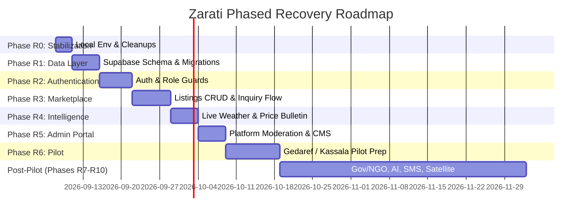

# ZARATI | زرعتي — Production MVP Definition & Recovery Roadmap
**Date:** September 4, 2026  
**Auditor / Architect:** Gemini 3.8 Flash (via Antigravity Pairing Assistant)  
**Project Path:** `C:\Users\mcreg\Desktop\zarati`  
**Classification:** STRATEGIC ENGINEERING ROADMAP

---

## Part 1: Minimal Viable Product (MVP) Definition

To bring Zarati from a high-fidelity visual prototype to a functional, pilot-ready platform without over-engineering or getting derailed by future concepts, the MVP is strictly bounded to four operational stakeholder roles:

```
                  ┌──────────────────────────────────────────────┐
                  │              ZARATI PRODUCTION MVP           │
                  └──────────────────────────────────────────────┘
                                         │
        ┌──────────────────┬─────────────┴────────────┬──────────────────┐
        ▼                  ▼                          ▼                  ▼
   [ PUBLIC ]         [ FARMER ]                 [ TRADER ]          [ ADMIN ]
 ──────────────     ──────────────             ──────────────      ──────────────
 • Home Page        • Phone/Email Auth         • Phone/Email Auth  • Password/Role Auth
 • About & Contact  • Farmer Profile           • Trader Profile    • User Directory
 • Weather View     • View Live Prices         • Search Catalog    • Listing Moderation
 • Crop Price Index • View Local Weather       • Filter by State   • Daily Price Entry
 • Public Market    • Create Listing (Crop/Qty)• Contact Farmer    • Waitlist Leads
 • Legal Pages      • Manage Own Listings      • Track Inquiries   • Basic Analytics
```

### Explicitly Excluded from MVP (Non-Goals)
- No in-app financial transactions or mobile money checkout (cash/bank transfer on delivery is standard in Sudan).
- No automated satellite NDVI analysis.
- No physical trucking or freight tracking.
- No cross-border export customs automation.
- No multi-turn AI chatbot (marketing preview card retained).

---

## Part 2: Phased Recovery Roadmap



---

### Phase R0 — Stabilization & Local Environment Parity
**Objective:** Eliminate development friction, establish local database parity, and resolve low-hanging technical debt.
- **Tasks:**
  1. Create `.env.local` template with development Supabase credentials and Resend test keys.
  2. Remove global interaction kill switch `* { transition: none; }` from `app/globals.css` to restore smooth UI transitions.
  3. Prune obsolete assets: delete `product-vision-deck.html` (v1), `public/maps/sudan-outline.svg`, and unused raster logos.
  4. Fix sitemap (`app/sitemap.ts`) to include `/crops`, `/overview`, and `/login`.
  5. Harmonize Arabic spelling of Port Sudan (`بورتسودان`) across `weather.ts` and `SudanMap.tsx`.
- **Deliverable:** Fully functional local dev environment with green lint and tests.

---

### Phase R1 — Production Data Layer & Relational Schema
**Objective:** Replace in-memory mock files with real PostgreSQL tables in Supabase.
- **Database Schema:**
  ```sql
  -- Core profiles table (extends Supabase auth.users)
  CREATE TABLE profiles (
    id UUID PRIMARY KEY REFERENCES auth.users(id) ON DELETE CASCADE,
    name TEXT NOT NULL,
    phone TEXT NOT NULL UNIQUE,
    role TEXT NOT NULL CHECK (role IN ('farmer', 'trader', 'admin')),
    state TEXT NOT NULL,
    locality TEXT,
    farm_size_hectares NUMERIC,
    created_at TIMESTAMPTZ DEFAULT now()
  );

  -- Commodity prices table
  CREATE TABLE crop_prices (
    id UUID PRIMARY KEY DEFAULT gen_random_uuid(),
    crop_id TEXT NOT NULL,
    crop_name_ar TEXT NOT NULL,
    crop_name_en TEXT NOT NULL,
    category TEXT NOT NULL CHECK (category IN ('grain', 'oilseed', 'cash')),
    market TEXT NOT NULL,
    market_ar TEXT NOT NULL,
    price_sdg NUMERIC NOT NULL,
    unit TEXT NOT NULL DEFAULT 'ton',
    change_sdg NUMERIC DEFAULT 0,
    change_percent NUMERIC DEFAULT 0,
    recorded_at TIMESTAMPTZ DEFAULT now()
  );

  -- Marketplace listings
  CREATE TABLE listings (
    id UUID PRIMARY KEY DEFAULT gen_random_uuid(),
    user_id UUID NOT NULL REFERENCES profiles(id) ON DELETE CASCADE,
    title_ar TEXT NOT NULL,
    title_en TEXT NOT NULL,
    description_ar TEXT,
    description_en TEXT,
    category TEXT NOT NULL CHECK (category IN ('crops', 'equipment', 'seeds', 'fertilizer')),
    price_sdg NUMERIC NOT NULL,
    unit TEXT NOT NULL,
    quantity NUMERIC NOT NULL,
    state TEXT NOT NULL,
    state_ar TEXT NOT NULL,
    status TEXT NOT NULL DEFAULT 'active' CHECK (status IN ('active', 'pending', 'sold', 'closed')),
    created_at TIMESTAMPTZ DEFAULT now()
  );

  -- Trader inquiries
  CREATE TABLE inquiries (
    id UUID PRIMARY KEY DEFAULT gen_random_uuid(),
    listing_id UUID NOT NULL REFERENCES listings(id) ON DELETE CASCADE,
    sender_id UUID REFERENCES profiles(id),
    sender_name TEXT NOT NULL,
    sender_phone TEXT NOT NULL,
    message TEXT NOT NULL,
    status TEXT NOT NULL DEFAULT 'unread' CHECK (status IN ('unread', 'read', 'contacted')),
    created_at TIMESTAMPTZ DEFAULT now()
  );
  ```
- **Deliverable:** Migration script executed in Supabase with basic RLS security policies enabled.

---

### Phase R2 — Authentication & Multi-Role Authorization
**Objective:** Replace placeholder login with secure, multi-role user authentication.
- **Tasks:**
  1. Implement Supabase Auth email/password and phone OTP client.
  2. Build live `/[lang]/login` page with role redirect logic.
  3. Expand `/[lang]/register` from a waitlist lead form into a true 2-step onboarding wizard:
     - Step 1: Role selection (Farmer / Trader).
     - Step 2: Profile details (Full Name, Phone Number, State, Locality, Farm Size if farmer).
  4. Activate `ROLE_PERMISSIONS` and update `proxy.ts` to guard protected routes (`/[lang]/overview` for Farmers/Traders; `/admin` for Admins).
  5. Add session sign-out button in Header and Dashboard.
- **Deliverable:** Functional account creation, login, and profile loading for Farmers and Traders.

---

### Phase R3 — Marketplace MVP (Real Listings & Trader Contact)
**Objective:** Transform the read-only catalog into a live marketplace.
- **Tasks:**
  1. Build "Create Listing" form in Farmer Dashboard with category selection, quantity, price in SDG, state selector, and crop type.
  2. Implement server action `createListing()` storing records in Supabase `listings`.
  3. Update `marketplace/page.tsx` to fetch active listings dynamically from Supabase.
  4. Implement state/location filter alongside existing category filter.
  5. Connect the "Contact" button: clicking opens an inquiry modal where a trader submits their phone and inquiry note.
  6. Store inquiry in `inquiries` table and trigger an immediate notification (Resend email or SMS).
  7. Farmer Dashboard displays actual inquiries received on their active listings.
- **Deliverable:** An end-to-end listing lifecycle: Farmer creates listing → Trader discovers listing → Trader submits inquiry → Farmer receives lead.

---

### Phase R4 — Live Market Prices & Weather Ingestion
**Objective:** Provide real, trustworthy agricultural intelligence for Sudan's farming regions.
- **Tasks:**
  1. **Weather Ingestion:** Connect Open-Meteo API (free, reliable, no API key required, highly accurate for Africa). Query coordinates for Khartoum, Gedaref, Kassala, Port Sudan, El Obeid, and Wad Madani. Cache forecasts in Next.js for 3 hours.
  2. **Price Bulletin Management:** Build an authenticated Admin Price Bulletin input screen. Enables a Zarati market enumerator in Gedaref or Kassala to enter daily spot prices for Sorghum, Sesame, Wheat, and Groundnuts in 2 minutes.
  3. Display "Updated Today" indicator with market location badges on the public `/crops` page.
- **Deliverable:** Accurate daily weather intelligence and verified Sudanese commodity market prices.

---

### Phase R5 — Admin Platform Portal & Content Moderation
**Objective:** Give the Zarati operations team complete administrative command of the platform.
- **Tasks:**
  1. Expand `/admin` beyond the waitlist into a full administrative console:
     - **Tab 1: Waitlist & Pre-registrations** (existing).
     - **Tab 2: Marketplace Moderation** (review newly submitted listings, approve, flag, or remove).
     - **Tab 3: Daily Price Bulletin** (input today's commodity prices per state).
     - **Tab 4: User Directory** (view registered farmers and traders, verify phone numbers).
  2. Add sliding-window rate limiting on all public actions (`adminLogin`, `submitWaitlist`, `createListing`, `sendInquiry`).
  3. Add honeypot bot protection to registration and inquiry forms.
- **Deliverable:** Fully secured, operational backend console for market operations.

---

### Phase R6 — Pilot Readiness & Field Hardening (Gedaref / Kassala / Red Sea)
**Objective:** Prepare the platform for real-world deployment in the three target rollout states.
- **Tasks:**
  1. Conduct field usability review on low-bandwidth 3G mobile connections (MTN / Sudani / Zain networks).
  2. Audit mobile viewports (360px–414px) for all forms and tables.
  3. Translate all remaining hardcoded strings in `marketplace/page.tsx` and `crops/page.tsx` into Sudanese Arabic idioms.
  4. Configure production domain `zarati.sd` with SSL and Cloudflare CDN caching.
  5. Run end-to-end integration tests on live Supabase staging database.
- **Deliverable:** Robust, production-grade Zarati MVP ready for field onboarding with initial farmer cooperatives in Gedaref.

---

## Part 3: Post-Pilot Horizon (Phases R7 – R10)

| Phase | Strategic Objective | Key Deliverables |
|---|---|---|
| **Phase R7: Institutional Analytics** | Government & NGO portals | Food security dashboards, state production aggregation, ODK/Excel export for aid agencies. |
| **Phase R8: AI Agronomy Advisor** | Intelligent farm advice | Google Gemini API integration with prompt grounding on Sudanese crop calendars, pest diagnostics, and local soil conditions. |
| **Phase R9: SMS & Offline Gateway** | Inclusion for feature phones | Africa's Talking / telco SMS gateway for offline price broadcast bulletins and USSD harvest registration. |
| **Phase R10: Satellite NDVI Monitoring** | Space-based vegetation health | Sentinel-2 / Copernicus open data integration for field vegetation health tracking and drought early warning. |

---

## Immediate Next Steps for Engineering

1. **Obtain User Approval** on this audit, gap analysis, and recovery roadmap.
2. **Execute Phase R0 (Stabilization):**
   - Create local `.env.local` template.
   - Remove `* { transition: none; }` to restore UI smoothness.
   - Update sitemap.
   - Clean up dead assets.
3. **Execute Phase R1 (Database Migration):**
   - Provision Supabase schema for `profiles`, `crops`, `crop_prices`, `listings`, `inquiries`.
