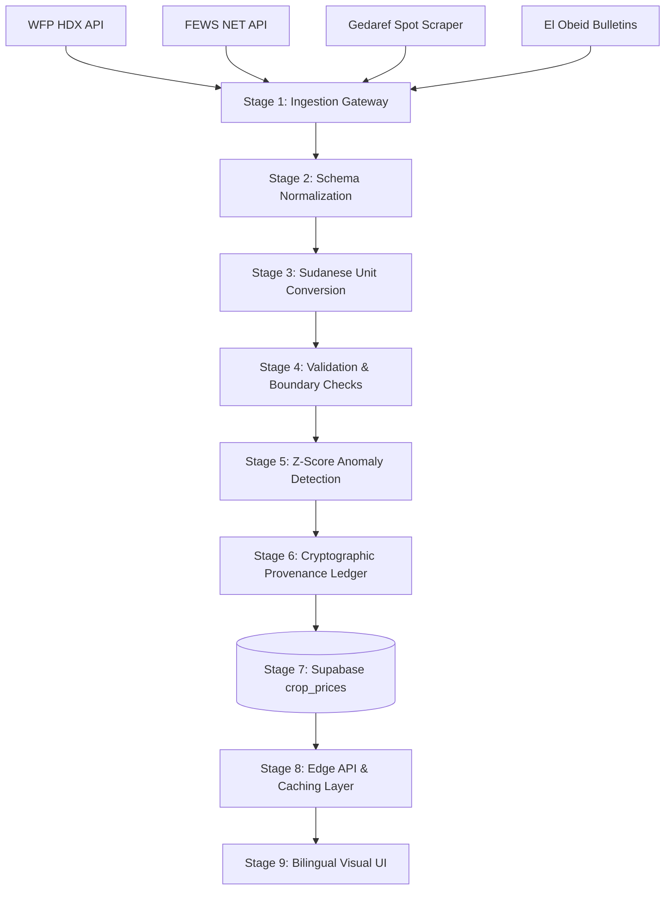

# Sudan Agricultural Market Price Intelligence & Ingestion Engine
**Document Ref:** 02_SUDAN_MARKET_PRICE_SOURCES.md  
**Classification:** Market Price Intelligence & Feed Engineering  
**Geographic Scope:** Gedaref, El Obeid, Port Sudan, Sennar, Kassala, Khartoum  
**Date Context:** September 2026  
**Author:** Zarati Master Research Program  

---

## 1. Inventory of Credible Price Sources

The following table documents every empirical price feed available for Sudanese agricultural commodities, detailing automated access feasibility, data formats, and latency.

| Source Name | Operating Entity | Primary Data Endpoints | Frequency & Latency | Data Format | Licensing | Ingestion Feasibility | Key Commodities Tracked |
|---|---|---|---|---|---|---|---|
| **WFP HDX Sudan Food Prices** | UN World Food Programme (WFP) | **CKAN API:** `https://data.humdata.org/api/3/action/package_show?id=wfp-food-prices-for-sudan`<br>**Direct CSV:** `https://data.humdata.org/dataset/369e003b-f0af-4e48-99d7-34fc85b44635/resource/8fea18b2-615f-4af5-9bd5-85cc31a25ffd/download/wfp_food_prices_sdn.csv` | Monthly<br>(3–5 weeks lag) | CSV, CKAN REST JSON | CC BY-IGO (Open Public) | **VERY HIGH** | Sorghum (Feterita), Millet, Wheat, Groundnuts, Sesame, Sugar, Fuel, Wage Rates |
| **FEWS NET Data Warehouse (FDW)** | USAID / Famine Early Warning Systems Network | **REST API:** `https://fdw.fews.net/api/marketpricefacts/?country=Sudan`<br>**Product Specs:** `https://fdw.fews.net/api/marketproduct/`<br>**Explorer:** `https://fews.net/data` | Monthly<br>(2–4 weeks lag) | REST JSON, CSV | Open Public Access (Free Auth Token) | **VERY HIGH** | Sorghum, Millet, Wheat, Mixed Livestock, Terms of Trade (Goat-to-Cereal) |
| **WFP VAM Economic Explorer** | WFP Vulnerability Analysis and Mapping | **DataViz:** `https://dataviz.vam.wfp.org/economic_explorer/prices`<br>**API Contact:** `wfp.economicanalysis@wfp.org` | Monthly<br>(3–4 weeks lag) | JSON, CSV | UN Restricted (Dev Token) | **HIGH** | Consumer Price Index, Standard Food Basket Cost, Cereal Deficit Ratios |
| **FAO FPMA (GIEWS)** | Food and Agriculture Organization (UN) | **Public Portal:** `https://fpma.fao.org/`<br>**GIEWS Tool:** `https://www.fao.org/giews/food-prices/tool/public/` | Monthly<br>(4–6 weeks lag) | HTML, CSV Mirror | CC BY-NC-SA 3.0 IGO | **MEDIUM** | Domestic wholesale/retail grains, import parity prices |
| **Gedaref Crop Exchange (سوق القضارف)** | Gedaref State Agricultural Market Authority | **Official News:** SUNA News Agency (`https://suna-sd.net/`)<br>**Broadcast:** Gedaref State TV/Radio Daily Auction Sheet | Daily<br>(Same-day to 24h) | Unstructured Arabic Text / Image Sheets | Public Spot Auctions | **MEDIUM** (Requires NLP parser) | White Sesame (Qintar), Sorghum Feterita/Dabar (Ardeb), Millet, Sunflower |
| **El Obeid Crop Exchange (بورصة الأبيض)** | North Kordofan Crops Market Administration | **Local Reports:** Sheikan Locality Bulletins / Kordofan Trading Network | Daily to 3x/week<br>(24–48h) | Unstructured Arabic Text | Public Spot Auctions | **MEDIUM-LOW** (Requires text scraper) | Gum Arabic Hashab/Talha (Qintar), Red Sesame, Shelled Groundnuts, Karkadeh |
| **Port Sudan Export Wholesale** | Red Sea Chamber of Commerce / Marine Exporters | **Port Terminal:** Port Sudan Export Quarantine & Custom Terminal | Daily / Weekly<br>(24–72h) | Commercial Invoices, Shipping Manifests | Commercial / Syndicate | **LOW-MEDIUM** | FOB Export Prices ($ USD / MT): Sesame, Gum Arabic, Cotton, Chickpeas |

---

## 2. Actual Market Clearing Prices (Empirical August/September 2026 Spot Benchmark)

*Note on Hyperinflation & Devaluation:* The Sudanese Pound (SDG) depreciated from ~600 SDG/USD in April 2023 to **~2,600 – 3,300 SDG/USD** on parallel markets by late 2026. Nominal SDG prices have adjusted accordingly.

```
+---------------------------------------------------------------------------------------------------+
| PHYSICAL MARKET CLEARING PRICES (RECORDED AUGUST 30 – SEPTEMBER 3, 2026)                          |
+----------------------+--------------------+--------------------+----------------------------------+
| Commodity            | Physical Market    | Local Quoted Unit  | Converted Metric Price           |
+----------------------+--------------------+--------------------+----------------------------------+
| Sorghum (Feterita)   | Gedaref Exchange   | 450,000 SDG /      | 2,272,000 SDG / Metric Ton       |
|                      |                    | Ardeb (198 kg)     | (~$688 – $870 USD / MT)          |
+----------------------+--------------------+--------------------+----------------------------------+
| Sorghum (Dabar)      | Gedaref Exchange   | 415,000 SDG /      | 2,095,000 SDG / Metric Ton       |
|                      |                    | Ardeb (198 kg)     |                                  |
+----------------------+--------------------+--------------------+----------------------------------+
| Pearl Millet         | El Obeid Exchange  | 900,000 SDG /      | 4,545,000 SDG / Metric Ton       |
| (Yellow Dukhn)       |                    | Ardeb (198 kg)     | (~$1,377 – $1,740 USD / MT)      |
+----------------------+--------------------+--------------------+----------------------------------+
| White Sesame         | Gedaref Exchange   | 400,000 SDG /      | 8,900,000 SDG / Metric Ton       |
| (Grade A Export)     |                    | Qintar (44.93 kg)  | (~$2,696 – $3,420 USD / MT)      |
+----------------------+--------------------+--------------------+----------------------------------+
| Red Sesame           | El Obeid Exchange  | 370,000 SDG /      | 8,235,000 SDG / Metric Ton       |
| (Crushing Grade)     |                    | Qintar (44.93 kg)  |                                  |
+----------------------+--------------------+--------------------+----------------------------------+
| Shelled Groundnuts   | El Obeid Exchange  | Spot Ton Lot       | 11,500,000 SDG / Metric Ton      |
| (مقشور)              |                    |                    | (~$3,480 – $4,420 USD / MT)      |
+----------------------+--------------------+--------------------+----------------------------------+
| Gum Arabic (Hashab)  | El Obeid Exchange  | 1,100,000 SDG /    | 24,480,000 SDG / Metric Ton      |
| (Grade 1 Cleaned)    |                    | Qintar (44.93 kg)  | (~$7,418 – $9,400 USD / MT)      |
+----------------------+--------------------+--------------------+----------------------------------+
| Winter Wheat         | River Nile / Halfa | 240,000 SDG /      | 2,666,000 SDG / Metric Ton       |
|                      |                    | 90 kg Sack         | (~$807 – $1,025 USD / MT)        |
+----------------------+--------------------+--------------------+----------------------------------+
```

---

## 3. Architecture: Zarati Market Price Ingestion Engine

To ingest, normalize, and display verified prices while protecting integrity, Zarati deploys an automated 9-stage pipeline:



### Stage Breakdown:
1. **Source Ingestion:** Automated GitHub Actions / Vercel Cron worker triggers hourly and daily fetchers.
2. **Schema Normalization:** Maps diverse external payloads into standard JSON entities: `{ market_code, crop_code, raw_price, raw_unit, currency, observation_date, source_id }`.
3. **Sudanese Unit Conversion:** Converts regional customary measurements into standard Metric Tons:
   - $1 \text{ Ardeb (Grains)} \approx 198 \text{ kg} = 0.198 \text{ MT}$
   - $1 \text{ Qintar (Sesame/Cotton)} \approx 100 \text{ Rotl} \approx 44.93 \text{ kg} = 0.04493 \text{ MT}$
   - $1 \text{ Sack (Wheat/Fava)} \approx 90 \text{ kg} = 0.090 \text{ MT}$
4. **Validation:** Rejects nulls, negative prices, dates in the future, or unmapped crop IDs.
5. **Anomaly Detection:** Flags price updates deviating $>30\%$ from the 7-day rolling median for manual administrative audit (`source = 'admin_override'`).
6. **Provenance Tracking:** Every record stores `source`, `source_url`, `observation_timestamp`, and `is_official`.
7. **Database Persistence:** Writes directly to `public.crop_prices` protected by RLS (Admin-only mutation).
8. **Edge Caching:** Next.js Route Handler (`/api/prices`) caches results with 1-hour TTL.
9. **Bilingual UI:** Displays clean dual-currency (SDG / USD benchmark) price tickers and 7-day sparklines.
