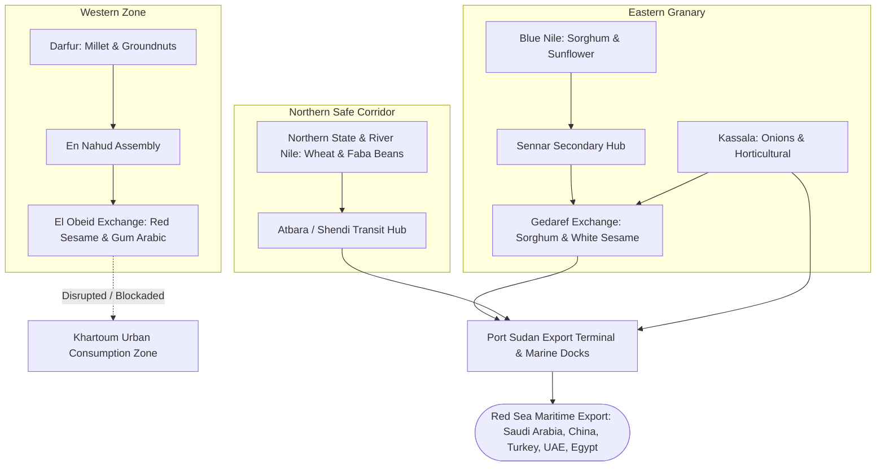

# Sudan Agricultural Market Structure & Commercial Trading Graph
**Document Ref:** 03_SUDAN_MARKET_MAP.md  
**Classification:** Market Systems Architecture & Trade Corridors  
**Geographic Scope:** Gedaref, El Obeid, Kassala, Port Sudan, Sennar, Wad Madani, River Nile  
**Date Context:** September 2026  
**Author:** Zarati Master Research Program  

---

## 1. Primary Sudanese Agricultural Trading Hubs

```
+--------------------------------------------------------------------------------------------------------------------+
| SUDAN AGRICULTURAL MARKET SYSTEM ARCHITECTURE                                                                      |
+----------------------+--------------------+-----------------------------+--------------------+---------------------+
| Market Hub           | Market Typology    | Primary Commodities Traded  | Trade Units Used   | Key Market Roles    |
+----------------------+--------------------+-----------------------------+--------------------+---------------------+
| **Gedaref Exchange** | Primary Physical   | White Sesame, Sorghum       | Ardeb (198 kg),    | Eastern grain       |
| (سوق القضارف)        | Spot Auction Floor | (Feterita, Dabar), Sunflwr  | Qintar (44.93 kg)  | capital; SAF-secure |
+----------------------+--------------------+-----------------------------+--------------------+---------------------+
| **El Obeid Exchange**| Primary Physical   | Gum Arabic (Hashab/Talha),  | Qintar, Ardeb,     | Western hub; under  |
| (بورصة الأبيض)       | Cash Auction Board | Red Sesame, Groundnuts      | Metric Ton         | siege pressure      |
+----------------------+--------------------+-----------------------------+--------------------+---------------------+
| **Port Sudan**       | Terminal Port /    | Export Sesame, Gum Arabic,  | Metric Ton (FOB),  | Sole maritime       |
| (الميناء والبورصة)   | Quarantine Market  | Cotton, Imported Wheat      | Shipping Container | export terminal     |
+----------------------+--------------------+-----------------------------+--------------------+---------------------+
| **Kassala Market**   | Regional Wholesale | Onions, Sorghum, Wheat,     | Sack (90 kg),      | Domestic hub;       |
| (سوق كسلا المركزي)   | & Border Assembly  | Horticultural Produce       | Wooden Crate       | Eritrea trade link  |
+----------------------+--------------------+-----------------------------+--------------------+---------------------+
| **Sennar & Singa**   | Producer Assembly  | Sorghum, Sesame, Maize,     | Ardeb,             | Blue Nile           |
| (سنار وسنجة)         | & River Transit    | Forest Products             | Jute Sack (100 kg) | agricultural axis   |
+----------------------+--------------------+-----------------------------+--------------------+---------------------+
| **Shendi & Atbara**  | Riverine Irrigated | Faba Beans (Ful Masri),     | Sack (90 kg),      | High-value winter   |
| (نهر النيل)          | Cash Crop Market   | Wheat, Spices, Onions       | Ardeb              | food security zone  |
+----------------------+--------------------+-----------------------------+--------------------+---------------------+
| **Nyala & En Nahud** | Western Primary    | Groundnuts (Sodari),        | Qintar,            | Disrupted western   |
| (دارفور وكردفان)     | Production Hub     | Millet, Livestock           | Head (Livestock)   | trade assembly      |
+----------------------+--------------------+-----------------------------+--------------------+---------------------+
```

---

## 2. The Sudan Agricultural Trade Corridors



---

## 3. Market Operations & Price Formation Mechanics

### 3.1 The Auction System (مزاد المحاصيل)
* **Opening & Bidding:** Auctions in Gedaref open at 9:00 AM upon physical sample inspection in the municipal market yard. Commission agents (*Samasira*) bid on standardized lots (minimum 50 to 500 bags).
* **Weighing & Quality Grading (*Al-Gabban* / القبان):** Official municipal weighing bridges verify lot weights. Sesame is graded by purity percentage (99% pure, 98% pure, standard commercial).
* **Payment Settlement:** Traditionally processed via certified banker's cheques. Post-2023, settlements transitioned overwhelmingly to **Bank of Khartoum "Bankak" instant mobile transfers** or deferred merchant escrow.

### 3.2 Key Value Chain Actors
1. **Smallholder Producer:** Price taker; sells at farm gate to village aggregators (*Kassaba*).
2. **Village Aggregator (*Kassabi*):** Operates small pickup trucks, buys at 30–40% discounts.
3. **Commission Agent (*Simsar*):** Controls auction licenses, negotiates deals, takes 5% cut.
4. **Wholesaler / Exporter:** Cleans, sorts, fumigates, and re-bags in Port Sudan warehouses for containerized shipping.
