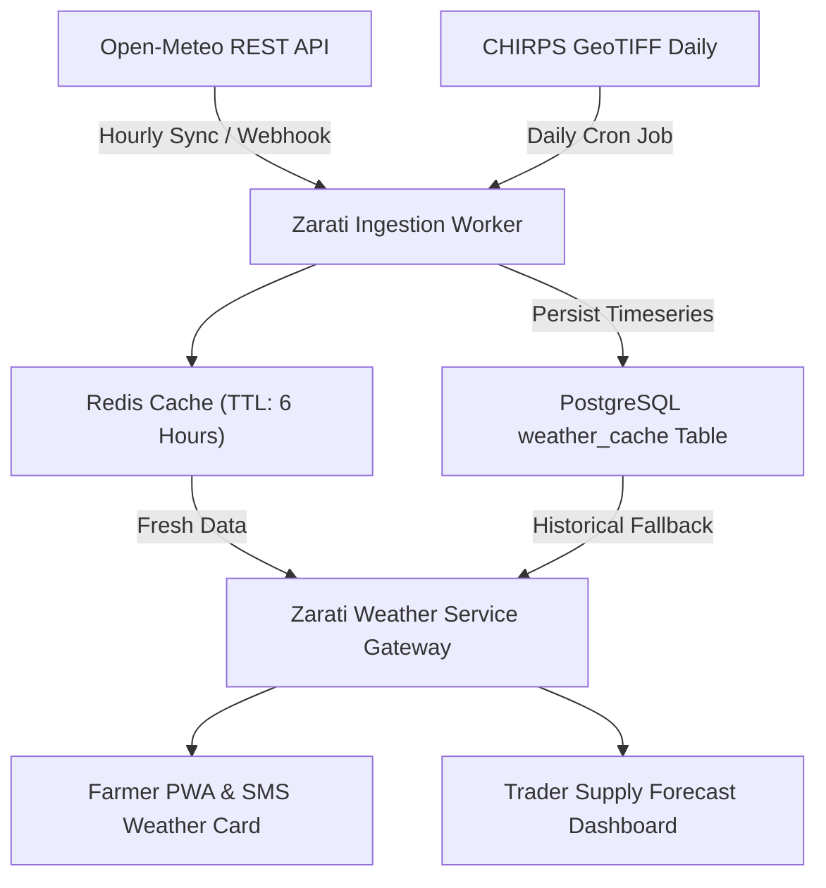

# ZARATI RESEARCH DOSSIER 05: WEATHER & CLIMATE DATA ARCHITECTURE FOR SUDAN

**Document Reference:** `ZARATI-RES-2026-05`  
**Classification:** Strategic Technical Intelligence  
**Geographic Scope:** Republic of Sudan (18 States, focus on Eastern Agricultural Belt)  
**Date Context:** September 2026  

---

## 1. Executive Summary & Core Ground Realities

Sudanese agriculture is predominantly rainfed (~80% of cultivated area across semi-mechanized Gedaref/Blue Nile and traditional Kordofan/Darfur belts). Rainfed smallholders and commercial schemes are extraordinarily vulnerable to the **Intertropical Convergence Zone (ITCZ)** oscillations, which dictate the onset, intensity, and cessation of the June–October rainy season.

Commercial weather APIs (e.g., Tomorrow.io, AccuWeather, IBM The Weather Company) charge prohibitive per-call rates ($0.001–$0.01/call) and suffer from severe model inaccuracies in the Sahel because they rely on sparse World Meteorological Organization (WMO) ground station networks. Sudan's formal meteorological ground network (Sudan Meteorological Authority - SMA) has lost over 70% of automated reporting stations due to conflict and power grid destruction.

**The Zarati Solution:** A zero-licensing-cost, multi-model blended weather pipeline combining **Open-Meteo (ECMWF IFS 0.25° + GFS 0.13°)** for operational forecasts and **CHIRPS (Climate Hazards Group InfraRed Precipitation with Station data, 0.05° ~5.3 km)** for high-resolution rainfall monitoring, backed by edge Redis/PostgreSQL caching.

---

## 2. Source-Grounded Weather Pipeline Matrix

| Source / Feed | Spatial Resolution | Temporal Frequency | Latency | Coverage in Sudan | Cost & Licensing | Ingestion Method | Zarati Production Role |
|:---|:---|:---|:---|:---|:---|:---|:---|
| **Open-Meteo API** (ECMWF IFS / GFS blend) | 0.1° – 0.25° (~11–27 km) | Hourly (16-day forecast) | < 1 hour | Full nationwide (all 18 states) | Free open source / Non-commercial open data; self-hostable | REST JSON API | **Primary operational forecast** (temperature, precip probability, wind, soil moisture) |
| **CHIRPS (UC Santa Barbara / USGS)** | 0.05° (~5.3 km) | Daily, pentadal, monthly (1981–present) | 1–2 days (CHIRPS Prelim); ~3 weeks (CHIRPS Final) | Full nationwide | Public Domain / Open Data (CC0) | GeoTIFF / NetCDF via HTTP / FTP / Google Earth Engine | **Rainfall onset validation & drought anomaly monitoring** |
| **ERA5-Land (Copernicus ECMWF)** | 0.1° (~9 km) | Hourly reanalysis | 5 days latency | Full nationwide | Open Access (Copernicus Licence) | CDS API / AWS Open Data Registry S3 | **Historical baseline & climate risk modeling** |
| **NASA POWER** | 0.5° (~55 km) | Daily | 2–3 days | Full nationwide | Public Domain | REST API / CSV | **Solar radiation & evapotranspiration (ET0) estimation** |
| **SMA (Sudan Met Authority)** | Ground points (Khartoum, Gedaref, Port Sudan, Wad Medani) | Variable | Irregular (conflict impacted) | Sparse (~15 active stations) | Bilateral government feed | Bilateral sync / PDF bulletins | **Ground truth calibration (where operational)** |

---

## 3. High-Value Agricultural Weather Metrics for Sudan

1. **Cumulative Rainfall & Pentad Anomalies:**
   - Tracking 5-day rainfall totals (pentads) against the 30-year climatological mean.
   - *Key trigger:* Identifies false onset (early rains followed by 14-day dry spells that kill germinating sorghum seedlings).
2. **Soil Moisture Profile (0–7 cm, 7–28 cm, 28–100 cm):**
   - Critical for vertisol (heavy clay) management in Gedaref and Gezira. Wet vertisols trap heavy machinery; accurate topsoil moisture predicts field accessibility for tractors.
3. **Reference Evapotranspiration ($ET_0$):**
   - Calculated via the FAO-56 Penman-Monteith method using solar radiation, wind speed, temperature, and relative humidity. Essential for pump scheduling in Gezira and River Nile state irrigated schemes.
4. **Extreme Heat Stress Warnings:**
   - Temperatures exceeding 42°C during the grain-filling stage of winter wheat (River Nile/Northern states, Feb–March) cause catastrophic yield reduction.

---

## 4. Zarati Production Weather Architecture

### Caching & Fallback SLA
- **Redis Cache Layer:** In-memory caching keyed by 0.1° grid coordinate (latitude/longitude rounded to 1 decimal place). Sudan spans roughly $22^\circ\text{N}$ to $9^\circ\text{N}$ and $21^\circ\text{E}$ to $38^\circ\text{E}$, mapping to roughly $130 \times 170 \approx 22,000$ active land grid cells.
- **Cache TTL:** 6 hours for forecasts, 24 hours for daily aggregates.
- **Circuit Breaker:** If Open-Meteo API is unreachable, the gateway falls back immediately to the latest cached record in `public.weather_cache` before serving static seasonal climatology.
