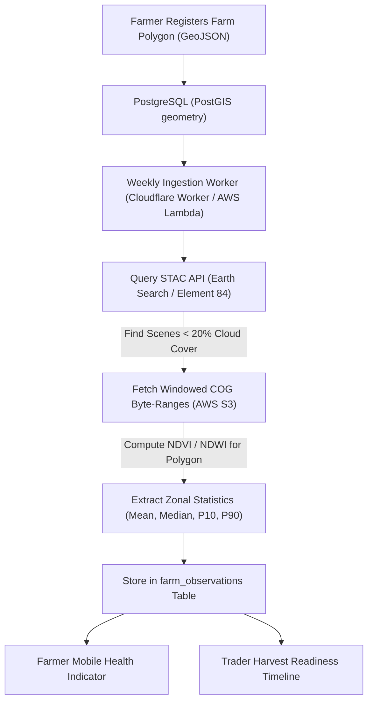

# ZARATI RESEARCH DOSSIER 06: SATELLITE EARTH OBSERVATION DATA ARCHITECTURE

**Document Reference:** `ZARATI-RES-2026-06`  
**Classification:** Strategic Technical Intelligence  
**Geographic Scope:** Sudan (Eastern Rainfed, Gezira Irrigated, Kordofan Belt)  
**Date Context:** September 2026  

---

## 1. Executive Summary & Core Ground Realities

Satellite Earth Observation (EO) provides objective, remote ground truth for Sudan's vast, geographically dispersed agricultural heartlands where on-site inspection is perilous or logistically constrained. With field schemes spanning millions of feddans (e.g., Gezira at 2.2 million feddans, Gedaref semi-mechanized schemes where single farms range from 500 to 5,000 feddans), satellite intelligence delivers non-intrusive monitoring of planting dates, crop health, flood damage, and yield potential.

Commercial satellite analytics providers (e.g., Planet Labs, Descartes Labs) charge $1.50–$5.00 per hectare per season. For Zarati's target scale of 100,000+ feddans, commercial licensing would destroy unit economics. 

**The Zarati Solution:** A 100% open-access, serverless satellite pipeline ingesting **Copernicus Sentinel-2 (10-meter resolution, 5-day revisit)** and **Landsat-8/9 (30-meter resolution)** from Cloud-Optimized GeoTIFF (COG) buckets on AWS Open Data Registry via SpatioTemporal Asset Catalogs (STAC), with zero imagery licensing fees.

---

## 2. Satellite Feeds Comparison Matrix

| Constellation | Spatial Resolution | Revisit Cycle | Spectral Bands Used | Access Method | Cost | Zarati Agricultural Use Case |
|:---|:---|:---|:---|:---|:---|:---|
| **Copernicus Sentinel-2 (A & B)** | 10m (VNIR), 20m (RedEdge/SWIR) | 5 days at equator | B02 (Blue), B04 (Red), B08 (NIR), B11 (SWIR-1) | STAC API (Earth Search / AWS `sentinel-cogs`) | **$0.00** (Open Data CC-BY 4.0) | **Field-level NDVI, NDWI, phenology monitoring, crop stage verification** |
| **Landsat 8 & 9 (USGS/NASA)** | 30m multispectral, 100m thermal | 8 days (combined) | Band 4 (Red), Band 5 (NIR), Band 6 (SWIR), Band 10 (Thermal) | USGS STAC / AWS Landsat | **$0.00** (Public Domain) | **Long-term crop rotation baselines (40-year historical depth), thermal drought stress** |
| **MODIS (Terra & Aqua)** | 250m – 1000m | Daily | Red, NIR, Surface Temp | NASA Earthdata / LP DAAC | **$0.00** (Public Domain) | **Macro-state level regional drought & locust swarm path assessment** |
| **PlanetScope (Commercial)** | 3m | Daily | RGB + NIR | Commercial Planet API | ~$2–$6/ha/yr | *Not recommended for MVP due to prohibitive unit economics* |

---

## 3. High-Value Vegetation & Water Indices

```
1. Normalized Difference Vegetation Index (NDVI)
   NDVI = (B08 - B04) / (B08 + B04)
   Scale: -1.0 to +1.0
   Application:
     < 0.15: Fallow soil / dry desert
     0.20 - 0.40: Early emergence / sparse vegetation
     0.45 - 0.85: Peak vegetative vigor (grain-filling sorghum/sesame)
     Downturn: Physiological maturity & harvest window

2. Normalized Difference Water Index (NDWI - Gao 1996)
   NDWI = (B08 - B11) / (B08 + B11)
   Scale: -1.0 to +1.0
   Application:
     Measures canopy liquid water content. Critical for early warning of moisture stress
     in rainfed Gedaref 7 to 10 days before visible chlorosis (yellowing) appears on NDVI.

3. Enhanced Vegetation Index (EVI)
   EVI = 2.5 * ((B08 - B04) / (B08 + 6.0*B04 - 7.5*B02 + 1.0))
   Application:
     Prevents saturation in high-biomass canopy environments (irrigated sugarcane,
     high-density riverine banana/alfalfa in Northern State).
```

---

## 4. Zarati Zero-Cost Serverless Processing Architecture



### Key Engineering Optimizations:
1. **Windowed Byte-Range Reads:** Using HTTP `Range: bytes=...` requests against Cloud-Optimized GeoTIFFs (COGs), Zarati fetches *only* the specific bounding box pixels of registered farms (typically < 200 KB per farm), avoiding the download of entire 500 MB Sentinel scenes.
2. **Cloud Masking:** Utilizing Sentinel-2 Scene Classification Layer (SCL) at 20m to automatically filter out cloud and cloud-shadow pixels before index aggregation.
3. **Storage Efficiency:** Raw raster imagery is never retained on Zarati servers; only aggregated polygonal timeseries scalars (mean NDVI, NDWI, cloud score) are persisted in PostgreSQL.
