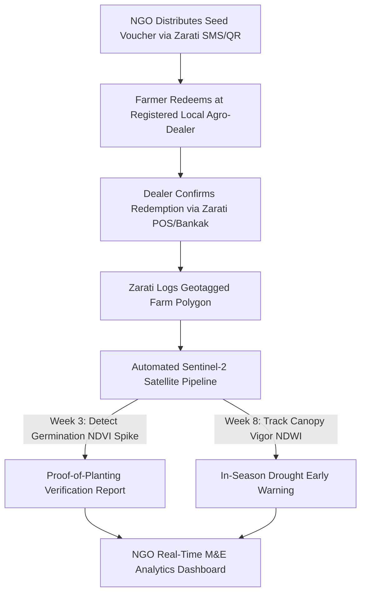

# ZARATI RESEARCH DOSSIER 10: MULTILATERAL & NGO DEVELOPMENT SECTOR OPPORTUNITY

**Document Reference:** `ZARATI-RES-2026-10`  
**Classification:** Institutional Partnership & B2B/B2N Revenue Architecture  
**Key Stakeholders:** FAO, WFP, IFAD, AfDB, World Bank, Mercy Corps, NRC, ICRC, IsDB, AAAID  
**Date Context:** September 2026  

---

## 1. Multilateral Funding Scale & Active Programs in Sudan

The humanitarian and food security response in Sudan represents one of the largest active multilateral operations globally, with over **$1.2 Billion** allocated across emergency food, seed distribution, and agricultural rehabilitation between 2024 and 2026.

### Key Active Institutional Programs:
1. **FAO Emergency Agricultural Livelihoods Plan:**
   - Budget: ~$230M+ targeted response.
   - Operations: Distribution of 10,000+ metric tons of certified crop seeds (sorghum, millet, sesame) to over 1.8 million farming households across Gedaref, Sennar, White Nile, Blue Nile, and Darfur.
2. **African Development Bank (AfDB) Emergency Wheat & Food Security Project:**
   - Budget: $87M grant facility implemented with WFP.
   - Target: Scaling certified heat-tolerant wheat varieties (*Imam*) and fertilizer to farmers in River Nile, Northern State, and Gezira to offset import deficits.
3. **WFP Local Food Procurement Initiative:**
   - Focus: Transitioning from expensive imported grain shipments to local grain procurement directly from Sudanese smallholder cooperatives and commercial schemes where surpluses exist.
4. **IFAD Resilience & Rural Finance Programs:**
   - Ongoing engagement in smallholder capacity building, water harvesting micro-dams, and community seed banks.

---

## 2. Institutional Pain Points & The "Verification Void"

International agencies face severe structural friction executing programs in rural Sudan:

1. **The Seed Consumption vs. Planting Dilemma:**
   - Donors distribute expensive certified seed, but during acute hunger seasons (June–August), desperate families frequently consume the seed grain rather than planting it. Agencies lack remote verification of whether distributed seeds were actually sown.
2. **Fragmented M&E and Survey Fatigue:**
   - Field enumerators use fragmented tools (KoboToolbox, ODK, paper clipboards). Data processing takes 6 to 12 weeks, meaning seasonal M&E reports arrive *after* the harvest has already failed.
3. **Beneficiary Deduplication Deficit:**
   - Without a unified national biometric or digital registry, beneficiaries often register with multiple NGOs in the same locality, creating gross misallocation.

---

## 3. Zarati Enterprise NGO Suite ("Zarati Impact")

### Commercial Monetization Model for NGO Tier:
- **Per-Beneficiary Verification Fee:** $1.20 – $2.50 per registered smallholder household per agricultural season. (Substantially cheaper than manual field enumerator visits, which cost $15–$30 per farm audit).
- **Custom Locality Food Security Feed:** Enterprise dashboard subscriptions ($15,000 – $40,000/year per international agency).
- **Direct Integration:** Two-way automated sync with UN standard systems (KoboToolbox API, WFP VAM, and HDX open data exchange).
