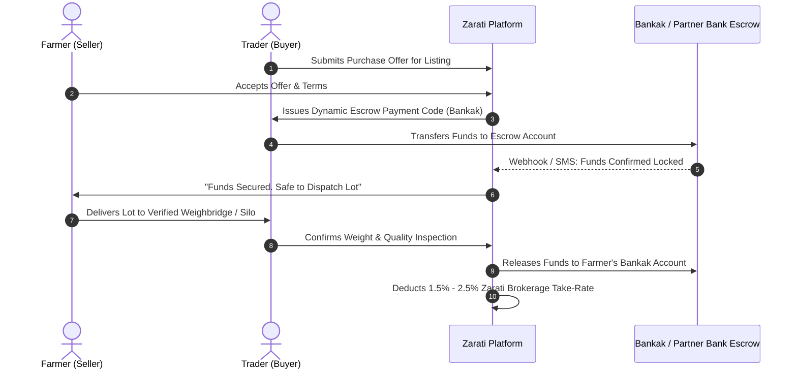

# ZARATI RESEARCH DOSSIER 12: PAYMENTS, FINTECH & RURAL FINANCIAL SETTLEMENT IN SUDAN

**Document Reference:** `ZARATI-RES-2026-12`  
**Classification:** Financial Infrastructure & Monetization Rails  
**Primary Banking Entities:** Bank of Khartoum (Bankak), Faisal Islamic Bank (Fawry), Omdurman National Bank (O-Cash), Agricultural Bank of Sudan (ABS)  
**Date Context:** September 2026  

---

## 1. The Sudanese Fintech Landscape: The "Bankak" Hegemony

Due to severe physical bank branch disruptions and extreme cash shortages (عدم توفر السيولة النقدية), Sudan experienced the most rapid digitization of retail transactions in its history between 2023 and 2026. 

**Bank of Khartoum's "Bankak" (بنكك):**
- **Market Share:** Dominates **> 80%** of all digital payments nationwide.
- **Ubiquity:** Used by everyone from street vendors and farm laborers to commercial grain wholesalers moving billions of Sudanese Pounds.
- **Architecture:** Operates via account-to-account (P2P), phone-number-to-phone-number transfers, and QR code merchant payments.
- **The Liquidity Squeeze (الكاش مقابل التحويل):** Because physical banknotes are scarce and banks set daily withdrawal caps, rural "Cash-Out Merchants" charge a 5% to 15% discount fee to provide physical cash in exchange for a Bankak digital transfer.

```
Key Secondary Rails:
1. Fawry (فوري) - Faisal Islamic Bank (strong among Islamic business networks and conservative traders).
2. O-Cash (أوكاش) - Omdurman National Bank (favored by institutional and defense-affiliated trade entities).
3. Baraka Bank Mobile - Active in Port Sudan foreign trade settlement.
```

---

## 2. Hyperinflation & Currency Volatility Realities

The Sudanese Pound has experienced massive macroeconomic depreciation:
- **Parallel Market Exchange Rate:** Fluctuation between **2,600 and 3,300 SDG per USD** (September 2026).
- **Listing Price Decay:** A listing priced at 2,000,000 SDG/MT in August may lose 10% of real purchasing power in 3 weeks if payment terms are delayed.

### Zarati Price Hedging & Multi-Currency Engine:
1. **Dynamic Real-Time Re-Indexing:** Listings display primary prices in SDG, but can be anchored to a USD or SAR reference peg.
2. **Commodity Parity Valuation:** Allowing farmers to compare grain value in real goods (e.g., "1 ton of Feterita Sorghum = 4.2 sacks of Urea 46% fertilizer").
3. **Short Expiry Windows on Offers:** Marketplace inquiries feature 48-hour price expiration timers to protect sellers against currency slides during negotiation.

---

## 3. Zarati Escrow & Verification Settlement Flow

To solve the profound trust deficit between distant buyers and sellers without taking balance-sheet inventory risk, Zarati introduces a tripartite settlement flow:


