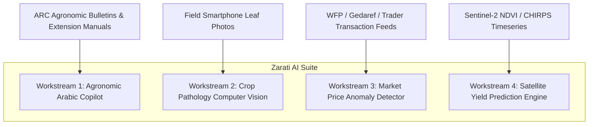

# ZARATI RESEARCH DOSSIER 13: ARTIFICIAL INTELLIGENCE & DOMAIN-SPECIFIC ML STRATEGY

**Document Reference:** `ZARATI-RES-2026-13`  
**Classification:** Strategic AI Architecture & R&D Roadmap  
**Target Capabilities:** Sudanese Dialect Agronomic RAG, Computer Vision Diagnostics, Anomaly Detection  
**Date Context:** September 2026  

---

## 1. The Strategy: Domain-Grounded AI vs. Generic Wrapper Traps

Many startups fail by bolting generic, uncalibrated LLM wrappers onto agricultural apps, leading to disastrous hallucinations (e.g., advising toxic pesticide dosages or failing to comprehend Sudanese regional dialects).

Zarati's AI strategy is grounded in three principles:
1. **Vernacular Arabic Grounding:** Trained on and calibrated with Sudanese Arabic agricultural vocabulary (*المفردات الزراعية السودانية*), including regional terminology used in Gedaref, Gezira, and Kordofan (e.g., *متراد*, *طايوق*, *كديب*, *عويشة*, *عدار*).
2. **Deterministic Safety Guardrails:** Strict RAG (Retrieval-Augmented Generation) constrained to peer-reviewed agronomic corpora from the Agricultural Research Corporation (ARC), FAO, and ICARDA. Zero hallucinated chemical dosages.
3. **Edge-Compute Prioritization:** Lightweight computer vision models capable of running client-side on mobile devices without sending multi-megabyte images over spotty 2G networks.

---

## 2. Core AI Workstreams for Zarati

### Workstream 1: Sudanese Agricultural Copilot (مساعد زرعتي)
- **Architecture:** Hybrid RAG pipeline combining embedding search over vetted Arabic agronomy texts with Gemini 1.5 Flash / Claude 3.5 Haiku as reasoning engines.
- **Audio-to-Audio / Voice Interface:** Powered by Whisper fine-tuned on Sudanese spoken Arabic dialects. Allows illiterate farmers to speak their question via WhatsApp or PWA audio note and receive a spoken Arabic answer in under 4 seconds.

### Workstream 2: Crop Pest & Weed Computer Vision
- **Target Threats:**
  - *Striga hermonthica* (بودة / عدار): Parasitic weed infesting up to 65% of sorghum fields in Gedaref and Sennar.
  - Desert Locust (*Schistocerca gregaria*) nymph stage identification.
  - Bacterial blight in sesame (*Xanthomonas campestris*).
- **Deployment:** Quantized ONNX / TensorFlow Lite model (< 8 MB) embedded in PWA Service Worker for zero-data offline leaf diagnosis.

### Workstream 3: Marketplace Fraud & Price Manipulation Detection
- **Mechanism:** Statistical outlier detection (Isolation Forests / Z-score bands) comparing user listings against 30-day market baseline prices.
- **Action:** Flags anomalous listings (e.g., Sorghum offered at 50% below Gedaref auction average) as high-risk scams or stolen grain lots, requiring manual moderation review before publication.
