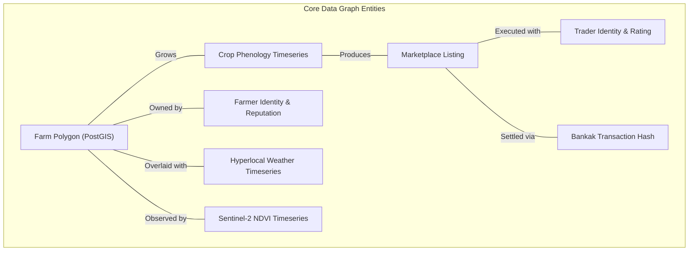

# ZARATI RESEARCH DOSSIER 14: PROPRIETARY DATA GRAPH & STRATEGIC DEFENSIVE MOAT

**Document Reference:** `ZARATI-RES-2026-14`  
**Classification:** Strategic Moat & Network Effects Architecture  
**Date Context:** September 2026  

---

## 1. The Anatomy of Zarati's Data Moat

Commodity marketplaces that rely solely on public listings are easily disintermediated or cloned. Zarati's long-term enterprise valuation and defensibility stem from building **Sudan's first Unified Agricultural Knowledge Graph (AKG)**.



### The 4 Proprietary Data Assets:
1. **The Georeferenced Farm Cadastre:** High-precision boundaries of hundreds of thousands of feddans across Gedaref, Gezira, Sennar, and Blue Nile. This map does not exist in any public repository or global GIS provider.
2. **Actual Cleared Transaction Prices:** Unlike public bid-ask boards, Zarati records the *actual agreed, inspected, and settled cash price per ton*, broken down by variety, moisture grade, and bag packaging.
3. **Hyperlocal Transport Route Cost Indices:** Real-time freight rates per metric ton across major arterial corridors (e.g., Gedaref-to-Port Sudan, Atbara-to-Sawakin, Kosti-to-Rabak), incorporating fuel surcharges and checkpoint friction.
4. **Smallholder Reputational Ledger:** Quantitative reliability scoring based on historical fulfillment rate, crop quality grading accuracy, and dispute frequency.

---

## 2. Multi-Sided Network Flywheel

```
             ┌────────────────────────────────────────────────────────┐
             │            More Farmers Register Farms & Crops         │
             └───────────────────────────┬────────────────────────────┘
                                         │
                                         ▼
             ┌────────────────────────────────────────────────────────┐
             │       Superior Pre-Harvest Supply Forecasts Built      │
             └───────────────────────────┬────────────────────────────┘
                                         │
                                         ▼
             ┌────────────────────────────────────────────────────────┐
             │      Wholesale Traders & Exporters Flock to Platform   │
             └───────────────────────────┬────────────────────────────┘
                                         │
                                         ▼
             ┌────────────────────────────────────────────────────────┐
             │     Liquidity Surges & Bid-Ask Spreads Tighten         │
             └───────────────────────────┬────────────────────────────┘
                                         │
                                         ▼
             ┌────────────────────────────────────────────────────────┐
             │   Banks & NGOs Rely Exclusively on Zarati Data Ledger  │
             └────────────────────────────────────────────────────────┘
```

### Why Global Tech & Local Copycats Cannot Clone This:
- **Global Tech (Google, Microsoft FarmBeats):** Lacks ground presence, vernacular Arabic language fluency, deep relationships with traditional market brokers (*Dallaleen*), and integration with local fintech rails like Bankak.
- **Local Copycats:** Building the data graph requires years of cumulative field verification, historical satellite timeseries correlation, and institutional trust with commercial banks and UN agencies.
